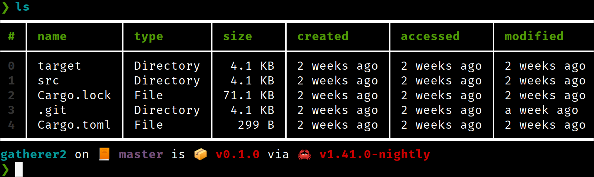

# Nushell 0.6.0

Nushell, or Nu for short, is a new shell that takes a modern, structured approach to your commandline. It works seamlessly with the data from your filesystem, operating system, and a growing number of file formats to make it easy to build powerful commandline pipelines.

We're happy to announce the 0.6.0 release of Nu. This release has a bunch of new features, bugfixes, and general improvements.

# Where to get it

Nu 0.6.0 is available as [pre-built binaries](https://github.com/nushell/nushell/releases/tag/0.6.0) or from [crates.io](https://crates.io/crates/nu). If you have Rust installed you can install it using `cargo install nu` (or if you want all the features `cargo install nu --all-features`).

# Starship support (Southclaws, sophiajt)


_Welcome to the starship!_

Having a configurable prompt has been a regularly requested feature, dating back to our first release of Nu. With 0.6.0, we're excited to show off the ability to integrate with [starship](https://starship.rs/). Starship is a powerful prompt being built in Rust, and it includes tons of fun features.

To use the Starship support, enable the starship feature (the binary releases will have this on by default). After this, you'll want to [configure starship](https://starship.rs/config/) to meet your needs.

Here's the config I use in the screenshot above:

```
❯ cat ~/.config/starship.toml
add_newline = false

[git_branch]
symbol = "📙 "

[git_status]
disabled = true
```

To enable Starship support, make sure to enable the `starship` feature, or to use the all-features build:

```
> cargo install nu --features starship-prompt
```

or

```
> cargo install nu --all-features
```

# Stable Rust (est31)

Nu now works on stable Rust!

Contributor est31 did a ton of work soon after our first Nu release, but it wasn't until just recently that it fully paid off. With the Rust 1.39 release, Nu now fully works on stable Rust! We're excited for what this means for package authors, as they will now have a stable dependency they can use to build Nu from, rather than tracking nightly.

# New website! New blog! (sebastian-xyz)

We're starting to work on an actual website, complete with a blog. In fact, where you're seeing this now is on our new site. We're excited to finally have something more official, and looking forward to growing the website in the weeks to come.

If you're a web developer or designer and you want to help out, please join us! You can find us on the [website repo](https://github.com/nushell/nushell.github.io) and [blog repo](https://github.com/nushell/blog).

# New features

## histogram (andrasio)

As we extend Nu's ability to function as a shell, we also wanted to include some features that help with doing some data analysis on structured data you're working with. In this release is a new `histogram` feature which gives a quick histogram of the data you're looking at:

```shell
> open tests/fixtures/formats/caco3_plastics.csv | histogram origin
━━━┯━━━━━━━━━━┯━━━━━━━━━━━━━━━━━━━━━━━━━━━━━━━━━━━━━━━━━━━━━━━━━━━━━━━━━━━━━━━━━━━━━━━━━━━━━━━━━━━━━━━━━━━━━━━━━
 # │ origin   │ frequency
───┼──────────┼─────────────────────────────────────────────────────────────────────────────────────────────────
 0 │ COLOMBIA │ ***********************************************************************************************
   │          │ *****
 1 │ SPAIN    │ ************************************************************
 2 │ TURKEY   │ ********************
━━━┷━━━━━━━━━━┷━━━━━━━━━━━━━━━━━━━━━━━━━━━━━━━━━━━━━━━━━━━━━━━━━━━━━━━━━━━━━━━━━━━━━━━━━━━━━━━━━━━━━━━━━━━━━━━━━
```

## split-by (andrasio)

When working with tables inside of tables, it's sometimes helpful to be able to group and regroup data so that the end result can be easily processed or charted. With this release, we've add a new command: `split-by`. Split-by is similar to `group-by`, in a way you can think of it as a re-group as it will create new groups to wrap your existing groups.

To see how this works, let's say we have some shipping data, and we want to group these by the region:

```shell
> open tests/fixtures/formats/caco3_plastics.csv | group-by origin

━━━━━━━━━━━━━━━━┯━━━━━━━━━━━━━━━━┯━━━━━━━━━━━━━━━━
 SPAIN          │ COLOMBIA       │ TURKEY
────────────────┼────────────────┼────────────────
 [table 3 rows] │ [table 5 rows] │ [table 1 rows]
━━━━━━━━━━━━━━━━┷━━━━━━━━━━━━━━━━┷━━━━━━━━━━━━━━━━
```

Next, let's say we know that inside of these new columns is a table that has a column called `shipped_at`. What we want to do is to `group-by` again, but this time use that new column to create new groups:

```shell
/home/sophia/Source/nushell(better_duration)> open tests/fixtures/formats/caco3_plastics.csv | group-by origin | split-by shipped_at
━━━━━━━━━━━━━┯━━━━━━━━━━━━━┯━━━━━━━━━━━━━┯━━━━━━━━━━━━━━━━┯━━━━━━━━━━━━━━━━┯━━━━━━━━━━━━━━━━┯━━━━━━━━━━━━━━
 18/03/2016  │ 27/07/2016  │ 24/06/2016  │ 07/07/2016     │ 01/01/1900     │ 01/11/2016     │ 04/10/2016
─────────────┼─────────────┼─────────────┼────────────────┼────────────────┼────────────────┼──────────────
 [row SPAIN] │ [row SPAIN] │ [row SPAIN] │ [row COLOMBIA] │ [row COLOMBIA] │ [row COLOMBIA] │ [row TURKEY]
━━━━━━━━━━━━━┷━━━━━━━━━━━━━┷━━━━━━━━━━━━━┷━━━━━━━━━━━━━━━━┷━━━━━━━━━━━━━━━━┷━━━━━━━━━━━━━━━━┷━━━━━━━━━━━━━━
```

What we have as a result is a kind of (row, column) grouping of the table data, which would allow you to graph for each date on one axis, and for each origin on the other.

## default and compact (andrasio)

One of the sticky issues working with tables is that sometimes you'll have gaps in the data. Perhaps there just isn't a value for that row.

To help with that, we've added two new commands: `default` and `compact`.

Default, as the name implies, will allow you to give blank spots a default value. Compact instead will allow you to remove a row if there's a blank in that position.

Here's an example of default:

```shell
> open amigos.json | get amigos
━━━┯━━━━━━━━━━━┯━━━━━━━━━━━━
 # │ name      │ rusty_luck
───┼───────────┼────────────
 0 │ Yehuda    │          1
 1 │ Sophia    │          1
 2 │ Andres    │          1
 3 │ GorbyPuff │
━━━┷━━━━━━━━━━━┷━━━━━━━━━━━━
```

We can default the missing column from the table like this:

```shell
> open amigos.json | get amigos | default rusty_luck 1 giving:

━━━┯━━━━━━━━━━┯━━━━━━━━━━━━
 # │ name     │ rusty_luck
───┼──────────┼────────────
 0 │ Yehuda   │          1
 1 │ Sophia   │          1
 2 │ Andres   │          1
 3 │ GorbyPuff│          1
━━━┷━━━━━━━━━━┷━━━━━━━━━━━━
```

## format (sophiajt)

To add to the abilities of outputting tables of various into readable strings, we've recently added the `format` command. This allows you to convert table data into a string by following a formatting pattern:

```shell
> ls | format "name is {name}"
━━━━┯━━━━━━━━━━━━━━━━━━━━━━━━━━━━
 #  │ <value>
────┼────────────────────────────
  0 │ name is .azure
  1 │ name is features.toml
  2 │ name is Cargo.toml
  3 │ name is LICENSE
  4 │ name is target
  5 │ name is images
  6 │ name is tests
```

## from-xlsx (sophiajt)

We now have an early start at Excel support. With it, you can now import Excel files as tables.

# On-going improvements

Lots of improvements to existing commands this time around.

## Simple and full `ls` (sophiajt)

To make `ls` work better on smaller terminals (including the bog standard 80x24 login size), we've shrunk `ls` a tiny bit by default. Have no worry, though, the original columns and more are available in the new `ls --full`.

## Fuzzy matching (bndbsh)

```shell
❯ ls | where name =~ "yml"
━━━━━━━━━━━━━┯━━━━━━┯━━━━━━━┯━━━━━━━━━━━━┯━━━━━━━━━━━━
 name        │ type │ size  │ accessed   │ modified
─────────────┼──────┼───────┼────────────┼────────────
 .gitpod.yml │ File │ 780 B │ a week ago │ a week ago
━━━━━━━━━━━━━┷━━━━━━┷━━━━━━━┷━━━━━━━━━━━━┷━━━━━━━━━━━━
```

A long-requested feature is the ability to match strings a bit more fuzzily. With 0.6.0, you'll be able to do just that with the new `=~` (fuzzy match to include) and `!~` (fuzzy match to exclude) commands.

## `from-csv`, now with separator (drmason13)

Sometimes you might find a .csv file in the wild that uses a different separator than comma. You can now configure `from-csv` to use a different character as the separator using, for example, `from-csv --separator ";"`.

## nth can take multiple row numbers (andrasio)

You can now pass multiple row numbers to `nth`. For example `nth 1 3 5` will return those three separate rows as a new table.

## Column paths can now include row numbers (wycats, andrasio)

Sometimes when you're trying to get to data inside an inner table, you want to describe travelling through a particular row to get there. With recent improvements, you can now include the row number in the column path (assuming it is not the first part of the path).

## Duration support (sophiajt, Aloso)

```shell
❯ ls | where accessed < 1w
━━━┯━━━━━━━━━━━━━━━┯━━━━━━━━━━━┯━━━━━━━━━━┯━━━━━━━━━━━━━┯━━━━━━━━━━━━━
 # │ name          │ type      │ size     │ accessed    │ modified
───┼───────────────┼───────────┼──────────┼─────────────┼─────────────
 0 │ Cargo.toml    │ File      │   4.7 KB │ an hour ago │ an hour ago
 1 │ Makefile.toml │ File      │    449 B │ 2 days ago  │ 2 days ago
 2 │ README.md     │ File      │  19.5 KB │ an hour ago │ an hour ago
 3 │ Cargo.lock    │ File      │ 170.7 KB │ an hour ago │ an hour ago
 4 │ crates        │ Directory │   4.1 KB │ an hour ago │ an hour ago
 5 │ TODO.md       │ File      │   1.3 KB │ an hour ago │ an hour ago
━━━┷━━━━━━━━━━━━━━━┷━━━━━━━━━━━┷━━━━━━━━━━┷━━━━━━━━━━━━━┷━━━━━━━━━━━━━
```

It's now possible to use duration values in Nu. This allows us to check for files accessed less than a week ago, as you see in the example above.

## Renamed `read` to `parse` (sophiajt)

To help with at-a-glance readability, we've renamed `read` to `parse`. While `read` felt more friendly, it could easily be confused for reading input, reading a file, etc.

# General improvements (wycats, thegedge, drmason13, sophiajt, uma1317, JesterOrNot, andrasio, BurNiinTRee)

There has been a ton of work behind the scenes on Nu itself. We now have a much-improved internal debugging system and better module separation courtesy of wycats. There are also a number of general cleanups and bugfixes that have gone into the release.

# Survey results

We recently ran a survey to ask Nu users/non-users what they thought of Nu. If you're interested, definitely check out the [results of the survey](https://www.nushell.sh/blog/2019-11-23-nushell-survey-results.html)

# Looking ahead

We're still hard at work on "MVP #2". It will be the next milestone on our way to the eventual 1.0. If you'd like to help with code, docs, translation, testing, or just want to come chat and throw ideas around, we'd love to have you! You can find us on [discord](), [twitter](https://twitter.com/nu_shell), and [github](https://github.com/nushell/nushell).
