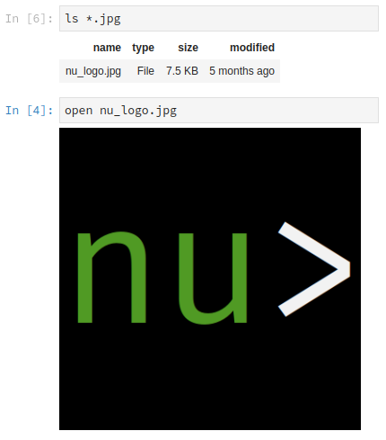

# Nushell 0.12.0

Nushell, or Nu for short, is a new shell that takes a modern, structured approach to your commandline. It works seamlessly with the data from your filesystem, operating system, and a growing number of file formats to make it easy to build powerful commandline pipelines.

We're excited to release version 0.12.0 of Nu!

# Where to get it

Nu 0.12.0 is available as [pre-built binaries](https://github.com/nushell/nushell/releases/tag/0.12.0) or from [crates.io](https://crates.io/crates/nu). If you have Rust installed you can install it using `cargo install nu`.

If you want more goodies, you can install `cargo install nu --features=stable`.

As part of this release, we also publish a set of plugins you can install and use with Nu. To install, use `cargo install nu_plugin_<plugin name>`.

# What's new

## Automatic `cd` (sophiajt)

```
nushell on 📙 master is 📦 v0.12.0 via 🦀 v1.42.0
❯ docs
nushell/docs on 📙 master
❯ ..
nushell on 📙 master is 📦 v0.12.0 via 🦀 v1.42.0
```

Fish and Windows users rejoice, you can now `cd` to a directory or drive by typing its name in the shell. This also allows Windows users to change drives by giving just the drive name. Now, when you use the drive letter, we'll switch drives and return you to your previous working directory on that drive (eg `D:` will change to the D: drive and `cd` to the path you had been at previously).

## Type inference (andrasio)

```
❯ open tests/fixtures/formats//caco3_plastics.csv | get cif_per_net_weight
───┬─────────
 # │ <value>
───┼─────────
 0 │  0.2300
 1 │  0.3100
 2 │  0.1400
 3 │  0.2300
 4 │  0.2100
 5 │  0.2800
 6 │  0.3000
 7 │  0.2500
 8 │  0.2800
───┴─────────
nushell on 📙 master is 📦 v0.12.0 via 🦀 v1.42.0
❯ open tests/fixtures/formats//caco3_plastics.csv | get cif_per_net_weight | sum
2.23
```

We've been hard at work at improving how we read in unstructured data. In this release, you'll see the beginning of type inference as data is read in. In the above example, you can see how we now autodetect decimal numbers and then can later sum them together.

## Jupyter notebook support (sophiajt)



Nu's core design goal is that it should be easier to work with your system and your data. In this release, we take a step beyond being just a shell with [Jupyter notebook support](https://github.com/nushell/nu_jupyter).

## `ls --all` (quebin31)

```
❯ ls
────┬─────────────────────────────────────────────────────┬──────┬──────────┬──────────────
 #  │                        name                         │ type │   size   │   modified
────┼─────────────────────────────────────────────────────┼──────┼──────────┼──────────────
  0 │ CODE_OF_CONDUCT.md                                  │ File │   3.4 KB │ 5 months ago
  1 │ Cargo.lock                                          │ File │ 104.5 KB │ 23 mins ago
  2 │ Cargo.toml                                          │ File │   5.5 KB │ 23 mins ago
...

❯ ls --all
────┬─────────────────────────────────────────────────────┬──────┬──────────┬──────────────
 #  │                        name                         │ type │   size   │   modified
────┼─────────────────────────────────────────────────────┼──────┼──────────┼──────────────
  0 │ .azure                                              │ Dir  │          │ 2 weeks ago
  1 │ .cargo                                              │ Dir  │          │ 2 weeks ago
  2 │ .circleci                                           │ Dir  │          │ 2 weeks ago
...
```

With 0.12.0, you can now show hidden files when listing directory contents with `ls`.

## `from-ics` and `from-vcf` (pulpdrew)

The file support continues to improve, as we add support for vCard and iCal file formats.

## `to-md` and `to-html` (sophiajt)

```
❯ ls | to-md
|name|type|size|modified|
|-|-|-|-|
|CODE_OF_CONDUCT.md|File|3.4 KB|5 months ago|
|Cargo.lock|File|104.5 KB|21 mins ago|
```

You can now output to markdown and html using the new converters.

## `headers` (samhedin)

```
❯ open tests/fixtures/formats/sample_data.ods | get SalesOrders
────┬────────────┬─────────┬──────────┬─────────┬─────────┬───────────┬───────────
 #  │  Column0   │ Column1 │ Column2  │ Column3 │ Column4 │  Column5  │  Column6
────┼────────────┼─────────┼──────────┼─────────┼─────────┼───────────┼───────────
  0 │ OrderDate  │ Region  │ Rep      │ Item    │ Units   │ Unit Cost │ Total
  1 │ 2018-01-06 │ East    │ Jones    │ Pencil  │ 95.0000 │    1.9900 │  189.0500

❯ open tests/fixtures/formats/sample_data.ods | get SalesOrders | headers
────┬────────────┬─────────┬──────────┬─────────┬─────────┬───────────┬───────────
 #  │ OrderDate  │ Region  │   Rep    │  Item   │  Units  │ Unit Cost │   Total
────┼────────────┼─────────┼──────────┼─────────┼─────────┼───────────┼───────────
  0 │ 2018-01-06 │ East    │ Jones    │ Pencil  │ 95.0000 │    1.9900 │  189.0500
  1 │ 2018-01-23 │ Central │ Kivell   │ Binder  │ 50.0000 │   19.9900 │  999.4999
```

Sometimes when working with data, you've managed to read in columns of data and notice that the first row is the headers you want. Previously, this required a lot of twiddling to lift the row into being the header. With 0.12.0, this has become much simpler with the `header` command.

## `ps --full` mode (sophiajt)

We're extending the information you can get back from `ps`. You are now able to get the original commandline and more for each process using the new `ps --full`.

## `rm` can now take multiple arguments to remove multiple files at once (pulpdrew)

Sometimes we're missing a feature and you wonder how we made it that long :D. In this release, you can now pass multiple files to `rm` for deletion.

## Row rotation (sophiajt)

```
❯ sys
─────────┬─────────────────────────────────────────
 host    │ [row 7 columns]
 cpu     │ [row cores current ghz max ghz min ghz]
 disks   │ [table 9 rows]
 mem     │ [row free swap free swap total total]
 temp    │ [table 8 rows]
 net     │ [table 4 rows]
 battery │ [table 1 rows]
─────────┴─────────────────────────────────────────
```

When working with data with lots of columns, it can sometimes be a pain to watch it print to the screen only to see that the data is missing columns because they won't fit. In this version, we're experimenting with a way to help this by auto-rotating a row when it is printed by itself. This will allow more of the row to fit into the screen.

## Configurable table headers (Amanita-muscaria)

You may have noticed that the headers in the above examples were centered. How's that for sneaking a feature in?

With 0.12.0, you can configure your table look a bit more by changing how the headers are displayed. Here are the new `config` settings:

- header_color: Available colors are from term::color module
- header_align: Sets header alignment center/left/right
- header_style: Sets style bold, underlined, italic. More than one can be used

## Lots of bugfixes/improvements (Sosthene-Guedon, quebin31, neuronull, andrasio, thegedge, vsoch, sophiajt, jonstodle)

Open no longer fails silently, improved CSV opening, improve canonicalize of filenames, `sys` now properly says user sessions, moved `shuffle` to being an internal command, relaxed file modes, cleaned up `which` implementation, fix Docker build matrix, streams can now be interrupted, improvements to `du`, `get` now will remove blank values for easier processing, respect CARGO_TARGET_DIR when set, allow `..` and `/` to be mv targets,

## Documentation improvements (pulpdrew, nickgerace, waldyrious, kloun)

Docs for `from-ics` and `from-vcf`, quickstart section for Docker users, docs for `skip` and `skip-while`, typos and whitespace fixes, typo in `calc` docs

# Looking ahead

"Just keep going!" as Yehuda Katz would say, and we intend to. Lots of internal improvements are coming, and of course aliases which has become a daily request.

We'd also like to hear from you. Let us know what would make Nu work better for your workflows, drop us a line in [discord](https://discord.gg/NtAbbGn) or [github](https://github.com/nushell/nushell). We'd love to hear from you!
