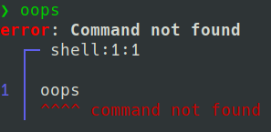

# Nushell 0.15.0

Nushell, or Nu for short, is a new shell that takes a modern, structured approach to your commandline. It works seamlessly with the data from your filesystem, operating system, and a growing number of file formats to make it easy to build powerful commandline pipelines.

Today, we're releasing 0.15 of Nu - and it has a few last-minute surprises we hope you'll find as much fun as we do.

As many of you know, this release was delayed as part of a wide-spread effort to elevate Black voices and raise awareness of police violence, a movement which has now grown worldwide. We encourage you to take time to understand what this movement stands for, why it's happening, and to get involved where you can.

# Where to get it

Nu 0.15.0 is available as [pre-built binaries](https://github.com/nushell/nushell/releases/tag/0.15.0) or from [crates.io](https://crates.io/crates/nu). If you have Rust installed you can install it using `cargo install nu`.

If you want more goodies, you can install `cargo install nu --features=stable`.

As part of this release, we also publish a set of plugins you can install and use with Nu. To install, use `cargo install nu_plugin_<plugin name>`.

# What's New

## Per-directory environment variables (samhedin)

Right before the announcement of 0.15, we had a surprise feature land - per-directory environment variables. This allows you to configure some environment variables specific to the directory (including subdirectories) that you're currently in, and Nu will set these environment variables as you `cd` into the directory and unset them as you `cd` out.

How it works:

In your config, create a new config setting called `nu_env_dirs` and set it to a list of directories you want to allow to control their own environments:

```
> config --set [nu_env_dirs ["/home/sam", "/home/sam/github", "/home/sam/github/test"]
```

Note: after setting the above config settings, restart Nu so that they can be picked up.

Once set, you can now create a `.nu-env` file in the directory that you want to control the environment in:

```
> open .nu-env
[env]
var = "value"
anothervar = "anothervalue"
```

With this file in place, you can `cd` into one of the directories you've configured and see the new environment variables now available.

## Improvements to auto-complete (AaronC81)

Starting with 0.15, you can now get autocompletions for external commands in your PATH.

Additionally, auto-completing a filepath with a space now is handled with cleaner logic than in previous versions.

## Argument invocation (sophiajt, cjpearce)

You're now able to run a pipeline inside of another command as an argument, and then use the results that come out.

```
> echo $(ls | where size > 10kb | count)
3
```

## String interpolation (sophiajt)

We also support string interpolation, or building a string from text and running commands. For example, if we wanted to print out the current path to the history file with a message, we could do:



```
> echo `My current history path is {{$nu.history-path}}`
My current history path is /home/jonathant/.local/share/nu/history.txt
```



## Prettier errors (sophiajt, brendanzab)

We've switched from language-reporting to codespan, giving us nicer looking errors:



## Big history by default (aeosynth, lightclient)

Let's start with 100k line history. You can also configure the history size using the new "history_size" config setting.

## Command updates

### `alias` now has a `--save` flag to save the alias to your config startup (1ntEgr8)

Ever have an alias you wanted to save but then had to look up all the steps to do so? Haven't we all.

With 0.15, it's easy to save an alias you like by using the `--save` flag.

### Add `str to-decimal` (k-brk, routrohan)

You can now easily parse decimal (sometimes called real or floating point numbers) using the new `str` subcommand.

### `fetch` now can take username/password (he4d)

Like its counterpart `post`, `fetch` can now accept a username/password to login to fetch URL contents.

### `average` now works over tables (andrasio)

In addition to using `average` on a column, you can now run it over a whole table.

### `start` now supports glob paths (arashout)

You can now pass multiple values to `start` at one time using the new glob support.

```
> start file*.rs
```

### Plugins no longer scan whole PATH (sophiajt, fdncred)

As we looking into startup times, we saw that scanning the whole PATH for plugins is quite costly. Even more, few people had used the feature to put plugins in a different directory than the `nu` application itself.

With 0.15, by default we will only look in the directory of the `nu` application. You can still manually store your plugins elsewhere by adding directories to the new "plugin_dirs" config setting.

### `echo` now will iterate over a range (sophiajt)

```
> echo 1..3
───┬───
 0 │ 1
 1 │ 2
 2 │ 3
───┴───
```

### `where` command speedups (sophiajt)

We did some work to optimize how command blocks are executed, which helps to speed up `where` quite a bit for long running queries.

### `du` can now be canceled with ctrl-c (JosephTLyons)

For those long-running `du` runs that you want to stop short, you can now use `ctrl-c` to exit back to Nu.

### `with-env` shorthand now works with quoted strings as well (k-brk)

Now support: passing a string as a value in environment shorthands:

```
> FOO="My Bar" command arg1 arg2
```

### Add config option for "rm_always_trash" (filalex77)

If you'd prefer to always `rm` to the recycle bin instead of permanently deleting, you can enable the new "rm_always_trash" config setting.

### `parse` now also takes a `--regex` flag (filalex77)

For when you need to do a bit more serious parsing work, you can now use regex from inside of the `parse` command.

### Various improvements to auto-pivot (fdncred, Samboy218)

Previously, we always auto-pivoted the single row. Now, you can configure whether or not you want the row to pivot before it's displayed, including a new heuristic mode that will attempt to only pivot the row if necessary.

### `histogram` now has a count (JosephTLyons)

You'll now be able to see the count of each of the rows in the histogram.

### `format` can now access variables as well as column names (sophiajt)

Previously, `format` would only allow you to pass in column names. This meant that also printing a variable's value was a bit convoluted. With 0.15, you can pass in either a column name, or a variable (including a full variable path like `$nu.history-path`)

### `to json` now has pretty printing support (JosephTLyons)

You can now get `to json` to give you pretty-printed output, using the new `--pretty <indent size>` flag.

```
> echo $nu | to json --pretty 2
```

### Consumers of `nu-cli` can now register custom commands (daschl)

If you're building applications and want to use `nu` as a library instead of directly as a cli, it's now possible to pass in your own set of custom commands that Nu will enable as internal commands.

## Doc and book updates

Contributor "zombie110year" has been working on translating the book to Simplified Chinese. If you'd like to help, let us know!

Also thanks to mhmdanas, andrasio, shiena, q-b, jzaefferer, Samboy218, ryepesg, 0xABAD, sseering, hilias, Dimagog, and fdncred for contributing to the book and continuing to help make it better.

## Bugfixes and polish (daschl, JosephTLyons, utam0k, arashout, andrasio, fdncred, johnae, sophiajt, thegedge, shaaraddalvi, notryanb, EmNudge, Kelli314, coolshaurya, johnterickson, klnusbaum, AdminXVII, Delapouite, hdhoang)

There are _far_ too many improvements and bugfixes to list here, but another _huge_ thank you to everyone who has helped fix an issue, report an issue, chatted with us on twitter and discord, and just shared your love for Nu with others.

# Looking forward

With 0.15, we've closed another set of gaps in what people need in a shell. We're looking to continue improving completions, as well as growing the parser to support Nu scripts not just line-by-line, but as whole source files. We're also working on improving jupyter support, file encoding for better support across languages, and more.
