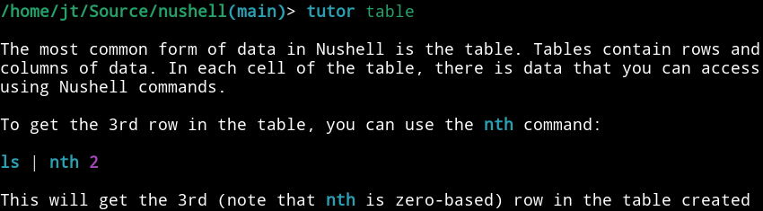

# Nushell 0.36

Nushell, or Nu for short, is a new shell that takes a modern, structured approach to your commandline. It works seamlessly with the data from your filesystem, operating system, and a growing number of file formats to make it easy to build powerful commandline pipelines.

Today, we're releasing 0.36 of Nu. This release fixes some long-standing issues with history, improves the help system, improves dataframes, and much more.

<!-- more -->

# Where to get it

Nu 0.36 is available as [pre-built binaries](https://github.com/nushell/nushell/releases/tag/0.36.0) or from [crates.io](https://crates.io/crates/nu). If you have Rust installed you can install it using `cargo install nu`.

If you want all the goodies, you can install `cargo install nu --features=extra`.

As part of this release, we also publish a set of plugins you can install and use with Nu. To install, use `cargo install nu_plugin_<plugin name>`.

# What's New

## Help now has search (fdncred)

You can now use `help -f <term>` and search the help for text. This can come in handy if you know roughly what you want but can't remember the name of the command:

```
> help -f string
────┬──────────────────────────┬────────────────────────────────────────────────┬─────────────
 #  │           name           │                     usage                      │ extra_usage
────┼──────────────────────────┼────────────────────────────────────────────────┼─────────────
  0 │ ansi strip               │ strip ansi escape sequences from string        │
  1 │ build-string             │ Builds a string from the arguments.            │
  2 │ dataframe concatenate    │ [Series] Concatenates strings with other array │
  3 │ dataframe contains       │ [Series] Checks if a pattern is contained in a │
    │                          │ string                                         │
  4 │ dataframe replace        │ [Series] Replace the leftmost (sub)string by a │
    │                          │ regex pattern                                  │
...
```

## Built-in tutor (jt)

In addition to the new help search, we've also started to build out a built-in Nushell tutorial. You can navigate by topic or search the help text for a string.



We've only added a few topics so far, but we hope to grow these topics (with your help) over the coming releases.

## New commands and features

- [`drop nth`](https://github.com/nushell/nushell/pull/3917) - drops the given rows (andrasio)
- [`PROMPT_STRING` environment variable](https://github.com/nushell/nushell/pull/3918) - configures the script to run to create the prompt directly from the environment (elferherrera)
- [`zip`](https://github.com/nushell/nushell/pull/3919) - combine two lists into one list of pairs (andrasio)

## Dataframe improvements (elferherrera)

- [datetime commands](https://github.com/nushell/nushell/pull/3894)
- [describe command](https://github.com/nushell/nushell/pull/3907)
- [rolling and cumulative commands](https://github.com/nushell/nushell/pull/3960)

## Important bugfixes (lily-mara, gwenn, jt)

A long-standing issue with history getting garbled when you have multiple shells open sending history updates is hopefully [now fixed](https://github.com/kkawakam/rustyline/pull/560). Thanks to the rustyline maintainers for helping find the root cause and creating a fix for it.

## Additional improvements

- waldyrious fixed [a typo](https://github.com/nushell/nushell/pull/3890), and fixed [issue templates](https://github.com/nushell/nushell/pull/3891)
- fdncred started a list of [projects that officially support Nushell](https://github.com/nushell/nushell/pull/3895)
- RealCundo added [PartialEq to ReturnValue](https://github.com/nushell/nushell/pull/3888)
- hedonihilist improved [how DirInfo calculates directory size](https://github.com/nushell/nushell/pull/3902)
- soumil-07 [worked around a BigDecimal issue that broke `math floor`](https://github.com/nushell/nushell/pull/3905)
- jt added [`in` and `not-in` for strings](https://github.com/nushell/nushell/pull/3906), changed the [release build to focus on binary size](https://github.com/nushell/nushell/pull/3924)
- baoyachi [updated shadow-rs, which fixes some datetime issues and more](https://github.com/nushell/nushell/pull/3914)
- knottio added [trailing slash when completing symlinked directory](https://github.com/nushell/nushell/pull/3921)
- fdncred fixed [`fetch` to better follow redirects](https://github.com/nushell/nushell/pull/3923), and improved the [issue template](https://github.com/nushell/nushell/pull/3962)
- filaretov fixed [unaliasing to only affect the current scope](https://github.com/nushell/nushell/pull/3936)
- kubouch fixed [an issue where `source` couldn't handle paths with emojis](https://github.com/nushell/nushell/pull/3939)

# Looking ahead

The ability to search help and improve a built-in tutorial gives us a lot of opportunities to make Nushell more user-friendly, especially to users who are just getting started learning what Nushell can do. If you're interested, these are some good places to [jump in and help](https://github.com/nushell/nushell/blob/main/crates/nu-command/src/commands/core_commands/tutor.rs) if you have specific topics or areas of interest.

The projects we reported on last time, engine-q and reedline, are steadily improving. We're currently working through any remaining issues so that we can begin experimenting with integrating them into Nushell.
