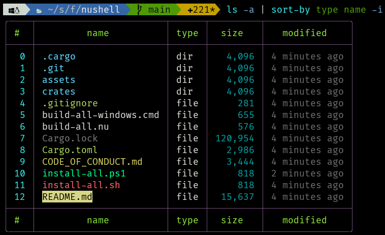
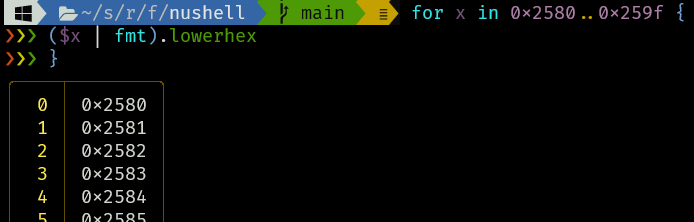
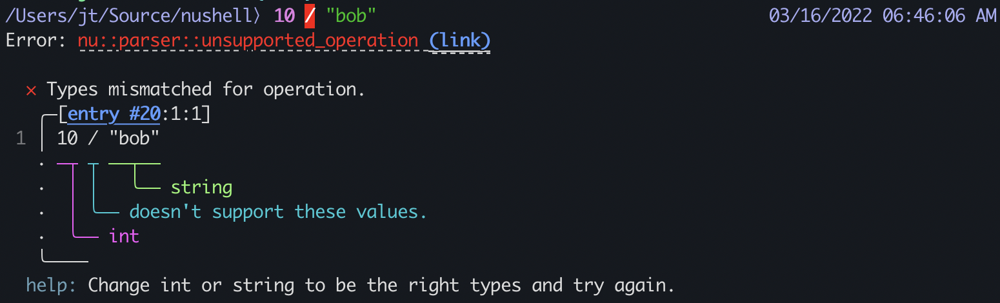

# Nushell 0.60

Nushell, or Nu for short, is a new shell that takes a modern, structured approach to your commandline. It works seamlessly with the data from your filesystem, operating system, and a growing number of file formats to make it easy to build powerful commandline pipelines.

Today, we're releasing a beta release of 0.60 of Nu. This is an enormous release, with lots of changes across all aspects of Nushell.

<!-- more -->

# Where to get it

Nu 0.60 is available as [pre-built binaries](https://github.com/nushell/nushell/releases/tag/0.60.0) or from [crates.io](https://crates.io/crates/nu). If you have Rust installed you can install it using `cargo install nu`.

If you want all the built-in goodies, you can install `cargo install nu --all-features`.

As part of this release, we also publish a set of optional plugins you can install and use with Nu. To install, use `cargo install nu_plugin_<plugin name>`.

# Party! 🥳

It's here! 🎉🎉

We're excited to announce the first full release of Nushell using the new engine, new line editor, and so much more!

# Jumping versions

The first thing you'll notice is that we're jumping from version 0.44 to 0.60. This is on purpose, you didn't miss anything!

Because of the number of changes, and the number of breaking changes, we wanted to let everyone know how much had changed by also making a big jump in the version number. Previous scripts will need to be updated, and you'll need to learn some of the new ways of doing things in Nushell to get back to your same level of comfort.

Let's talk about the features new in this release.

# Custom completions


Let's start with Nushell's most-requested feature: custom completions. The long-awaited, long-requested feature of having nice completions is finally here. With 0.60, you'll be able to write scripts that help you complete parameters and flag values. Let's take a look at an example. When you create a new config, you'll see this section:

```
# This is a simplified version of completions for git branches and git remotes
def "nu-complete git branches" [] {
  ^git branch | lines | each { |line| $line | str find-replace '\* ' '' | str trim }
}

def "nu-complete git remotes" [] {
  ^git remote | lines | each { |line| $line | str trim }
}
```

To call these function at the right time, we need to tell Nushell which parameter can complete with them.

```
extern "git checkout" [
  branch?: string@"nu-complete git branches" # name of the branch to checkout
  -b: string                                 # create and checkout a new branch
  -B: string                                 # create/reset and checkout a branch
  # note: other parameters removed for brevity
]
```

The new `extern` command allows you to describe all the type information for an external command to Nushell. With this, it can perform error checking, completions, syntax highlighting, and more.

You may also notice the `@` followed by the name of the completion function. This tells the completer what command to call to get a list of completions to use in that position, and you can down-select from these.

We've already seen early adopters starting to write their own completions for other commands, and are excited to see what people will do.

# A new config file

With 0.60, we've moved away from the .toml style of config to a config built from a Nushell script. We've found this to be both more intuitive and much easier to work with.

When you first start up Nushell, you'll be asked if you'd like to create a default config file. This is a great way to see the new defaults and to change them to meet your needs. You'll also see some examples in how to modify the stylings, prompt, keybindings, and external completions.


# Table improvements



Tables can now be configured to show a footer with the column names.

Nushell now also respects your `LS_COLORS` environment variable if set. If it's not set, Nushell will provide a default 8-bit setting so people with color terminal can see file types in different colors as seen below in the following screenshots.

With 0.60, you can also pipe `ls` and other table-creating commands through a pager, like: `ls | less`. Nushell by default will strip the ANSI colors, letting you look at the data with most pagers.

# Language improvements

There's quite a list of changes to the language itself. Let's talk about each one to help you transition to the new Nushell:

## Escape characters in strings

With 0.60, Nushell now divides strings into two types: strings with escape characters and strings without. The escaping case is written with double-quotes (`"`) and the non-escaping case is written with single-quotes (`'`):

```
> "hello\world"
hello
world
> 'hello\nworld'
hello\nworld
```

Nushell will prefer the single-quotes for things like path names that include spaces, allowing you to naturally write paths for Windows as well.

The difference in double-quoted and single-quoted strings also extends to interpolated strings (`$""` and `$''`):

```
> let x = 100
> $"value is:\n($x)"
value is:
100
> $'value is:\n($x)'
value is:\n100
```

## New value forms

The 0.60 release also brings with it a number of new value forms.

### Records

You now can write a record, or a list of key/value pairs, as a native data type in Nushell:

```
> {name: "Bob", age: 10}
╭──────┬─────╮
│ name │ Bob │
│ age  │ 10  │
╰──────┴─────╯
```

### Table as a list of records

With the introduction of records, a second way to define a table is a list (or stream) of records:

```
> seq 3 | each { |x| { name: Bob, x: $x } }
  #   name   x
────────────────
  0   Bob    1
  1   Bob    2
  2   Bob    3
```

### Integers are now signed 64-bit integers

We're moving away from the 'bigint' style of integers, so now integers are always signed 64-bit ints.

### Decimals are now signed 64-bit floats

Likewise, we're moving away from 'bigdecimal' to signed 64-bit float values.

### Dates

Earlier versions of Nushell supported dates as a value type, but they lacked a way to write them. You can now write a date literal in one of three ways:

```
# As a date
> 2022-02-02

# As a date and time, assuming UTC
> 2022-02-23T19:47:47

# As a date and time, with a timezone
2022-02-23T19:47:47.888239621-05:00
```

These come from the [RFC 3339](https://datatracker.ietf.org/doc/html/rfc3339) standard for datetime formats.

### Binary data

Like dates, earlier versions of Nushell also supported binary data but there was no way to write a binary data literal. You're now able to write them using the `0x[...]` form:

```
> 0x[11 ff]
Length: 2 (0x2) bytes | printable whitespace ascii_other non_ascii
00000000:   11 ff                                                •×
```

Spaces and commas are optional in this form, letting you separate write them however is best for readability.

### Custom values

Another form we'll be talking about more as it grows is the "custom value" form. These are value types that you can extend the current set with by implementing a trait in Rust and registering the type.

The dataframe support in 0.60 uses this feature.

## if, meet else

We've improved the syntax of Nushell in a few key places. Previously, in 0.44 you'd write:

```
> if $x < 3 { echo "true!" } { echo "false" }
```

This not only felt inelegant, but was prone to errors as people would want to leave off the second block when they didn't need it or just naturally want to type `else`.

This led to a new concept in Nushell: the keyword shape. Shapes in Nushell are a way for commands to tell the parser what the shape of their parameters are. In turn, the parser will use this knowledge to parse the arguments before they're given to the command (and also to do completions and early errors). With this, `else` is now one of the new keyword shapes, allowing it to take an expression that follows.

Taken together, in 0.60 we can now not only write the above like this:

```
if $x < 3 {
  echo $true
} else {
  echo $false
}
```

We can also string together multiple if/else:

```
if $x < 3 {
  echo "less than three"
} else if $x < 10 {
  echo "less than ten
} else {
  echo "something else!"
}
```

## Shortcircuiting conditions

Boolean operators `&&` and `||` now will properly shortcircuit, only evaluating the right hand side if necessary.

## New built-in values

We're introducing `true` and `false` as builtin values. These represent their boolean values true and false respectively.

## Better binary data support

You can now use `get`, `skip`, and `first` on binary data to reach the bytes you'd like to work with. We're exploring extending this further so that it becomes easier to explore your binary data just like your text data.

## Structured environment

Inside of Nu, the environment can now hold any kind of structured value. For example, opening the `PATH` environment variable now might look like in macOS:

```
> $env.PATH
╭───┬─────────────────────────────────╮
│ 0 │ /opt/homebrew/opt/openssl@3/bin │
│ 1 │ /opt/homebrew/bin               │
│ 2 │ /opt/homebrew/sbin              │
│ 3 │ /usr/local/bin                  │
│ 4 │ /usr/bin                        │
│ 5 │ /bin                            │
│ 6 │ /usr/sbin                       │
│ 7 │ /sbin                           │
╰───┴─────────────────────────────────╯
```

This allows you to more easily add and update to the environment. For example, we can add a new entry to the PATH:

```
> let-env PATH = ($env.path | prepend '/my/path')
```

Environment variables that aren't strings can be converted to strings automatically using the new `ENV_CONVERSIONS` environment variable.

## Scoped `cd`

In this release, we're also moving to keeping the current directory in the environment as `$env.PWD`. This leads to a few interesting twists in the design. For one, this means that `cd` is now scoped to the block you're currently in.

```
> cd ./foo
./foo> do { cd ./bar }
./foo> 
```

This allows you to more easily loop over subdirectories without having to do the bookkeeping of remembering to change back to the previous directory:

```
> ls | where type == dir | each { cd $it.name; ls | length }
```

That said, it takes a little getting used to. It does mean that changing a directory in a traditional custom command won't work, as the `PWD` environment variable will reset after the call completes. To help with this, we're also introducing `def-env`, a way to work inside the caller's environment and not lose any environment changes made by the custom command:

```
> def-env my-cd [path] { 
  cd $path
}

> my-cd ./foo
./foo> 
```

## More consistent tables and cell paths

With this release, we've simplified the commands for working with tables. The two fundamental commands are now: `select` and `get`.

### `Select`-ing data

The `select` command allows you to keep the structure of what you're working on and reduce it to only the part you want. For example, just as before you can pass `select` to get a column:

```
> ls | select name
╭────┬───────────────────╮
│ #  │       name        │
├────┼───────────────────┤
│  0 │ CNAME             │
│  1 │ CONTRIBUTING.md   │
│  2 │ LICENSE           │
│  3 │ README.md         │
│  4 │ assets            │
│  5 │ blog              │
...
```

You can now also use `select` on rows, by passing in a row number:

```
> ls | select 1
╭───┬─────────────────┬──────┬───────┬────────────╮
│ # │      name       │ type │ size  │  modified  │
├───┼─────────────────┼──────┼───────┼────────────┤
│ 0 │ CONTRIBUTING.md │ file │ 389 B │ 2 days ago │
╰───┴─────────────────┴──────┴───────┴────────────╯
```

### `Get`-ing data

The other fundamental command for working with tables is `get`. Like `select`, `get` allows you to work with columns and rows in a table, or fields in a record. Unlike `select`, the `get` command extracts data out of the table and does not try to preserve its original form. This is helpful when you want to get at the cell data itself.

Via a column:

```
> ls | get name
╭────┬───────────────────╮
│  0 │ CNAME             │
│  1 │ CONTRIBUTING.md   │
│  2 │ LICENSE           │
│  3 │ README.md         │
│  4 │ assets            │
│  5 │ blog              │
...
```

Via a row:

```
> ls | get 1
╭──────────┬─────────────────╮
│ name     │ CONTRIBUTING.md │
│ type     │ file            │
│ size     │ 389 B           │
│ modified │ 2 days ago      │
╰──────────┴─────────────────╯
```

You'll notice that getting rows out of a table with columns gives you back a record. You can think of a table as a list of records.

You can combine working with rows and columns together into a "cell path", a way of reaching the data you want. If we only wanted to get the cell's data in row 1, column "size", we can do:

```
> ls | get size.1
```

## New pipeline syntax form

When writing scripts in Nushell, often folks want to be able to build up a pipeline and line up all the pipes on the left. This is now supported in scripts:

```
ls
| where size > 10kb
| length
```


## Default params

A common request as more people tried Nushell was "can we have default values for parameters". Thanks to the work on the new parser, we can!

Now, you're able to set a default value for any optional parameter in your command:

```
def add-maybe-hundred [x:int, y = 100] {
  $x + $y
}

let twelve_squared = add-maybe-hundred 44
```

Default values also work for flag parameters.

## Stdout, stderr, and exit codes

In previous versions of Nushell, you generally had easy access to the stdout of an external command. You could run it, and then create a pipe and work with its output. If you wanted to work with stderr or get its exit code, you didn't have an easy way to do it.

With 0.60, we've introduced the `complete` command. Running an external command and then pipeline it to `complete` runs the external to completion and then gives you the stdout, stderr, and exit code of that external.

```
> cat CNAME | complete
╭───────────┬────────────────╮
│ stdout    │ www.nushell.sh │
│ stderr    │                │
│ exit_code │ 0              │
╰───────────┴────────────────╯
```

You can also access the last exit code via `$env.LAST_EXIT_CODE`.

## Modules

With 0.60, you're now able to create your own modules, allowing you to grow to larger projects with clean interfaces between files. A module can be written either using the `module` keyword:

```
module greetings {
  export def greet [] {
    print "hello!"
  }
}

use greetings greet
greet
```

You can also make modules from whole files. We can rewrite the above using a separate file:

```
# greetings.nu
export def greet [] {
  print "hello!"
}

# main.nu
use greetings.nu greet
greet
```

Modules allow you to `export` custom commands and environment variables to be used in other places.

## Make your own errors

You can also create your own error messages in your custom commands and send these back to the user if they call your command in the wrong way. For example, let's say you wanted to require that the user pass in a value between 1 and 10:

```
> def one-to-ten [x: int] {
    let span = (metadata $x).span
    if $x > 10 || $x < 1 {
      error make {
        msg: "Value not between 1 and 10",
        label: {
          text: "expected a value between 1 and 10",
          start: $span.start,
          end: $span.end
        }
      }
    } else {
      $"passed ($x)"
    }
  }
> one-to-ten 6
passed 6
> one-to-ten 21
Error:
  × Value not between 1 and 10
   ╭─[entry #47:1:1]
 1 │ one-to-ten 21
   ·            ─┬
   ·             ╰── expected a value between 1 and 10
   ╰────
```

## New commands

To accompany the new functionality in the language, we've also added a number of new commands.

| category     | command                                         |
| ------------ | ----------------------------------------------- |
| conversions  | `into bool`, `into datetime`, `into decimal`, `into duration`                 |
| core         | `def-env`, `error make`, `export def env`, `export def`, `export env`, `export`, `env`, `extern`, `hide`, `metadata`, `module`, `register`, `use`, `view-source` |
| filters      | `columns`, `group`, `par-each`, `transpose`, `window`, `roll`, `roll down`, `roll left`, `roll right`, `upsert`    |
| formats      | `from nuon`, `to nuon`                                            |
| plugins      | `gstat`                                           |
| strings      | `decode`, `nu-highlight`, `print`, `fmt`                     |
| system       | `complete`, `input`, `keybindings`,  `keybindings default`, `keybindings list`, `keybindings listen`|
| viewers      | `grid`                                            |


# Shell improvements

## Bang bang and more

You can now use `!!` to run the previous command, or `!` followed by the row number in the `history` you'd like to run again.

We're working to bring the [book up to date](https://www.nushell.sh/book/), and it's a good place to find explanations of these improvements. Be sure to also look at the [updated command documentation](https://www.nushell.sh/book/command_reference.html) for more information on the updated commands.

## Better multiline editing



With the switch to reedline, you can also get better feedback when working on multiline edits. For example, moving to the next line, you'll now see `:::` by default preceding the extended input:

```
> do {
::: echo "hello"
::: echo "world"
::: }
hello
world
```

You can configure the `:::` default value by setting the `PROMPT_MULTILINE_INDICATOR` environment variable. For example, the above screenshot uses ANSI to give it a bit of flare.

## Grid output

Nushell also now has a more compact `ls` representation you can use called `grid`.


## Miette

We're moving to a new error reporter called [miette](https://github.com/zkat/miette). It's an attractive way of showing errors back while you're working in the REPL or on scripts.




# Reedline

Nushell has changed its line editor and now it uses [Reedline](https://github.com/nushell/reedline). This new line
editor allows for improvements and added functionality to the already awesome Nushell experience. Some of the
new improvements are:

## Completions menus


Do you want to search for commands using a menu? Nushell has you covered.
Press tab and a completion menu will appear with options for you to select. Based on the context different
options will be available to you

## History menu


Your shell history can be easily accessed as well via menus. Using ctrl-x, you can search for a
history item or you could just simply navigate the menu until you find what you are looking for.

You can also use the history menu to compose a pipe with smaller pipes you have used before.


## New Keybindings

Now you can define complex keybindings for nushell. For example, say you have changed your config file and
want to reload it in your nushell session. You can create a special keybinding to help reload your config file:

```
{
    name: reload_config
    modifier: none
    keycode: f5
    mode: emacs
    event: {
      send: executehostcommand,
      cmd: $"source '($nu.config-path)'"
    }
}
```

with this keybinding every time you press F5 your config file is sourced and ready to go. Neat!

# Introducing 'nuon'

As the syntax for Nushell has continued to grow and evolve, we noticed that writing data in Nushell was kinda fun. The more we played with it, the more the idea grew that we could create a data file format using the Nushell syntax for data. Thus, 'nuon' was born. With it, we now include `from nuon` and `to nuon` to help you work with the new .nuon files.

Nuon is a superset of JSON, allowing you to pass JSON files and parse them as Nuon. Additionally, Nuon supports the data forms from Nushell, including compact tables, durations, filesizes, and more.

```
# sample.nuon
[
    # The nuon compact table format
    [[a, nuon, table]; [1, 2, 3], [4, 5, 6]],

    # A filesize
    100kib,

    # A duration
    100sec,

    # A date
    2022-01-11,

    # A boolean
    true,

    # A record
    {name: "Bobby", age: 99},

    # Binary data
    0x[11, ff, ee, 1f]
]
```

Nuon is still experimental, but we're already enjoying using it and are eager to continue to improve on it.

# Smaller release size

The 0.60 release is significantly smaller than the previous 0.44 release. 

| release file for 0.44.0 | size    |
| ----------------------- | ------- |
| nu_0_44_0_linux.tar.gz  | 103 MB  |
| nu_0_44_0_macOS.zip     | 79.7 MB |
| nu_0_44_0_windows.msi   | 55.5 MB |
| nu_0_44_0_windows.zip   | 57.9 MB |

| release file for 0.60.0 | size    |
| ----------------------- | ------- |
| nu_0_60_0_linux.tar.gz  | 14.8 MB |
| nu_0_60_0_macOS.zip     | 12.9 MB |
| nu_0_60_0_windows.msi   | 10.1 MB |
| nu_0_60_0_windows.zip   | 10.1 MB |

# New Engine

Nicknamed "engine-q", the new engine grew from being a rewrite of parsing and evaluation logic into a full rewrite of Nushell itself. Done over 8 months, the final result has many improvements over the 0.44 engine.

## The new delta system

One powerful new aspect of the new engine is its delta system. Deltas, or change sets, let the engine stay immutable except at key phase shifts. For Nushell, after the user has hit enter in the repl, it will phase shift into parsing, then take a delta of what was given by the user. This delta may contain new definitions, new variables, new modules and more. This delta is merged into the permanent state inside of the engine. After this, the engine returns to being immutable as evaluation begins.

These discrete phase shifts make it possible to limit what mutates while maintaining flexibility, including the ability for users to write parallel code against the engine at any point of evaluation.

Mutation during evaluation isn't removed, instead it's isolated to the stack.

## Stacks, the site of change

For evaluation, stacks are now the site of change in the engine. Stacks are represented as vectors that are passed around during evaluation. They include changes to the environment, newly shadowed variables, and more.

## Closing over variables

Another important aspect of the engine and the new uses of stacks is an increased focus on correctness for how blocks work with stacks. In 0.60, we've eliminated many bugs related to variables scopes, where sometimes variables would "leak" from one scope to the next. Now, a "snapshot" of a variable's value is captured when the block is taken as a value in the system. This allows us easy access to run the block later and always have the correct state to run it with.

## Spans for better errors

Another important area of correctness we wanted to fix from previous versions of Nushell was error spans. Prior Nushell versions struggled with a very common pattern: errors that happen in code that isn't the code you just typed. For example, aliases that failed, calls to custom commands that were previously defined, and more.

In 0.60, along with keeping around code that's still available for the user to call, we also keep around the original span information and original source. This allows us to give better errors for the cases where the error refers to code that's not the current line.

## Bind once, run anywhere

While improving the parser and engine, we also improved how the two connected to each other. One piece of this was "binding", that is, how definition sites and use sites connect to one another.

In the new engine, we use unique identifiers for all forms of definition in the engine, including variables, declarations, aliases, modules and more. During parse time, we bind the use we see against the definition in scope, and replace the use with a reference to the ID we found. With this, we can later safely export or pass the containing block without losing track of what the original code meant.

## Faster than ever before

The new engine's data representation is also quite a bit lighter than before. This allows us to evaluate scripts with less overhead. Early results are already quite positive:

| 1 million iteration tight loop | timing |
|--------------------------------|--------|
| 0.44 | 626ms |
| 0.60 | 239ms |

| Gradient drawing benchmark | timing |
|----------------------------|--------|
| 0.44 | 168ms |
| 0.60 | 78ms |

## Going parallel

The new engine has a fun trick up it's sleeve: you can effortlessly convert your scripts to run in parallel by changing `each` calls to `par-each`.

For example, if we had a script that opened files that fit a certain pattern and counted their number of lines:

```
ls **/*.rs | each { |it|
  let num_lines = (open $it.name | lines | length)
  {name: $it.name, loc: $num_lines}
}
```

We can turn this into a script that runs in parallel by changing the `each` to `par-each`:

```
ls **/*.rs | par-each { |it|
  let num_lines = (open $it.name | lines | length)
  {name: $it.name, loc: $num_lines}
}
```


| Line counter script | timing |
|---------------------|--------|
| `each` | 683ms |
| `par-each` | 447ms |

While further improvements are possible, it's nice to know we can get such a speedup with a four character change to our script.

# New plugin architecture

Rather that scanning for all new plugins on startup like we did with 0.44 (and taking ages to start Nu), the new `register` command stores the
location and signature of your plugins, making it easier to load at start up.

```
> register -e capnp ~/.cargo/bin/nu_plugin_extra_query
```

Also, the new plugin architecture is now multi-protocol, allowing you to pick the right protocol for your plugin. We currently support json and capnp.

By the way, you are not limited to write plugins in Rust. You can even create a python script and use it as a Nushell plugin. You only need to
specify what command should be used to run the plugin

```
> register -e json -s python ~/my_plugins/plugin.py
```

# Breaking changes

There are quite a number of breaking changes as we fixed design flaws, cleaned up the design, and rethought how commands should work.

| Nushell 0.44 | Nushell 0.60 |
| - | - |
| if { } { } | if { } else { } |
| str trim -rc (char nl) | str trim -r -c (char nl) |
| config.toml | config.nu (find location with `$nu.config-path`) |
| let-env FOO = $nothing | hide $FOO |
| $nu.home-dir | $nu.home-path |
| $nu.temp-dir | $nu.temp-path |
| config commands | $config |
| `$nu.env` | `$nu.env` is now `$env` |
| $nu.path | `$env.PATH`/`$env.Path` <- can do more in config.nu |
| $nu.lang | $nu.scope.commands |
| str to-int | into int|
| `$nu.env.PROMPT_COMMAND` is a string | `$env.PROMPT_COMMAND` is a block or a string |
| get (has auto flatten) | get doesn't auto flatten |
| to json | to json is formatted as 'pretty' |
| environment variable is a string | environment variable can be any value |
| `tags` | `tags` is now `metadata` |
| bigint/bigdecimal | engine-q uses machine i64 and f64 |
| File, Dir in `ls` | file, dir in `ls` |
| binaryview | binaryview has been removed (it may be an optional plugin in the future) |
| textview | textview is removed. Install `bat` to view source files, or pipe the output into `less` |
| dataframe | dfr |
| shells: `active`, `name`, `path` columns| shells: `active`, `path` columns |
| `cd` is now scoped  | current directory now comes from `PWD` in `$env`. Changing directory in a block or custom command no longer changes the caller's directory. To do this, return a table that the caller can use to update their env |
| char branch, char segment| char nf-branch, char nf-segment (`char`s that start with `nf-` are from nerdfont fonts) |
| wasm supported | wasm support currently not started |
| `enter <filename>` | engine-q only supports entering directories |
| str to-decimal | into decimal |
| `pivot` | renamed to `transpose` |
| `term size -w -t` | `term size -c -r` |
| selector | query web |
| xpath | query xml |
| config directory name: `nu` | config directory name: `nushell` |
| `nth 1` | `select 1`, `select` can now down-select rows as well as columns |
| match | match command is now integrated into the find command |
| `each group` | `each` and `group` are now separate |
| `each window` | `each` and `windows` are now separate |

You can find out more on [the full breaking changes list](https://github.com/nushell/nushell/issues/4305).

# Acknowledgements

A big "thank you!" to everyone who helped us build this version of Nushell!

```
╭────┬─────────────────────────────────╮
│  0 │ Access                          │
│  1 │ adamijak                        │
│  2 │ ahkrr                           │
│  3 │ ammkrn                          │
│  4 │ Andrew                          │
│  5 │ Andrew Barnes                   │
│  6 │ Andrés N. Robalino              │
│  7 │ Antonio Natilla                 │
│  8 │ Arthur                          │
│  9 │ Arthur Targaryen                │
│ 10 │ Ashish Thapa                    │
│ 11 │ Basile Henry                    │
│ 12 │ Benoît Cortier                  │
│ 13 │ Chris Gillespie                 │
│ 14 │ crozbo                          │
│ 15 │ Daniel Reilly                   │
│ 16 │ Darren Schroeder                │
│ 17 │ David Lattimore                 │
│ 18 │ DawnMagnet                      │
│ 19 │ dependabot[bot]                 │
│ 20 │ dgalbraith                      │
│ 21 │ Dheepak Krishnamurthy           │
│ 22 │ Ebuka Agbanyim                  │
│ 23 │ eggcaker                        │
│ 24 │ Eli Flanagan                    │
│ 25 │ Fernando Herrera                │
│ 26 │ Gabriel B Gutierrez             │
│ 27 │ Gabriel Borges Gutierrez        │
│ 28 │ Genna Wingert                   │
│ 29 │ Guillermo Lella                 │
│ 30 │ Hilmar Gústafsson               │
│ 31 │ hustcer                         │
│ 32 │ jacremer                        │
│ 33 │ Jae-Heon Ji                     │
│ 34 │ jaeheonji                       │
│ 35 │ Jakub Žádník                    │
│ 36 │ Jason Hansen                    │
│ 37 │ Jonathan Moore                  │
│ 38 │ Joseph T. Lyons                 │
│ 39 │ Josh                            │
│ 40 │ JT                              │
│ 41 │ Julian Aichholz                 │
│ 42 │ Justin                          │
│ 43 │ Justin Ma                       │
│ 44 │ Kamil                           │
│ 45 │ Kat Marchán                     │
│ 46 │ Leo Kettmeir                    │
│ 47 │ LordMZTE                        │
│ 48 │ Luca Trevisani                  │
│ 49 │ Luccas Mateus                   │
│ 50 │ Luccas Mateus de Medeiros Gomes │
│ 51 │ Marco Zanrosso                  │
│ 52 │ Mariano Guerra                  │
│ 53 │ Matthew Auld                    │
│ 54 │ Maxim Zhiburt                   │
│ 55 │ Michael Angerman                │
│ 56 │ Michael Rutter                  │
│ 57 │ mzanrosso                       │
│ 58 │ nibon7                          │
│ 59 │ Niklas S                        │
│ 60 │ Niklas Schoellhorn              │
│ 61 │ onthebridgetonowhere            │
│ 62 │ Onur Şahin                      │
│ 63 │ panicbit                        │
│ 64 │ Ray Henry                       │
│ 65 │ Reilly Wood                     │
│ 66 │ Robert O'Shea                   │
│ 67 │ sebastian-xyz                   │
│ 68 │ Sherub Thakur                   │
│ 69 │ sholderbach                     │
│ 70 │ st155052                        │
│ 71 │ Stefan Holderbach               │
│ 72 │ Stefan Stanciulescu             │
│ 73 │ Tanishq Kancharla               │
│ 74 │ Tom Panton                      │
│ 75 │ Urgau                           │
│ 76 │ WindSoilder                     │
│ 77 │ xiuxiu62                        │
│ 78 │ Yutaro Ohno                     │
│ 79 │ ZetaNumbers                     │
│ 80 │ zkldi                           │
│ 81 │ Ștefan                          │
╰────┴─────────────────────────────────╯
```

# Looking ahead

With 0.60, we have a solid foundation to build on to reach 1.0. The cleaner architecture and improvements to the language will make way for future improvements, like pattern matching, tasks, and more.
