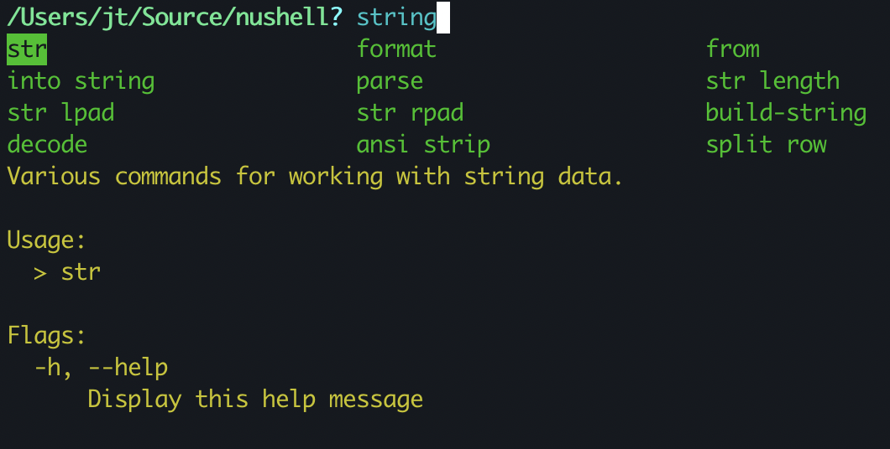
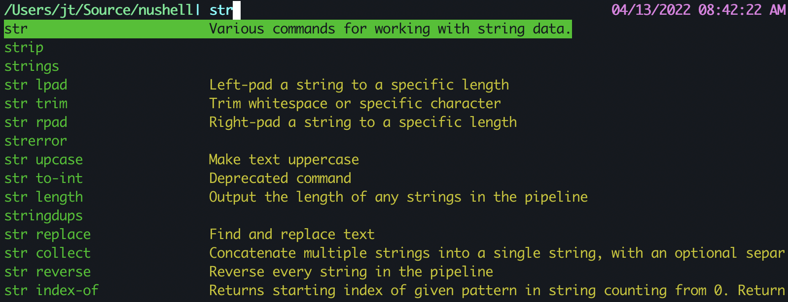

# Nushell 0.61

Nushell, or Nu for short, is a new shell that takes a modern, structured approach to your commandline. It works seamlessly with the data from your filesystem, operating system, and a growing number of file formats to make it easy to build powerful commandline pipelines.

Today, we're releasing version 0.61 of Nu. This release includes UI improvements, many bugfixes, improved glob support, and more.

<!-- more -->

# Where to get it

Nu 0.61 is available as [pre-built binaries](https://github.com/nushell/nushell/releases/tag/0.61.0) or from [crates.io](https://crates.io/crates/nu). If you have Rust installed you can install it using `cargo install nu`.

If you want all the built-in goodies, you can install `cargo install nu --all-features`.

As part of this release, we also publish a set of optional plugins you can install and use with Nu. To install, use `cargo install nu_plugin_<plugin name>`.

# Help Menu (elferherrera)

In 0.61, you can now use `<ctrl+q>` to ask a question/query in Nushell. Currently, this will search through the commands and show you commands that mention the word you type.

Tab lets you move between the available commands.

You can use up/down to pick the example you'd like to use. Pressing enter will select the example and insert it into the input for you.

# Completion descriptions (elferherrera, fdncred, jt)

Completions now show you a description of the command you're completing, if it's available.

# Introducing 'env.nu' (kubouch)

Just as we added 'config.nu' with 0.60, we're now adding a new additional startup file called 'env.nu'. The job of this file is to set up the environment that you'll run Nushell in. As a result, you're able to set up important environment variables like `$env.NU_LIB_DIRS` before 'config.nu' begins to run, let you take full advantage of the new library directories you've configured.

# Features

* `input` can now [suppress output](https://github.com/nushell/nushell/pull/5017) (dev-msp)
* [Termux/Android target support for new engine](https://github.com/nushell/nushell/pull/4956) (dscottboggs)
* `open` can now use [`from ...` named custom commands](https://github.com/nushell/nushell/pull/5049) (neosam)
* New [`sort` command for easier sorting](https://github.com/nushell/nushell/pull/5054) (jt)
* `date to-record` for [working with structured dates](https://github.com/nushell/nushell/pull/5058) (jt)
* New [starts-with operator](https://github.com/nushell/nushell/pull/5061) (fdncred)
* Can now create [generic menus for repl interactions](https://github.com/nushell/nushell/pull/5085) (elferherrera)
* New [`glob` command for fancier globbing](https://github.com/nushell/nushell/pull/5087) (fdncred)
* [Unary `not` support](https://github.com/nushell/nushell/pull/5111) (jt)
* Startup and pre-prompt setup should now be [significantly faster](https://github.com/nushell/nushell/pull/5115) (jt)
* [`0b[...]` support for binary literals](https://github.com/nushell/nushell/pull/5149) (merkrafter)

# Improvements

* Parser improvements by uasi, jt, rgwood
* Error improvements by jmoore34, jt, rgwood
* Documentation updates by hustcer, vishalsodani, fdncred, futile, kubouch, stormasm, Hofer-Julian, herlon214, rgwood, michel-slm
* General code cleanliness fixes by stormasm, bowlofeggs, rgwood, sholderbach, fdncred, herlon214, elferherrera, boyvanduuren, jt
* Multiple improvements to known external commands (filaretov, jt)
* [Use recent miette](https://github.com/nushell/nushell/pull/5167) (zkat)
* [Improved logic to path expansion](https://github.com/nushell/nushell/pull/5153) (strega-nil-ms)
* [`ls` now outputs date in local time](https://github.com/nushell/nushell/pull/5141) (fdncred)
* [`$in` should now work in more places](https://github.com/nushell/nushell/pull/5137) (jt)
* [`each` now also pipes each item as input to the block](https://github.com/nushell/nushell/pull/5136) (jt)
* Add ability to [opt-in to normal strings in `str replace`](https://github.com/nushell/nushell/pull/5133) (fdncred)
* `touch` now [includes all common flags](https://github.com/nushell/nushell/pull/5119) (rybertm)
* `=~` and `!~` now [use regex](https://github.com/nushell/nushell/pull/5117) (rgwood)
* `describe` should now be [more precise](https://github.com/nushell/nushell/pull/5116)
* completions now [give priority to non-hidden folders](https://github.com/nushell/nushell/pull/5108) (herlon214)
* [plugins are now loaded for scripts and commands](https://github.com/nushell/nushell/pull/5105) (jt)
* [`input` now trims the newline](https://github.com/nushell/nushell/pull/5097) (rgwood)
* [regex `find` now works with records](https://github.com/nushell/nushell/pull/5100) (fdncred)
* Fixes to [`format` for non-basic datatypes](https://github.com/nushell/nushell/pull/5095) (rgwood)
* Added [raw string support via backticks](https://github.com/nushell/nushell/pull/5090) (jt)
* Switched to [levenshtein distance sorting for completions](https://github.com/nushell/nushell/pull/5001) (jt)
* Improvements to [line editor state handling](https://github.com/nushell/nushell/pull/5041) (sholderbach)
* Treat [prompt indicators as commands](https://github.com/nushell/nushell/pull/5026) (elferherrera)
* Added [record, list, and table to signature types](https://github.com/nushell/nushell/pull/5040) (kubouch)
* Improvements to [default git completions](https://github.com/nushell/nushell/pull/5016) (naufraghi)
* Prompts [can now be simple strings](https://github.com/nushell/nushell/pull/5052) (jt)
* Sets [LAST_EXIT_CODE on parse errors](https://github.com/nushell/nushell/pull/5084) (rgwood)
* Passed [more metadata through filter commands](https://github.com/nushell/nushell/pull/5009) (rrcwang)
* `last` now returns a [simple value for single items](https://github.com/nushell/nushell/pull/5060) (jt)
* Fixed [loops not terminating with ctrl-c](https://github.com/nushell/nushell/pull/5003) (jt)
* Added [bounded channels for backpressure](https://github.com/nushell/nushell/pull/4986) (b333z)
* Added [streaming support to `save`](https://github.com/nushell/nushell/pull/4985) (b333z)
* [Support for passing binary data into run-external](https://github.com/nushell/nushell/pull/4984) (b333z)
* [Fix for alias imports](https://github.com/nushell/nushell/pull/4968) (filaretov, jt)
* [Fix for `ls` when file is a socket on macOS](https://github.com/nushell/nushell/pull/4983) (fdncred)
* [Better tilde expansion](https://github.com/nushell/nushell/pull/4974) (filaretov)
* Added [keywords to help messages](https://github.com/nushell/nushell/pull/4978) (kubouch)
* Removed [is_private from `$nu.scope.commands`](https://github.com/nushell/nushell/pull/4979) (kubouch)
* [Fix for `path join` on streams](https://github.com/nushell/nushell/pull/4959) (jt)
* [Fixes to environment defaults](https://github.com/nushell/nushell/pull/4960) (jt)
* [Adding escapes to `to nuon`](https://github.com/nushell/nushell/pull/4964) (jt)
* Improvements to the [`reject` command](https://github.com/nushell/nushell/pull/4951) (jt)
* Fix to the [precedence parser](https://github.com/nushell/nushell/pull/4947) (jt)
* Calling out through `cmd.exe` [no longer uses AutoRun](https://github.com/nushell/nushell/pull/4903) (LebsterFace)

# Breaking changes

* [`str find-replace` is now `str replace`](https://github.com/nushell/nushell/pull/5120)
* [`keep` is now `take`](https://github.com/nushell/nushell/pull/5123)

# Looking ahead

The 0.61 release, despite slowing down a little to recoup from the 0.60 release, is one of our largest releases. We averaged over 7 PRs/day over the last three weeks, as many new people joined on and more took an interest in Nushell.

Areas of upcoming focus will be on improving dataframe support, adding IDE support, and exploring new ways of working with Nushell.
