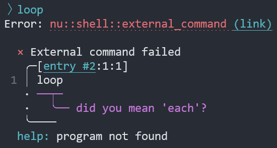

# Nushell 0.67

Nushell, or Nu for short, is a new shell that takes a modern, structured approach to your commandline. It works seamlessly with the data from your filesystem, operating system, and a growing number of file formats to make it easy to build powerful commandline pipelines.

Today, we're releasing version 0.67 of Nu. This is release includes a new variable naming convention, improvements to module imports and file sourcing, and more.

<!-- more -->

# Where to get it

Nu 0.67 is available as [pre-built binaries](https://github.com/nushell/nushell/releases/tag/0.67.0) or from [crates.io](https://crates.io/crates/nu). If you have Rust installed you can install it using `cargo install nu`.

If you want all the built-in goodies, you can install `cargo install nu --features=extra`.

As part of this release, we also publish a set of optional plugins you can install and use with Nu. To install, use `cargo install nu_plugin_<plugin name>`.

# Themes of this release

## We have a new welcome banner ([fdncred](https://github.com/nushell/nushell/pull/6163))

(screenshot here - figured this would be good at the front?)

## New variable naming convention ([jt](https://github.com/nushell/nushell/pull/6125))

**WARNING! Breaking change!**

In this release, we cleaned up some of the syntax parsing.
The major implication of it is that variable names can no longer contain `-` characters in it.
Make sure to rename your variables from `kebab-case` to `snake_case`.
This is true also for variables created from command flags.
For example, a `--foo-bar` flag in a command signature will be referenced by a `$foo_bar` variable.

## Custom values defined in plugins?

It was a part of 0.66 already but we can mention it here once the docs are updated. https://github.com/nushell/nushell/pull/6070

## Relative paths in scripts are file-relative ([kubouch](https://github.com/nushell/nushell/pull/6150))

When you use `source`, `use`, or `overlay add` with a relative path in a script or a module file, the path is assumed to be relative to the file, not the current working directory.

Example:

```
# script.nu

use foo.nu *  # foo.nu is assumed to be relative to script.nu
```

## Writing SQLite files

We added a fun way to create sqlite database files ([fdncred](https://github.com/nushell/nushell/pull/6266))

Previously nushell was limited to reading sqlite database files. Now we allow you to take tables or lists and create database files like `ls | into sqlite my_ls.db`. Currently this functionality works with regular tables output from commands, table literals like `[[col1 col2]; [a b] [c d]]` and lists like `[one 10mib 20sec 2 2.5]`.

## Shell integration

We worked with @Tyiar from the visual studio code team to get some of our shell integration right. ([fdncred]https://github.com/nushell/nushell/pull/6087)
Now nushell will display the little blue, red, gray indicators in the vscode terminal.

(maybe screenshot?)

## Windows `cmd.exe` changes

Breaking change: Nu no longer "shells out" to `cmd.exe` for any command that can't be found - only [a few known `cmd.exe` internal commands](https://github.com/rgwood/nushell/blob/00bace9e82d3f3e3e337c510ce6cef0818ade7aa/crates/nu-command/src/system/run_external.rs#L134). This change improves error handling and error messages, but let us know if it causes you any trouble.

## Error Messages



The error message when an external command is not found has been improved. Nu now displays fancy [`miette`](https://github.com/zkat/miette) errors on all platforms including Windows, and it offers helpful suggestions for typos and mistaken command names.

## Bits and Bytes

Nushell now has a full array for `bits` and `bytes` commands. The most recent of which are from @hustcer and @WindSoilder.

- [bits ror and bits rol](https://github.com/nushell/nushell/pull/6224)
- [bits shl and bits shr](https://github.com/nushell/nushell/pull/6202)
- [bits or and bits xor](https://github.com/nushell/nushell/pull/6190)
- [bits root command and bits and](https://github.com/nushell/nushell/pull/6188)
- [bits not](https://github.com/nushell/nushell/pull/6143)

## Hiding Environment Variables ([kubouch](https://github.com/nushell/nushell/pull/6313))

A new `hide-env` command is added that can hide environmnet variables in the current scope.
`hide` still retains this functionality, but in the future, we expect `hide` to be able to hide only parser definitions (commands and aliases).
It is therefore recommended to change your `hide` calls to `hide-env` when dealing with environment variables.

Unlike `hide`, `hide-env` has a slightly different signature: It accepts multiple arguments and the arguments can be constructed dynamically:
```
> load-env {
    ENV_FOO: 'foo'
    ENV_BAR: 'bar'
}

> let prefix = 'ENV_'

> hide-env ($prefix + 'FOO') ($prefix + 'BAR')
```

## Prefixed Overlays ([kubouch](https://github.com/nushell/nushell/pull/6301))

The `overlay add spam` command would take all commands and aliases from the module and put them directly into the current namespace.
Sometimes, however, you might want them behind a prefix.
That's what `--prefix` is for.
Here is an example:
```
> module spam { 
    export def foo [] { "foo" }
}

> overlay add --prefix spam

> spam foo
foo
```

## Customize Added Overlay Name ([kubouch](https://github.com/nushell/nushell/pull/6314))

You can now change the name of the added overlay using the new `as` keyword:
```
> module spam { export def foo [] { "foo" } }

> overlay add spam as eggs

> overlay list | last
eggs

> foo
foo

> overlay remove eggs
```

This can be useful if you have a generic script name, such as virtualenv's `activate.nu` but you want some more descriptive name for your overlay.

It is also compatible with the `--prefix` flag introduced above.

# Next Steps

Time for a new engine! 

We've been looking through the fixes we'd need for some of the issues we're seeing and decided Nushell's core needs a thorough refactor. On this page https://kubouch.notion.site/4db276462ba24704919edb4cc4b86be7?v=10506505557f4f7b9a65155128c04250 we started gathering ideas and design notes about features that we think should make it to the update. You can click the cards and they should expand into more detailed notes.

Many (most?) ideas are not polished yet and we need to work on the full design before we start the implementation. Therefore, we would like you to invite you to participate in the discussion. If you have questions, comments and ideas, please channel them todesign-discussion . We especially welcome thorough design writeups. You can even "adopt" a topic and specialize in it, if you wish. And of course, later, we'll need help implementing everything.

By the end of this, we'll be heading towards 0.80 which should have all, or most of, the features we want for 1.0 and the work from 0.80 to 1.0 is expected to be mostly polish, bugfixes, IDE integrations, stabilizing the language, etc.

Oh, and if you're scared this will turn into another engine-q, this time our goal is to try to make the updates incrementally instead of building a new Nushell on the side and then replacing everything.

# Full changelog

## Nushell

## Documentation

## Nu_Scripts

## reedline
