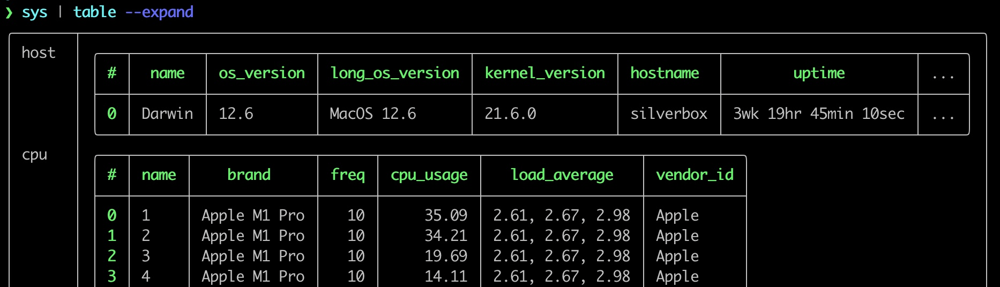

# Nushell 0.70

Nushell, or Nu for short, is a new shell that takes a modern, structured approach to your commandline. It works seamlessly with the data from your filesystem, operating system, and a growing number of file formats to make it easy to build powerful commandline pipelines.

Today, we're releasing version 0.70 of Nu. This release includes big improvements to table drawing and lots of overall polish.

<!-- more -->

# Where to get it

Nu 0.70 is available as [pre-built binaries](https://github.com/nushell/nushell/releases/tag/0.70.0) or from [crates.io](https://crates.io/crates/nu). If you have Rust installed you can install it using `cargo install nu`.

If you want all the built-in goodies, such as support for dataframes and SQLite databases, you can install it via `cargo install nu --features=extra`.

As part of this release, we also publish a set of optional plugins you can install and use with Nu. To install, use `cargo install nu_plugin_<plugin name>`.

# Themes of this release

## New table flags

 -  `--expand`: changes a standard table view; expand the table structure so internally all data will be displayed as inner tables
    
    #### **NOTICE**
    The `expand` mode can be considered generally slower than a base table view.
    So, if you have a large data set it may be slow.
    
 -  `--expand-deep {int}`: set a limit after which table enlargement is stopped
 -  `--flatten`: an `--expand` view option to return a set of values instead of table for a simple lists
 -  `--flatten-separator {char}`: a configuration of a separator for `--flatten`
 -  `--collapse`: changes a standard table view; expand the table structure in a squashed way
    
    #### **NOTICE**
    `collapse` mode currently doesn't support width control, therefore if your terminal is not wide enough the table might be broken.
    The `collapse` mode can be considered generally slower than a base table view.
    So, if you have a large data set it may be slow.

# Breaking changes

- The command `first 1` now returns a list with the single value rather than the value itself. This brings it in line with the behaviour of `last 1`.
- The dataframe command `with-sql` or `query dfr` has been renamed to `query df` for consistency.

# Next Steps

We're continuing to work on language updates and hope to have more information for you soon. If you'd like to become part of the effort, please [join the discord](https://discord.gg/NtAbbGn).

# Full changelog

## Nushell

- jt created [Fix let-env in banner](https://github.com/nushell/nushell/pull/6795), and [Allow auto-cd to work with backticks](https://github.com/nushell/nushell/pull/6728)
- sholderbach created [Pin reedline to the 0.13.0 release](https://github.com/nushell/nushell/pull/6789), and [Upgrade reedline to latest dev version](https://github.com/nushell/nushell/pull/6778), and [Backport fixes from nushell/nushell.github.io#633](https://github.com/nushell/nushell/pull/6712), and [Fix e.g. completion `git push --force-with-lease`](https://github.com/nushell/nushell/pull/6702)
- JEndler created [Update README.md](https://github.com/nushell/nushell/pull/6782)
- unrelentingtech created [Tolerate more tty acquisition failures in non-interactive mode, fixes #6719](https://github.com/nushell/nushell/pull/6779), and [Foreground process group management, again](https://github.com/nushell/nushell/pull/6584)
- dandavison created [Rename `query dfr` -> `query df`](https://github.com/nushell/nushell/pull/6777), and [Add documentation requirement to PR template](https://github.com/nushell/nushell/pull/6749), and [Remove unnecessary flags from `term size`](https://github.com/nushell/nushell/pull/6651)
- rjfc created [Add search terms to roll commands](https://github.com/nushell/nushell/pull/6761)
- fdncred created [add filesize_metric comment](https://github.com/nushell/nushell/pull/6760), and [add the ability to convert durations](https://github.com/nushell/nushell/pull/6723), and [add a new command to query the registry on windows](https://github.com/nushell/nushell/pull/6670), and [tweak the banner message and make the time more accurate](https://github.com/nushell/nushell/pull/6641), and [changed the way durations and filesizes are parsed](https://github.com/nushell/nushell/pull/6640), and [add better description to table_index_mode](https://github.com/nushell/nushell/pull/6637)
- Dorumin created [window --remainder](https://github.com/nushell/nushell/pull/6738), and [Remove unnecessary clone in window](https://github.com/nushell/nushell/pull/6729), and [Fix quadratic time complexity with large strides](https://github.com/nushell/nushell/pull/6727)
- howardjohn created [Delete out.log](https://github.com/nushell/nushell/pull/6731)
- merelymyself created [Improve erroring of `config nu` and `config env`](https://github.com/nushell/nushell/pull/6730), and [let `alias` list aliases](https://github.com/nushell/nushell/pull/6717), and [return gid and uid in numbers if name not found](https://github.com/nushell/nushell/pull/6684), and [Don't attempt to eval and trace if the repl line is empty](https://github.com/nushell/nushell/pull/6674), and [allow for `$in` to affect environment](https://github.com/nushell/nushell/pull/6649), and [ensure Operator::And errors out with incompatible types](https://github.com/nushell/nushell/pull/6638)
- HannahZhuSWE created [Add search terms to arg dataframe commands](https://github.com/nushell/nushell/pull/6724)
- Dylan987 created [Add search terms for export commands](https://github.com/nushell/nushell/pull/6722)
- zephaniahong created [Add search terms for uppercase](https://github.com/nushell/nushell/pull/6720)
- HoLLy-HaCKeR created [Fix invalid variable name in `input` command docs](https://github.com/nushell/nushell/pull/6716)
- WindSoilder created [avoid freeze when external command generates too much stdout output ](https://github.com/nushell/nushell/pull/6715), and [avoid freeze when capturing external stderr](https://github.com/nushell/nushell/pull/6700), and [avoid freeze for table print](https://github.com/nushell/nushell/pull/6688), and [Eval external command result immediately when using `do` command with `-c`](https://github.com/nushell/nushell/pull/6645), and [Make semicolon works better for internal commands](https://github.com/nushell/nushell/pull/6643)
- KyleRAnderson created [Filter out empty glob patterns to "glob" command](https://github.com/nushell/nushell/pull/6707)
- jake-albert created [Return error on `str replace` RegEx parse fail](https://github.com/nushell/nushell/pull/6695)
- bcmyers created [Upgrade num-format to 0.4.3](https://github.com/nushell/nushell/pull/6694)
- hustcer created [Update nushell version for release workflow](https://github.com/nushell/nushell/pull/6666)
- NotLebedev created [To nuon escapes](https://github.com/nushell/nushell/pull/6660)
- rsteube created [nu-cli: external completer precedence before file](https://github.com/nushell/nushell/pull/6652)
- Kangaxx-0 created [Fix issue 6596](https://github.com/nushell/nushell/pull/6603)
- zhiburt created [WIP/ Checkout to new `tabled`](https://github.com/nushell/nushell/pull/6286)

## Documentation

- WindSoilder created [Add note about subexpression with external commands](https://github.com/nushell/nushell.github.io/pull/641)
- zephaniahong created [Update working_with_lists.md](https://github.com/nushell/nushell.github.io/pull/638), and [Update working_with_lists.md](https://github.com/nushell/nushell.github.io/pull/637), and [Update working_with_strings.md](https://github.com/nushell/nushell.github.io/pull/636)
- HoLLy-HaCKeR created [Fix example variables using `-` in their name](https://github.com/nushell/nushell.github.io/pull/635)
- merelymyself created [add reference to semicolons, remove redundant `group` from types_of_data](https://github.com/nushell/nushell.github.io/pull/634), and [Update blog with breaking change: different behaviour for `first 1`](https://github.com/nushell/nushell.github.io/pull/615)
- ohno418 created [Fix a sample code on the "moving around" chapter](https://github.com/nushell/nushell.github.io/pull/632)
- sholderbach created [Mention the `--features extra` requirement in the text](https://github.com/nushell/nushell.github.io/pull/630)
- NotTheEconomist created [Update installation.md](https://github.com/nushell/nushell.github.io/pull/629)
- avkonst created [Make `foo` example for Groups parsable by nushell](https://github.com/nushell/nushell.github.io/pull/628)
- hustcer created [Update some styles and command doc generation script](https://github.com/nushell/nushell.github.io/pull/627), and [ci skip](https://github.com/nushell/nushell.github.io/pull/626), and [Merge docs with the same command name](https://github.com/nushell/nushell.github.io/pull/625), and [Refresh commands for v0.69](https://github.com/nushell/nushell.github.io/pull/616)
- hugosenari created [fix (plugins): python plugin url changed](https://github.com/nushell/nushell.github.io/pull/624)
- SUPERCILEX created [Add example of inline string concat](https://github.com/nushell/nushell.github.io/pull/621)
- dandavison created [Some copy editing of initial book sections ](https://github.com/nushell/nushell.github.io/pull/620)

## Nu_Scripts

- dandavison created [sockets command](https://github.com/nushell/nu_scripts/pull/306)
- eggcaker created [fix the PATH not working on windows](https://github.com/nushell/nu_scripts/pull/305)
- DWTW321 created [New custom completions for ani-cli, btm, glow & tealdeer](https://github.com/nushell/nu_scripts/pull/304)
- Yethal created [add update-path.nu](https://github.com/nushell/nu_scripts/pull/303)
- ehdevries created [Replace str collect with str join in panache-git](https://github.com/nushell/nu_scripts/pull/301)

## reedline

- sholderbach created [Fix completion example in README/lib.rs](https://github.com/nushell/reedline/pull/497), and [Fix examples in README based on lib.rs](https://github.com/nushell/reedline/pull/496), and [Prepare 0.13 release](https://github.com/nushell/reedline/pull/495)
- perlindgren created [examples updated](https://github.com/nushell/reedline/pull/493)
- tailhook created [Add `Submit` and `SubmitOrNewline` editor events](https://github.com/nushell/reedline/pull/490), and [Remove flicker on external print](https://github.com/nushell/reedline/pull/488)
