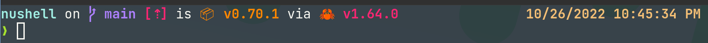
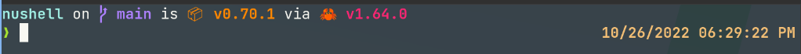

# Nushell 0.71

Nushell, or Nu for short, is a new shell that takes a modern, structured approach to your commandline. It works seamlessly with the data from your filesystem, operating system, and a growing number of file formats to make it easy to build powerful commandline pipelines.

Today, we're releasing version 0.71 of Nu. This release includes lots of overall polish.

<!-- more -->

# Where to get it

Nu 0.71 is available as [pre-built binaries](https://github.com/nushell/nushell/releases/tag/0.71.0) or from [crates.io](https://crates.io/crates/nu). If you have Rust installed you can install it using `cargo install nu`.

If you want all the built-in goodies, such as support for dataframes and SQLite databases, you can install it via `cargo install nu --features=extra`.

As part of this release, we also publish a set of optional plugins you can install and use with Nu. To install, use `cargo install nu_plugin_<plugin name>`.

# Themes of this release

## New `++` operator as a short-hand to append to lists (merelymyself)
https://github.com/nushell/nushell/pull/6766


## General consistency accross commands and types has improved:
### More iterating filter commands now support the `$in` variable consistently (webbedspace)
https://github.com/nushell/nushell/pull/6951
### `List`s finally support `upsert` (fdncred)
https://github.com/nushell/nushell/pull/6932
### `merge` can now also operate on records (webbedspace)
https://github.com/nushell/nushell/pull/6919
### `str substring` now also takes ranges (rgwood)
https://github.com/nushell/nushell/pull/6867

## The position of the right prompt can now be customized ([nibon7](https://github.com/nushell/nushell/pull/6781))

Previously the right prompt appeared only on the same line where the user input started. Now you can choose to place the right prompt part on the last line of user input.
This feature is not enabled by default, you can enable it using the `config nu` command to modify the config.nu file, just set `render_right_prompt_on_last_line` to true:

```
let-env config {
  render_right_prompt_on_last_line : true
  ...
}
```

* disabled



* enabled



## How nushell outputs values can now be customized via `display_output` hook (perbothner)
https://github.com/nushell/nushell/pull/6915


# Breaking changes

- New `--force (-f)` flag for the `mv` command. This change alters `mv` default behavior. By default overwriting existing files is now prevented (You can use `alias mv = mv -f` in you config to get the old defaults back). ([#6904](https://github.com/nushell/nushell/pull/6904))
- The column name for the command name in `$nu.scope.commands` has been changed from `command` to `name`. Thus, `$nu.scope.commands | where name =~ zip` would give you specific command info. ([#7007](https://github.com/nushell/nushell/pull/7007))
- The `str distance` command now directly returns an `Int` instead of a record `{"distance": <Int>}` ([#6963](https://github.com/nushell/nushell/pull/6963))
- The argument order of `format filesize` was made consistent with other commands that accept a `CellPath` to specify fields that should be affected by it. Now the string specifying the format is the first positional argument and the cell path is specified in the following positional argument(s). ([#6879]https://github.com/nushell/nushell/pull/6879)

- @dandavison completion defaults

# Next Steps

We're continuing to work on language updates and hope to have more information for you soon. If you'd like to become part of the effort, please [join the discord](https://discord.gg/NtAbbGn).

# Full changelog
