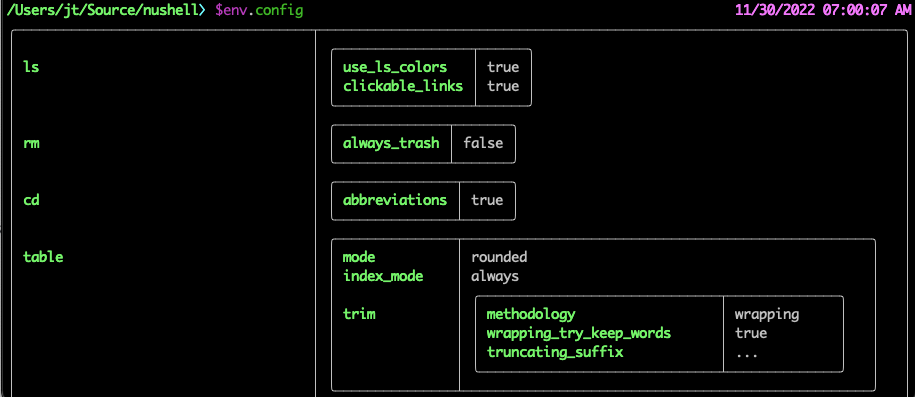

# Nushell 0.72

Nushell, or Nu for short, is a new shell that takes a modern, structured approach to your command line. It works seamlessly with the data from your filesystem, operating system, and a growing number of file formats to make it easy to build powerful command line pipelines.

Today, we're releasing version 0.72 of Nu. This release includes many new features: mutability, looping, early returns, changes to the core commands, and much more.

<!-- more -->

# Where to get it

Nu 0.72 is available as [pre-built binaries](https://github.com/nushell/nushell/releases/tag/0.72.0) or from [crates.io](https://crates.io/crates/nu). If you have Rust installed you can install it using `cargo install nu`.

NOTE: as part of this release, we are no longer including additional features in `--features=extra`. With 0.72, SQLite features have moved into the main Nushell installation and dataframe functionality is now part of `--features=dataframe`.

As part of this release, we also publish a set of optional plugins you can install and use with Nu. To install, use `cargo install nu_plugin_<plugin name>`.

# Themes of this release / New features

## Try/catch

Starting with 0.72, it's now much easier to run a command that might fail and then handle the failure if it happens.

```
try {
    1 / 0
} catch {
    print "look, no crash"
}
```

The `catch` part of the `try/catch` is optional. Without it, the `try` block will run, and any error that occurs will be ignored.

You can also access the error, if one happens, using a closure syntax:

```
try {
    1 / 0
} catch {|e|
    print "look, no crash."
    print $e
}
```

## Auto-expanding data views



With the new default config, we now also detect the terminal width and will automatically expand the data view to include more information if it's available.

This uses an improved expanding data view capability from 0.70.

## Redirection

This release also includes a new way of redirecting the stdout and/or stderr of external commands. This gives easier access to the output streams than was previously possible.

```
> cat foo.txt out> bar.txt
```

```
> cat missingfilename.txt err> my_error.txt
```

You can also create a stream built from the above, allowing one stream to empty and then be followed by the other stream:

```
> git status out+err> git_status.txt
```

## Closures/blocks

We have now split closures and blocks into two separate value types. A closure can have parameters, can close over variables outside of its scope, and can be passed as a value.

An example closure:

```
ls | each {|| print $it.name }
```

You can also think of creating a custom command like `def foo [] { ... }` as creating a closure.

A block is much simpler and is used as the bottom of commands like `if` and loops.

An example block:

```
if true {
    print "hello!"
}
```

Blocks don't close over (or capture) variables, don't have parameters, and can't be passed as a value. Blocks, however, do have one special trick...

## Mutation

Starting in this release, you can create local mutable variables. You can create mutable variables using the `mut` keyword:

```
mut x = 1
$x = $x + 100
print $x
```

A mutable variable can only live and change in the closure in which it's created. Blocks, however, have access to the mutable variables in the parent closure. For example, mutating a variable inside of the block used in an `if` call is valid:

```
mut x = 1
if true {
    $x += 1000
}
print $x
```

## Loop/while

The 0.72 release also includes a few new looping commands: `loop` and `while`.

The `loop` command runs a block forever:

```
loop {
    print "hit ctrl-c to break out of this example"
}
```

The `while` command will run its block as long as a condition is met:

```
mut x = 0
while $x < 10 {
    print $x
    $x += 1
}
```

## Break/continue

Loops can now also use the `break` and `continue` feature common in many programming languages. `break` will break out of the current loop. And `continue` will continue the loop at the next iteration.

## Return

The 0.72 release also includes the ability to return early from a closure or command.

```
def foo [x] {
    if $x > 10 {
        return 1000
    }
    0
}
```

## Command refinement, simplification, and elimination

This release contains many breaking changes to Nu's built-in commands (sorry!). As we move toward version 1.0 we want to ensure that Nu ships with a small curated set of consistent, well-designed "standard library" commands. This requires taking a hard look at existing commands, and in some cases breaking changes are unavoidable. We expect that this effort will span a few release cycles.

## Dataframes no longer included by default - smaller binaries

Nu's dataframe support is extensive, impressive, and very useful to users who rely on it. However, it comes at a high cost in terms of compile time, binary size, and complexity. Starting with version 0.72, dataframe commands are no longer included in the release binaries published on GitHub or the default binaries published via package managers (like Homebrew, winget, Scoop). As a result of this change, the main Nu executable is now about 50% smaller.

To continue using dataframe commands, you can build Nu from source using the `dataframe` [Cargo feature](https://doc.rust-lang.org/cargo/reference/features.html). For example, to install using Cargo: `cargo install nu --features=dataframe`

## Allow reloading overlay definitions ([kubouch](https://github.com/nushell/nushell/pull/7231))

A common pattern in using overlays is shadowing an existing environment variable, such as PROMPT_COMMAND. However, `overlay use` would keep loading the value from the first activation. It is best explained with an example. Assume the following module:

```
module prompt {
    export-env {
        let-env PROMPT_COMMAND = (date now | into string)
    }
}
```

Calling `overlay use prompt` for the first time changes the prompt to the current time, however, subsequent calls to `overlay use` won't change the time. That's because overlays, once activated, store their state so they can be hidden and restored at later time. To force-reload the environment, we added a new `--reload` flag: Calling `overlay use --reload prompt` repeatedly now updates the prompt with the current time each time.

## virtualenv activation changes ([kubouch](https://github.com/pypa/virtualenv/pull/2422))

Since the verion 20.17.0 of [virtualenv](https://github.com/pypa/virtualenv), the new way to activate an environment is to call `overlay use activate.nu` instead of the `source activate.nu`. This change is in line with gradual deprecation of `source` and moving us towards using modules as overlays in more cases. Please, check the [activation script itself](https://github.com/pypa/virtualenv/blob/main/src/virtualenv/activation/nushell/activate.nu) for more details.

# Breaking changes

- As mentioned above, dataframe support has been removed from the default Nu binaries.
- [Nu's SQLite DSL commands have been removed](https://github.com/nushell/nushell/pull/7040). `open foo.db` and `open foo.db | query db "SELECT * ..."` still work, but the commands which mapped 1-to-1 with SQL clauses (ex: `open foo.db | into db | select * | from table some_table | order-by some_column`) have been removed. These commands were an interesting experiment but they didn't work out, and we're removing them to simplify database access in Nu.
- [The `is_plugin`, `is_custom`, and `is_keyword` columns in `help commands` have been replaced with a single `command_type` column.](https://github.com/nushell/nushell/pull/7052)
- [`date format` now returns an error if not given an input.](https://github.com/nushell/nushell/pull/7043) Previously it would default to the current time.
- [`first`](https://github.com/nushell/nushell/pull/7186) and [`last`](https://github.com/nushell/nushell/pull/7184) will now return an error if given a negative index. Previously the behavior was undefined and may have returned entries due to an underflow.
- [The `--predicate` flag has been removed from `find`](https://github.com/nushell/nushell/pull/7042). `where` can be used in all situations where `find --predicate` was previously used.
- [`sort-by` now requires a column name to sort by](https://github.com/nushell/nushell/pull/7042). To sort lists without specifying a column name, `sort` can be used.
- `seq`, `seq char`, and `seq date` no longer have `--separator` and `--terminator` flags ([#7045](https://github.com/nushell/nushell/pull/7045), [#7054](https://github.com/nushell/nushell/pull/7054), [#7096](https://github.com/nushell/nushell/pull/7096)). This helps ensure that the return type for those commands is consistent, and `str join` can be used to accomplish the same effect.
- [The `build-string` command has been removed](https://github.com/nushell/nushell/pull/7144). To concatenate strings, use the `+` operator, [string interpolation](https://www.nushell.sh/book/working_with_strings.html#string-interpolation), or `str join`.
- [`wrap` now expands ranges](https://github.com/nushell/nushell/pull/7159). It works the same as with lists or `seq`.
- [`url parse` `url scheme`, `url host`, `url path`, and `url query` commands have been removed. We added the command `url parse`.](https://github.com/nushell/nushell/pull/7124) This new command returns a Record with scheme, username, password, host, path, query, params (as a Record) and fragment.
- [`sort`, `sort-by`, `str contains` and `find` have had their `--insensitive` flags renamed to `--ignore-case`.](https://github.com/nushell/nushell/pull/7198). `--ignore-case` is used by `uniq`, as well as popular external commands like `less`, `grep` and `wget`, so it could be considered a standard flag name.

## New boolean operator `xor` - Planned operator simplification

To complement our logical boolean operators `and`/`&&` and `or`/`||` we [added boolean `xor`](https://github.com/nushell/nushell/pull/7242).
This is consistent with `bit-and`, `bit-xor`, and `bit-or`.

We are currently considering to deprecate the C-style symbols `&&`/`||` in favor of the spelled out `and`/`or` to increase consistency and provide more actionable error messages when trying to use `&&`/`||` in a similar fashion to bash.

## Config options have been grouped together

The structure of $env.config (and thus the record used with `let-env config = ` statements in `config.nu` and other places) has been reorganised. Various options are now grouped into subrecords (similar to `table_trim`) and had their names shortened. This allows `config.nu` files to be better structured, and thus easier to edit and read, while also allowing future options to be added without making the

:::warning
Your existing `config.nu` options WILL still work in this version!! However, you will get a warning message if you use the old versions of the options (as you might already be aware). Support for these old options will be dropped in a future Nushell update, so take care to convert your `config.nu` files when you can.
:::

The changes are:

- `use_ls_colors` and `clickable_links` have been moved to into an `ls` subrecord.
- `rm_always_trash` has been moved into the `rm` record. Further `rm` config options to accompany it may appear in the future.
- `cd_with_abbreviations` has been moved into a `cd` record. Further `cd` config options to accompany it may appear in the future.
- `history_file_format`, `sync_history_on_enter` and `max_history_size` have been moved to a `history` subrecord.
- `filesize_metric` and `filesize_format` have been moved to a `filesize` subrecord.
- `case_sensitive_completions`, `quick_completions`, `partial_completions` and `completion_algorithm` have been moved into a `completions` subrecord.
- The `completions` subrecord also contains an `external` subrecord.
  - `enable_external_completion`, `max_external_completion_results`, and `external_completer` have been moved into the aforementioned subrecord.
- `table_mode`, `table_index_mode` and the `table_trim` subrecord have been moved into a `table` subrecord.

The new grouped options look like this:

```sh
  ls: {
    use_ls_colors: true # use the LS_COLORS environment variable to colorize output
    clickable_links: true # enable or disable clickable links. Your terminal has to support links.
  }
  rm: {
    always_trash: true # always act as if -t was given. Can be overridden with -p
  }
  cd: {
    abbreviations: true # allows `cd s/o/f` to expand to `cd some/other/folder`
  }
  table: {
    mode: rounded # basic, compact, compact_double, light, thin, with_love, rounded, reinforced, heavy, none, other
    index_mode: always # "always" show indexes, "never" show indexes, "auto" = show indexes when a table has "index" column
    trim: {
      methodology: wrapping # wrapping or truncating
      wrapping_try_keep_words: true # A strategy used by the 'wrapping' methodology
      truncating_suffix: "..." # A suffix used by the 'truncating' methodology
    }
  }
  history: {
    max_size: 10000 # Session has to be reloaded for this to take effect
    sync_on_enter: true # Enable to share history between multiple sessions, else you have to close the session to write history to file
    file_format: "plaintext" # "sqlite" or "plaintext"
  }
  completions: {
    case_sensitive: false # set to true to enable case-sensitive completions
    quick: true  # set this to false to prevent auto-selecting completions when only one remains
    partial: true  # set this to false to prevent partial filling of the prompt
    algorithm: "prefix"  # prefix or fuzzy
    external: {
      enable: true # set to false to prevent nushell looking into $env.PATH to find more suggestions, `false` recommended for WSL users as this look up my be very slow
      max_results: 100 # setting it lower can improve completion performance at the cost of omitting some options
      completer: null # check 'carapace_completer' above as an example
    }
  }
  filesize: {
    metric: true # true => KB, MB, GB (ISO standard), false => KiB, MiB, GiB (Windows standard)
    format: "auto" # b, kb, kib, mb, mib, gb, gib, tb, tib, pb, pib, eb, eib, zb, zib, auto
  }
```

To output your existing options in the above format (that could be pasted into your config.nu file before you delete the old options), run this code in your copy of Nushell:

```sh
$env.config | do { { ls: { use_ls_colors: $in.use_ls_colors clickable_links: $in.show_clickable_links_in_ls } rm: { always_trash: $in.rm_always_trash } cd: { abbreviations: $in.cd_with_abbreviations } table: { mode: $in.table_mode index_mode: $in.table_index_mode trim: $in.table_trim } history: { max_size: $in.max_history_size sync_on_enter: $in.sync_history_on_enter file_format: $in.history_file_format } completions: { case_sensitive: $in.case_sensitive_completions quick: $in.quick_completions partial: $in.partial_completions algorithm:$in.completion_algorithm external: { enable: $in.enable_external_completion max_results: $in.max_external_completion_results completer:$in.external_completer } } } } | to nuon | str substring 1..-1
```

## Minimum Rust version has bumped to 1.65

Due to some breakage in dependencies, we've gone ahead and bumped the required version of Rust to 1.65, which addresses the issue. Apologies to anyone who is inconvenienced by the bump. We anticipate returning to the Rust-1 versions in the future.

# Full changelog

## Nushell

- fdncred created [update release-pkg.nu to include more recent less version](https://github.com/nushell/nushell/pull/7265), and [add a more verbose description of operators](https://github.com/nushell/nushell/pull/7263), and [add `help operators` command](https://github.com/nushell/nushell/pull/7254), and [pin to rust v1.65](https://github.com/nushell/nushell/pull/7249), and [pin to a version of zstd that doesn't break dataframe compilation](https://github.com/nushell/nushell/pull/7227), and [add `into record` command](https://github.com/nushell/nushell/pull/7225), and [update default_config.nu with display_output](https://github.com/nushell/nushell/pull/7146), and [fix `ansi --osc` parameter adding extra semi-colon](https://github.com/nushell/nushell/pull/7113), and [reset stack size to 10mb vs 2gb](https://github.com/nushell/nushell/pull/7103), and [fix plugin detection in help commands](https://github.com/nushell/nushell/pull/7088), and [add commented out mold linker usage](https://github.com/nushell/nushell/pull/7081), and [use path.try_exist() to fix silent errors](https://github.com/nushell/nushell/pull/7069), and [bump to dev release 0.71.1](https://github.com/nushell/nushell/pull/7064), and [return value::int instead of value::record in `history session`](https://github.com/nushell/nushell/pull/7049)
- rgwood created [Clean up .sh scripts with shellcheck](https://github.com/nushell/nushell/pull/7261), and [Make catch block a closure w/ access to error](https://github.com/nushell/nushell/pull/7228), and [Feature cleanup](https://github.com/nushell/nushell/pull/7182), and [Remove `build-string` command](https://github.com/nushell/nushell/pull/7144), and [Return errors on unexpected inputs to `take` and `first`](https://github.com/nushell/nushell/pull/7123), and [Improve `rm` error message when file not found](https://github.com/nushell/nushell/pull/7098), and [Remove --separator from `seq date`](https://github.com/nushell/nushell/pull/7096), and [Fix CI failures after PR merge conflicts](https://github.com/nushell/nushell/pull/7072), and [Simplify `seq char`](https://github.com/nushell/nushell/pull/7054), and [Make seq output type consistent (by removing flags)](https://github.com/nushell/nushell/pull/7045)
- sholderbach created [Add did-you-mean suggestions for operators](https://github.com/nushell/nushell/pull/7251), and [Add logical `xor` operator](https://github.com/nushell/nushell/pull/7242), and [Remove `samples/wasm` folder](https://github.com/nushell/nushell/pull/7214), and [Error on negative argument of `first`](https://github.com/nushell/nushell/pull/7186), and [Error on negative argument to `last`](https://github.com/nushell/nushell/pull/7184), and [Try --locked install in virtualenv CI tests](https://github.com/nushell/nushell/pull/7117), and [Remove accidental `strip-ansi-escapes` after #6938](https://github.com/nushell/nushell/pull/7115)
- jt created [Clean up keyword lines in help](https://github.com/nushell/nushell/pull/7243), and [New commands: `break`, `continue`, `return`, and `loop`](https://github.com/nushell/nushell/pull/7230), and [Remove And and Or pipeline elements](https://github.com/nushell/nushell/pull/7229), and [Add try/catch functionality](https://github.com/nushell/nushell/pull/7221), and [A set of fixes for stderr redirect](https://github.com/nushell/nushell/pull/7219), and [Don't redirect stdout when only redirecting stderr](https://github.com/nushell/nushell/pull/7206), and [Stdout/Stderr redirection](https://github.com/nushell/nushell/pull/7185), and [Move dataframe out of extra](https://github.com/nushell/nushell/pull/7180), and [Add auto-expanding table view to default config](https://github.com/nushell/nushell/pull/7172), and [Parser refactoring for improving pipelines](https://github.com/nushell/nushell/pull/7162), and [Add additional assignment operators](https://github.com/nushell/nushell/pull/7102), and [Add support for while loops](https://github.com/nushell/nushell/pull/7101), and [Allow field assignment into the env variable](https://github.com/nushell/nushell/pull/7099), and [Update README re: typechecking](https://github.com/nushell/nushell/pull/7094), and [Fix environment conversions](https://github.com/nushell/nushell/pull/7092), and [Limited mutable variables](https://github.com/nushell/nushell/pull/7089), and [Convert 'for' to a statement](https://github.com/nushell/nushell/pull/7086), and [Split blocks and closures](https://github.com/nushell/nushell/pull/7075), and [Turn off foreground processes on macOS](https://github.com/nushell/nushell/pull/7068)
- stormasm created [Revert "remove zstd warning message"](https://github.com/nushell/nushell/pull/7235), and [remove zstd warning message](https://github.com/nushell/nushell/pull/7232)
- kubouch created [Reorder export-env eval and allow reloading an overlay](https://github.com/nushell/nushell/pull/7231), and [Update PR template and contributing guide](https://github.com/nushell/nushell/pull/7135), and [Change parser cwd when running a file](https://github.com/nushell/nushell/pull/7134)
- dmatos2012 created [fix color_config crashing on nonstring data](https://github.com/nushell/nushell/pull/7215), and [fix overflow on negative bytes](https://github.com/nushell/nushell/pull/7070)
- webbedspace created [Fix `fetch`/`post` not erroring on 4xx and 5xx statuses](https://github.com/nushell/nushell/pull/7213), and [Fix `sort-by`, `path join` and `size` error arrows](https://github.com/nushell/nushell/pull/7199), and [Change all `--insensitive` flags to `--ignore-case`](https://github.com/nushell/nushell/pull/7198), and [Fix `mv` error message issues (arrows, Windows paths)](https://github.com/nushell/nushell/pull/7197), and [Fix `glob` error arrows](https://github.com/nushell/nushell/pull/7194), and [Remove erroneous test introduced in #6994](https://github.com/nushell/nushell/pull/7179), and [Rename dataframe `describe` to `summary` so that the normal `describe` isn't overloaded](https://github.com/nushell/nushell/pull/7176), and [Bugfix: add table_index_mode check that was missing from #6983](https://github.com/nushell/nushell/pull/7170), and [Edit `rm` help messages](https://github.com/nushell/nushell/pull/7165), and [Improve CantFindColumn and ColumnAlreadyExists errors](https://github.com/nushell/nushell/pull/7164), and [Improve `run-external`'s "Cannot convert argument to string" message](https://github.com/nushell/nushell/pull/7161), and [`to html --list` now returns a table](https://github.com/nushell/nushell/pull/7080), and [Replace all instances of 'column path' in `help` messages with 'cell path'](https://github.com/nushell/nushell/pull/7063), and [Add `help` warnings for `path exists` and `path type` regarding usage](https://github.com/nushell/nushell/pull/7062), and [Fix needs_quotes() in `to nuon` (closes #6989)](https://github.com/nushell/nushell/pull/7056)
- michel-slm created [Add binstall metadata](https://github.com/nushell/nushell/pull/7212)
- raccmonteiro created [`uniq -i` does not convert to lowercase (#7192)](https://github.com/nushell/nushell/pull/7209), and [`uniq` code refactoring](https://github.com/nushell/nushell/pull/7188), and [avoid test failure caused by locale thousand separator](https://github.com/nushell/nushell/pull/7142), and [new command `url parse` (#6854) and `url` subcommands tests](https://github.com/nushell/nushell/pull/7124), and [command `open` returns error when does not have parameters (#7048)](https://github.com/nushell/nushell/pull/7058), and [Type validation for `headers` command (#6918)](https://github.com/nushell/nushell/pull/7047)
- kamirr created [Fix while ctrlc behavior](https://github.com/nushell/nushell/pull/7195), and [Fix `last` memory use](https://github.com/nushell/nushell/pull/7178)
- nibon7 created [Apply clippy fix](https://github.com/nushell/nushell/pull/7193)
- dependabot[bot] created [Bump minimatch from 3.0.4 to 3.1.2 in /samples/wasm](https://github.com/nushell/nushell/pull/7181)
- WindSoilder created [remove block input support in merge](https://github.com/nushell/nushell/pull/7177), and [Plugin: make friendly error message when python is not found](https://github.com/nushell/nushell/pull/7163), and [Make external command substitution works friendly(like fish shell, trailing ending newlines)](https://github.com/nushell/nushell/pull/7156), and [add signature information when get help on one command](https://github.com/nushell/nushell/pull/7079)
- nanoqsh created [Fixed json parsing](https://github.com/nushell/nushell/pull/7175), and [Consistent `wrap`](https://github.com/nushell/nushell/pull/7159)
- zhiburt created [fix #7145](https://github.com/nushell/nushell/pull/7148)
- Decodetalkers created [fix: ls not show pattern error](https://github.com/nushell/nushell/pull/7143), and [chore: chrono_update](https://github.com/nushell/nushell/pull/7132), and [feat: Use Raw text to save if pipeline data is ExternalStream or String](https://github.com/nushell/nushell/pull/7082)
- SUPERCILEX created [Restore original do -i behavior and add flags to break down shell vs program errors](https://github.com/nushell/nushell/pull/7122)
- dandavison created [Add missing strip-ansi-escapes dependency to Cargo.lock](https://github.com/nushell/nushell/pull/7114), and [Add input-output types to $nu.scope.commands](https://github.com/nushell/nushell/pull/7105), and [Refactor create_scope](https://github.com/nushell/nushell/pull/7104), and [Fix command_type classification](https://github.com/nushell/nushell/pull/7074), and [Collapse some `help commands` columns into a single column](https://github.com/nushell/nushell/pull/7052)
- denstiny created [fix(#7097): let-env should not be able to set PWD](https://github.com/nushell/nushell/pull/7100)

## Extension

- fdncred created [updates for nushell 0.72](https://github.com/nushell/vscode-nushell-lang/pull/70)

## Documentation

- sholderbach created [Fix tip boxes in `book/custom_commands.md`](https://github.com/nushell/nushell.github.io/pull/686), and [Fix octal literal mentions](https://github.com/nushell/nushell.github.io/pull/684), and [Update operator docs](https://github.com/nushell/nushell.github.io/pull/683)
- WindSoilder created [remove `Subexpressions with external commands` session](https://github.com/nushell/nushell.github.io/pull/681)
- dmatos2012 created [expand docs on using use with export-env](https://github.com/nushell/nushell.github.io/pull/680)
- webbedspace created [Release Notes: add note about `--ignore-case`](https://github.com/nushell/nushell.github.io/pull/678), and [Add config.nu structure changes](https://github.com/nushell/nushell.github.io/pull/675)
- raccmonteiro created [document `url parse` command](https://github.com/nushell/nushell.github.io/pull/677)
- casidiablo created [Fix typo in advanced.md page](https://github.com/nushell/nushell.github.io/pull/676)
- remlse created [Fix variable path expression example](https://github.com/nushell/nushell.github.io/pull/674)
- nanoqsh created [Document wrap update](https://github.com/nushell/nushell.github.io/pull/673)
- hustcer created [Refresh commands docs for nu v0.71](https://github.com/nushell/nushell.github.io/pull/669)
- hbt created [fix 404 link](https://github.com/nushell/nushell.github.io/pull/668)
- jt created [Create a section for the 0.80 philosophy](https://github.com/nushell/nushell.github.io/pull/656)

## Nu_Scripts

- WindSoilder created [fix merge doesnt support block input](https://github.com/nushell/nu_scripts/pull/318)
- Joxtacy created [Add zellij completions](https://github.com/nushell/nu_scripts/pull/317)
- Emilgardis created [improve cargo completions](https://github.com/nushell/nu_scripts/pull/316)
- tshaynik created [Add custom completions for nix](https://github.com/nushell/nu_scripts/pull/314)
- fdncred created [updates get-weather to remove the for loop](https://github.com/nushell/nu_scripts/pull/313)
- taooceros created [Fix undetected windows enviroment](https://github.com/nushell/nu_scripts/pull/312)

## reedline

- rgwood created [Fix example in CONTRIBUTING.md](https://github.com/nushell/reedline/pull/517)
