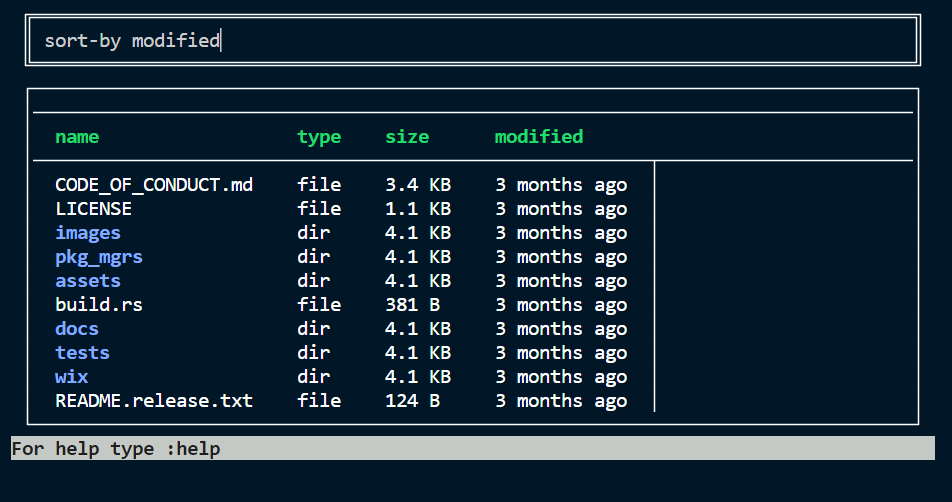

# Nushell 0.73

Nushell, or Nu for short, is a new shell that takes a modern, structured approach to your command line. It works seamlessly with the data from your filesystem, operating system, and a growing number of file formats to make it easy to build powerful command line pipelines.

Today, we're releasing version 0.73 of Nu. This release includes new math commands, an interactive data viewer, and many command refinements.

<!-- more -->

# Where to get it

Nu 0.73 is available as [pre-built binaries](https://github.com/nushell/nushell/releases/tag/0.73.0) or from [crates.io](https://crates.io/crates/nu). If you have Rust installed you can install it using `cargo install nu`.

NOTE: The optional dataframe functionality is available by `cargo install nu --features=dataframe`.

As part of this release, we also publish a set of optional plugins you can install and use with Nu. To install, use `cargo install nu_plugin_<plugin name>`.

# Themes of this release / New features

## PLEASE NOTE: Boolean `&&` and `||` have changed

The boolean `&&` is now `and` and the boolean `||` is now `or`. These were deprecated in the 0.72 release and have now been removed. Existing scripts will need to be updated to the new syntax to run in 0.73.

## Experimental interactive `explore` command ([zhiburt](https://github.com/nushell/nushell/pull/6984))



This release includes a new experimental command called `explore` for viewing Nu data in an interactive UI. Some things to try:

- pipe a large table to `explore` (ex: `ls | explore`) and use `explore` as a fancy pager
- run `explore`, then type `:try` and press the Enter key to enter a mode where you can run commands inside `explore`

`explore` is highly experimental and we expect it to change in the future. [Please report any issues you discover](https://github.com/nushell/nushell/issues/new/choose).

## New `math` commands ([sholderbach](https://github.com/nushell/nushell/pull/7258))

With this release we include a larger number of `math` commands for real valued math such as trigonometric functions and logarithms.
The goal is to remove the `math eval` command that operates on strings instead of proper nushell expressions.

### Constants

- `math pi`
- `math tau`
- `math e`

### Trigonometry and hyperbolic functions

- `math sin`
- `math cos`
- `math tan`
- `math sinh`
- `math cosh`
- `math tanh`
- `math arcsin`
- `math arccos`
- `math arctan`
- `math arcsinh`
- `math arccosh`
- `math arctanh`

### Logarithms

- `math log`
- `math ln`

```nu
〉math pi | math cos
-1
〉math e | math ln
1
〉[16 8 4 2] | math log 2
[4 3 2 1]
```

## Changes to commands with predicates ([kubouch](https://github.com/nushell/nushell/pull/7428))

`any`, `all`, `skip until`, `skip while`, `take until`, and `take while` now accept a closure instead of a row condition. For example

```nu
[[status]; [UP] [UP]] | all status == UP
```

becomes

```nu
[[status]; [UP] [UP]] | all {|el| $el.status == UP }
```

This makes them slightly more verbose but it is a part of an effort to refactor our parser to allow defining concrete grammar rules for the Nu language. Row condition is currently accepted only in the `where` command which becomes a parser built-in command (like `use` or `let`).

## New `filter` command and simpler `where` ([kubouch](https://github.com/nushell/nushell/pull/7365))

We found the `-b` flag of `where` quite confusing and decided to remove it in favor of a new `filter` command. Both `filter` and `where` have similar functionality but `where` now only accepts a row condition and `filter` accepts a closure. Before:

```nu
[{a: 1} {a: 2}] | where -b {|x| $x.a > 1}
```

After:

```nu
[{a: 1} {a: 2}] | filter {|x| $x.a > 1}
```

Why is it useful to have two commands doing the same thing? Because with the `filter` command, you can store the closure in a variable:

```nu
let cond = {|x| $x.a > 1}
[{a: 1} {a: 2}] | filter $cond
```

On the other hand, `where` is more concise (`[{a: 1} {a: 2}] | where a > 1`) but you can't store its condition in a variable. The choice is yours!

## New command `uniq-by` ([raccmonteiro](https://github.com/nushell/nushell/pull/7295))

To complement `uniq` which can identify unique or duplicated values in a collection or report the number of occurrences for a particular entry, we now have `uniq-by`.
It supports filtering a table by entries appearing in a particular column.

```nu
〉 [[fruit day]; [apple monday] [apple friday] [Apple friday] [apple monday] [pear monday] [orange tuesday]] | uniq-by fruit
╭───┬────────┬─────────╮
│ # │ fruit  │   day   │
├───┼────────┼─────────┤
│ 0 │ apple  │ monday  │
│ 1 │ Apple  │ friday  │
│ 2 │ pear   │ monday  │
│ 3 │ orange │ tuesday │
╰───┴────────┴─────────╯
```

## Mutable data structures can now have their inner values mutated using `=` ([webbedspace](https://github.com/nushell/nushell/pull/7318))

If a variable has been defined as mutable using the recently-added `mut` keyword, you can now deeply mutate its inner values using `=`.

```nu
〉 mut a = { b: 1 }
〉 $a.b = 2
〉 $a.c = 3
〉 $a | to nuon
{b: 2, c: 3}
```

This syntax enhancement was added primarily to make modifying `$env.config` during a normal session much easier. Now, `$env.config` is considered inherently mutable. You can change a single config value like so:

```nu
$env.config.table.mode = compact_double
```

...and it will remain in effect for the rest of the session.

## More sophisticated coloring of data values using closures ([webbedspace](https://github.com/nushell/nushell/pull/7141))

The `color_config` config record has new functionality: instead of specifying a single color name for all values of a given type, you may now alternatively provide a closure that dynamically computes a color for each individual value. The closure takes, as input, a single value of the given type, and must produce either a string value representing a color, or a `{ fg, bg, attr }` record (the same as what `color_config` already accepts as a color value). This feature can be used to provide important visual distinctions between ranges of values in data.

Here are some examples.

```nu
filesize: {|e|
	if $e == 0b { 'dark_gray'
	} else if $e < 1mb { 'cyan_bold'
	} else { 'blue_bold' }
}
```

This causes all filesize values to be colored using `dark_gray` if they equal `0b`, `cyan_bold` if they are less than `1mb`, and `blue_bold` otherwise. This means that, in `ls` output, empty files can be more easily distinguished from non-empty ones.

```nu
bool: { if $in { 'light_cyan' } else { 'light_gray' } }
```

This colors `true` in `light_cyan`, and `false` in `light_gray`. This can be useful when browsing a large table of booleans.

The themes in the default `config.nu` file have been updated with further examples of these closures.

In certain situations (most notably, during a single `ls` call that isn't piped to anything else) Nushell will parallelize the execution of these closures. As such, you cannot expect that they will run in the same order as each value appears in the output data.

:::warning
Currently, closures are only supported for output values - they do not work with color settings that begin with `shape_`, such as `shape_literal`. They also do not work with the color configuration for the new `explore` command. Only values inside of tables are highlighted using closures.
:::

## RISC V binary release

Starting with 0.73, Nushell now provides a RISC V for Linux as part of the set of release binaries.

# Breaking changes

- `save` no longer overwrites files by default, you must use the new `-f`/`--force` flag to overwrite an existing file ([#7262](https://github.com/nushell/nushell/pull/7262))
- `split row` command will retain an empty string if the split string is empty. ([#7413](https://github.com/nushell/nushell/pull/7413))
- `split list` now properly removes the separator in all positions ([#7355](https://github.com/nushell/nushell/pull/7355))
- [The `--show-created-paths` flag has been replaced by `--verbose` from `mkdir`](https://github.com/nushell/nushell/pull/7462).
- `fetch`: the `--output`, `--bin`, `--append` flags have been removed, use `fetch` with `save` to save fetched page to a file. ([#7468](https://github.com/nushell/nushell/pull/7468))
- changes to how `get` works with deep cell paths ([#7480](https://github.com/nushell/nushell/pull/7497))
- `mkdir`'s `-s`/`--show-created-paths` has been renamed to `-v`/`--verbose` for better consistency ([#7462](https://github.com/nushell/nushell/pull/7462))
- `&&` is now `and` and `||` is now `or`
- `any`, `all`, `skip until`, `skip while`, `take until`, `take while` now take only a closure as an argument.
- `where` now takes only row condition argument, the `-b` flag has been removed (use `filter` instead of `where -b`).

# Full changelog

## Nushell

- jt created [bump to 0.73](https://github.com/nushell/nushell/pull/7542), and [Turn off `cd` abbreviations by default](https://github.com/nushell/nushell/pull/7536), and [Revert "Add pipeline operators to help"](https://github.com/nushell/nushell/pull/7454), and [Revert "Pipeline operators: `&&` and `||`"](https://github.com/nushell/nushell/pull/7452), and [Add pipeline operators to help](https://github.com/nushell/nushell/pull/7449), and [Pipeline operators: `&&` and `||`](https://github.com/nushell/nushell/pull/7448), and [Remove and/or from 'help operators'](https://github.com/nushell/nushell/pull/7388), and [Fix input redirect for externals](https://github.com/nushell/nushell/pull/7387), and [Add OneOf shape to fix `else`](https://github.com/nushell/nushell/pull/7385), and [Improve empty pipelines](https://github.com/nushell/nushell/pull/7383), and [couple minor updates to xml deps](https://github.com/nushell/nushell/pull/7311)
- sholderbach created [Remove unused deps or move to devdeps](https://github.com/nushell/nushell/pull/7537), and [Use `nu-path` correctly in `nu!` test macro to make dev-dependency transitive](https://github.com/nushell/nushell/pull/7488), and [Add example showing first class closure to `do`](https://github.com/nushell/nushell/pull/7473), and [Add arbitrary base `math log`](https://github.com/nushell/nushell/pull/7409), and [Add `math tau`](https://github.com/nushell/nushell/pull/7408), and [Fix `math e` usage text](https://github.com/nushell/nushell/pull/7406)
- rgwood created [Revert "into cellpath command (#7417)"](https://github.com/nushell/nushell/pull/7523), and [`explore` tweaks Round 1](https://github.com/nushell/nushell/pull/7511), and [Fix cell path when getting columns of non-records](https://github.com/nushell/nushell/pull/7508), and [Remove unnecessary `echo` uses from examples](https://github.com/nushell/nushell/pull/7500), and [Add helper method to check whether ctrl+c was pressed, adopt it](https://github.com/nushell/nushell/pull/7482), and [Handle ctrl-c in `uniq` and `uniq-by`](https://github.com/nushell/nushell/pull/7478), and [Fix streaming page missing newline](https://github.com/nushell/nushell/pull/7466), and [Make hook execution stream instead of collecting](https://github.com/nushell/nushell/pull/7440), and [Remove use of deprecated `actions-rs/cargo` GH action](https://github.com/nushell/nushell/pull/7375), and [Fix `watch` for block+closure split](https://github.com/nushell/nushell/pull/7374), and [Pin CI jobs to Ubuntu 20.04](https://github.com/nushell/nushell/pull/7359), and [Make SQLite queries cancellable](https://github.com/nushell/nushell/pull/7351), and [Improve error message for illegal filenames on Windows](https://github.com/nushell/nushell/pull/7348), and [Overhaul `schema` command, remove database name](https://github.com/nushell/nushell/pull/7344), and [Handle mixed LF+CRLF in `lines`](https://github.com/nushell/nushell/pull/7316), and [Handle `ctrl-c` in `RawStream` iterator](https://github.com/nushell/nushell/pull/7314)
- merelymyself created [prevent panic with format command](https://github.com/nushell/nushell/pull/7522), and [ensure `get` doesn't delve too deep in nested lists](https://github.com/nushell/nushell/pull/7497), and [let `UnknownFlag` error list out available flags](https://github.com/nushell/nushell/pull/7443), and [add interact-once switch to `rm`](https://github.com/nushell/nushell/pull/7432), and [ensure error in `else` is forwarded appropriately](https://github.com/nushell/nushell/pull/7411), and [fix external completions; add a caret when there is overlap](https://github.com/nushell/nushell/pull/7405), and [Add quotes to hash file autocomplete](https://github.com/nushell/nushell/pull/7398), and [Make `seq` return a `ListStream` where possible](https://github.com/nushell/nushell/pull/7367)
- zhiburt created [nu-explore/ Fix configuration issues](https://github.com/nushell/nushell/pull/7520), and [Patch explore 4](https://github.com/nushell/nushell/pull/7517), and [Patch after fix after fix 7380](https://github.com/nushell/nushell/pull/7501), and [Fix #7486](https://github.com/nushell/nushell/pull/7487), and [Try to fix #7380](https://github.com/nushell/nushell/pull/7446), and [Try to fix #7338](https://github.com/nushell/nushell/pull/7343), and [nu-explore/ A few things](https://github.com/nushell/nushell/pull/7339), and [nu-explore/ A few fixes.](https://github.com/nushell/nushell/pull/7334), and [Deliver a few fixes for `explore` command](https://github.com/nushell/nushell/pull/7310)
- webbedspace created [Fix `encode base64` type signature and examples](https://github.com/nushell/nushell/pull/7515), and [Help messages: edit various instances of "block" to "closure"](https://github.com/nushell/nushell/pull/7470), and [Fix `du` error message](https://github.com/nushell/nushell/pull/7460), and [Tweak "Cannot convert {x} to a string argument" error in run_external](https://github.com/nushell/nushell/pull/7434), and [Reduced LOC by replacing several instances of `Value::Int {}`, `Value::Float{}`, `Value::Bool {}`, and `Value::String {}` with `Value::int()`, `Value::float()`, `Value::boolean()` and `Value::string()`](https://github.com/nushell/nushell/pull/7412), and [Edited help text and examples in `explore` for readability](https://github.com/nushell/nushell/pull/7324), and [Allow `$env` and mutable records to be mutated by `=` (closes #7110)](https://github.com/nushell/nushell/pull/7318), and [Rename `$env.config.explore_config` to `$env.config.explore` (for consistency with `$env.config.ls`, `$env.config.table` etc.)](https://github.com/nushell/nushell/pull/7317)
- fdncred created [add xterm color names to `ansi --list`](https://github.com/nushell/nushell/pull/7513), and [add new plugins to script](https://github.com/nushell/nushell/pull/7493), and [add `--long` flag to `history` command for sqlite history](https://github.com/nushell/nushell/pull/7480), and [add missing shapes to default_config](https://github.com/nushell/nushell/pull/7472), and [sort enums add missing items to parse_shape_name](https://github.com/nushell/nushell/pull/7450), and [remove example missed from an earlier refactor](https://github.com/nushell/nushell/pull/7419), and [bump to dev build v0.72.2](https://github.com/nushell/nushell/pull/7360), and [add input_output_types() to `ansi gradient`](https://github.com/nushell/nushell/pull/7357), and [add `:q!` alias to explore command](https://github.com/nushell/nushell/pull/7326), and [add background colors to the ansi command](https://github.com/nushell/nushell/pull/7312)
- pinjeff created [replace lazy_static with once_cell](https://github.com/nushell/nushell/pull/7502)
- andrasio created [(register-plugins.nu): Filter out files ending with .d on systems other than windows.](https://github.com/nushell/nushell/pull/7492), and [(nu_plugin_python): Send back the signature required fields.](https://github.com/nushell/nushell/pull/7489)
- WindSoilder created [refactor: introduce is_external_failed to PipelineData, and simplify try logic](https://github.com/nushell/nushell/pull/7476), and [break `for`, `loop`, `while` execution when external command runs to failed](https://github.com/nushell/nushell/pull/7475), and [remove output, append, bin flag from fetch command](https://github.com/nushell/nushell/pull/7468), and [in for, loop, while, auto print final value in each iteration](https://github.com/nushell/nushell/pull/7433), and [make split row works like python and rust ways](https://github.com/nushell/nushell/pull/7413), and [fix semicolon doesn't work for some commands](https://github.com/nushell/nushell/pull/7373), and [fix `split list` when separator is the first element of list](https://github.com/nushell/nushell/pull/7355)
- hustcer created [Add riscv64 binary release target](https://github.com/nushell/nushell/pull/7469), and [add input_output_types() to benchmark,cd and config reset](https://github.com/nushell/nushell/pull/7455), and [Use setup-rust-toolchain for release workflow](https://github.com/nushell/nushell/pull/7315)
- raccmonteiro created [some filesystem command signatures](https://github.com/nushell/nushell/pull/7464), and [`mkdir` change flag `-s` to `-v`](https://github.com/nushell/nushell/pull/7462), and [`++=` appendAssign operator (#7346)](https://github.com/nushell/nushell/pull/7354)
- Kangaxx-0 created [Add config mutation tests](https://github.com/nushell/nushell/pull/7437), and [into cellpath command](https://github.com/nushell/nushell/pull/7417), and [fix `upsert` index of zero](https://github.com/nushell/nushell/pull/7350), and [Add comments for nu syntax shape](https://github.com/nushell/nushell/pull/7349)
- kubouch created [Replace row conditions with closures in commands](https://github.com/nushell/nushell/pull/7428), and [Simplify FILE_PWD setting in 'overlay use'](https://github.com/nushell/nushell/pull/7425), and [Add FILE_PWD environment variable when running 'nu script.nu'](https://github.com/nushell/nushell/pull/7424), and [Make env-related tests more resilient](https://github.com/nushell/nushell/pull/7423), and [Fix tab not working in vi editor mode](https://github.com/nushell/nushell/pull/7396), and [Move 'where' to parser keywords; Add 'filter' command](https://github.com/nushell/nushell/pull/7365), and [Fix where -b flag](https://github.com/nushell/nushell/pull/7313)
- metacoma created [fix docker build](https://github.com/nushell/nushell/pull/7422)
- stormasm created [remove redundant code mentioning ToCsv](https://github.com/nushell/nushell/pull/7370)
- nibon7 created [kill: don't show signal example on windows](https://github.com/nushell/nushell/pull/7353)
- JohnJohnstone created [fix menus in default config](https://github.com/nushell/nushell/pull/7352)
- bgeron created [Fix documentation for merge](https://github.com/nushell/nushell/pull/7329)

## Extension

- fdncred created [add `and` and `or` so they highlight properly](https://github.com/nushell/vscode-nushell-lang/pull/72)

## Documentation

- WindSoilder created [add breaking change for fetch](https://github.com/nushell/nushell.github.io/pull/708), and [add breaking change for split row](https://github.com/nushell/nushell.github.io/pull/696), and [add command signature section](https://github.com/nushell/nushell.github.io/pull/671)
- webbedspace created [[release-notes-0.73] Add color closures and deeply mutable data structure features](https://github.com/nushell/nushell.github.io/pull/707)
- rsteube created [custom completion: added external_completer](https://github.com/nushell/nushell.github.io/pull/706)
- zhiburt created [Add a description file for `explore` command](https://github.com/nushell/nushell.github.io/pull/704)
- Tengs-Penkwe created [Correct command](https://github.com/nushell/nushell.github.io/pull/703), and [Correct command examples](https://github.com/nushell/nushell.github.io/pull/702)
- raccmonteiro created [`mkdir` `--show-created-paths` flag replaced](https://github.com/nushell/nushell.github.io/pull/701), and [typo fix](https://github.com/nushell/nushell.github.io/pull/691)
- sin created [Fix error in `book/dataframes.md`](https://github.com/nushell/nushell.github.io/pull/700)
- hustcer created [feat: optimize make_docs script for better performance](https://github.com/nushell/nushell.github.io/pull/697), and [chore: Upgrade some outdated dependencies](https://github.com/nushell/nushell.github.io/pull/694)
- thara created [Fix dead links](https://github.com/nushell/nushell.github.io/pull/695)
- rgwood created [Remove old features from install instructions](https://github.com/nushell/nushell.github.io/pull/693)
- Kissaki created [Fix typo in 0.71 release notes](https://github.com/nushell/nushell.github.io/pull/692)
- sholderbach created [Autoformat book/types_of_data.md](https://github.com/nushell/nushell.github.io/pull/685)

## Nu_Scripts

- jt created [Since last release script](https://github.com/nushell/nu_scripts/pull/330), and [Fix TWiN script](https://github.com/nushell/nu_scripts/pull/328), and [Switch to 'and' and 'or'](https://github.com/nushell/nu_scripts/pull/322)
- xlittlerag created [fixed get-weather celsius loop](https://github.com/nushell/nu_scripts/pull/326)
- 1Kinoti created [fix `up` command for v0.72.0](https://github.com/nushell/nu_scripts/pull/325)
- WindSoilder created [fix custom completions arg names](https://github.com/nushell/nu_scripts/pull/324)
- fdncred created [change `for` to `each` in oh-my.nu](https://github.com/nushell/nu_scripts/pull/323)
- ehdevries created [Replace deprecated operators in panache-git](https://github.com/nushell/nu_scripts/pull/321)
- Decodetalkers created [feat: add example for starship and shell_space](https://github.com/nushell/nu_scripts/pull/320)

## reedline

- jmoore34 created [Make DefaultPrompt configurable](https://github.com/nushell/reedline/pull/519)
