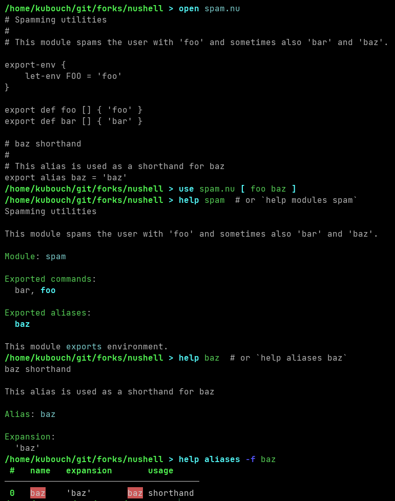
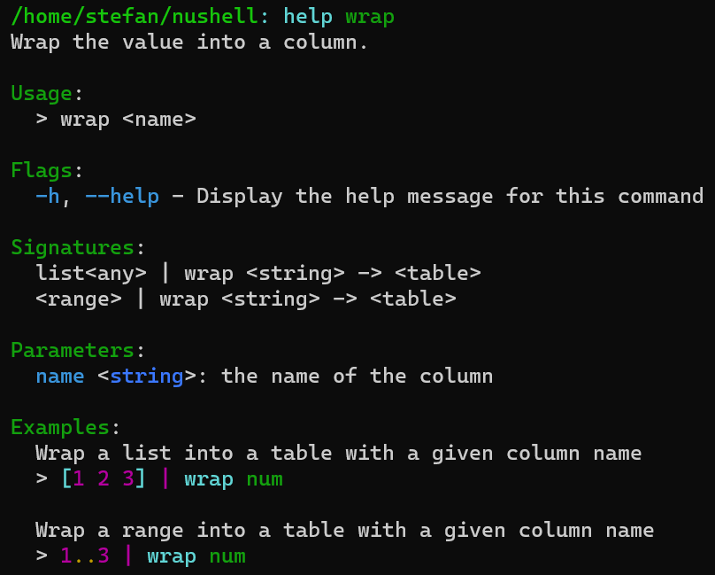

# Nushell 0.74

Nushell, or Nu for short, is a new shell that takes a modern, structured approach to your command line. It works seamlessly with the data from your filesystem, operating system, and a growing number of file formats to make it easy to build powerful command line pipelines.

Today, we're releasing version 0.74 of Nu. This release includes improvements on handling signatures of `exec` and known externals, improved `help`, initial support for parse-time constants, new commands, and many improvements to our existing commands.

<!-- more -->

# Where to get it

Nu 0.74 is available as [pre-built binaries](https://github.com/nushell/nushell/releases/tag/0.74.0) or from [crates.io](https://crates.io/crates/nu). If you have Rust installed you can install it using `cargo install nu`.

NOTE: The optional dataframe functionality is available by `cargo install nu --features=dataframe`.

As part of this release, we also publish a set of optional plugins you can install and use with Nu. To install, use `cargo install nu_plugin_<plugin name>`.

# Themes of this release / New features

## Known externals commands and `exec` now have "fall-through" signatures ([merelymyself, WindSoilder, kubouch](https://github.com/nushell/nushell/pull/7527))

A common pitfall in Nushell when defining custom signatures using `extern` used to be that unrecognized arguments passed to the command would throw an error. Now, arguments are still checked against the `extern` signature but those that are not recognized are simply ignored.

```sh
> extern `git checkout` []
> git checkout -b foo  # does not throw an error
```

`exec` uses similar style which fixes errors with tools like `ssh` and `gdb` that internally invoke `exec`.

```sh
> nu -c 'exec ls -l'  # does not throw an error
```

## `help` is now more helpful ([kubouch](https://github.com/nushell/nushell/pull/7611))

For a long time, Nushell had the option to provide custom help messages for commands via comments:

```
# Some Command
#
# More description goes here
def some-command [] { 'foo' }

help some-command  # displays the comments in the help message
```

In this release, we allow user-defined help messages with aliases and modules. This goes hand-in-hand with a handful of new `help` subcommands to explore these help messages.

The help messages now also treat the first line followed by an empty line as a "brief" description displayed in summary tables generated by `help commands`, `$nu.scope.aliases`, etc. The full description is available when querying a particular command/alias/module (e.g., `help spam`). This brief vs. full separation was already present for built-in commands, like `path`, but now it is applied also to all user-defined help messages.

An example of using custom module and alias help messages:


The current batch of improvements can still be taken further. For example, custom help messages could possibly be defined also for variables and environment variables (via comments adjacent to `let` and `let-env`). We could also further improve the presentation of existing `help xxx` commands.

## Initial support for parse-time constants ([kubouch](https://github.com/nushell/nushell/pull/7436))

_This is a proof-of-concept that we plan to expand in the future._

_Tip: We also addedd a new [book section](book/how_nushell_code_gets_run.md) with an in-depth explanation of Nushell's parsing and evaluation, hopefully clearing up some confusion about things like "Why can't I source a dynamic path?". It also touches on the concept of parse-time constants._

A new `const` keyword is added to Nushell to define "parse-time" constants. Constants defined with `const` behave the same as variables defined with `let`, but in addition, they are usable in some contexts that require values known at parse-time. Currently, this applies to files or names passed to `use`, `overlay use`, `source`, and `source-env`. For example, the following now works:

```sh
# Source a file from a constant
> 'print hello!' | save --raw say_hello.nu
> const fname = 'say_hello.nu'
> source $fname
hello!
```

```sh
# Load an overlay from a constant name:
> module spam {
	export def foo [] { 'foo' }
}
> const name = 'spam'
> const new_name = 'eggs'
> overlay use $name as $new_name
> overlay list | last
eggs
> foo
foo
```

Only a limited subset of values is allowed to be a constant. In general, "simple" values, like strings or integers, and their collections (lists, records) are allowed but values requiring some evaluation (string interpolation, subexpressions, environment variables) are not allowed. The current selection is not set in stone, however, and might change in the future.

Some future direction we can take this:

- Move parts of `$nu` to be constant to allow things like `source $nu.config-path`
- Allow modules to have constants (`module spam { const CONTENTS = [ 'eggs', 'bacon', 'sausage', 'spam' ] }`)
- Some limited form of parse-time evaluation to allow static control flow, for example

```
const fname = const if $nu.os-info.name == 'windows' {
    'C:\Users\viking\spam.nu'
} else {
    '/home/viking/spam.nu'
}
overlay use $fname
```

In general, we want to be very conservative with parse-time constants and evaluation because it can be easy to introduce awkward side-effects and performance pitfalls. We plan to extend this only where it brings some tangible benefit to Nushell's user experience.

## New `url encode` command to percent-encode URLs ([MehulG](https://github.com/nushell/nushell/pull/7664))

To encode text that is used as a path component in a URL we now provide `url encode`.

By default it preserves the structure of a URL and only replaces invalid characters. With `--all` the whole string gets encoded.

```sh
> 'https://example.com/foo bar' | url encode
https://example.com/foo%20bar
> 'https://example.com/foo bar' | url encode --all
https%3A%2F%2Fexample%2Ecom%2Ffoo%20bar
```
## `values` command to programmatically interact with records ([webbedspace](https://github.com/nushell/nushell/pull/7583))

This is a complement to `columns`, designed to allow the values of a record to be easily filtered and iterated over using the standard list tools like `each` and `where`. The name `values` is derived from similar functions in Ruby, Python and JavaScript.

```sh
>  {a: "Happy", b: "new", c: "year"} | values
╭───┬───────╮
│ 0 │ Happy │
│ 1 │ new   │
│ 2 │ year  │
╰───┴───────╯
```

It can also operate on tables to convert them to lists-of-lists:

```sh
>  [[a b]; [4 7] [5 8] [6 9]] | values
╭───┬───────────╮
│ 0 │ ╭───┬───╮ │
│   │ │ 0 │ 4 │ │
│   │ │ 1 │ 5 │ │
│   │ │ 2 │ 6 │ │
│   │ ╰───┴───╯ │
│ 1 │ ╭───┬───╮ │
│   │ │ 0 │ 7 │ │
│   │ │ 1 │ 8 │ │
│   │ │ 2 │ 9 │ │
│   │ ╰───┴───╯ │
╰───┴───────────╯
```

## `get`, `select`, cell path access on tables will now error when encountering a hole ([kubouch](https://github.com/nushell/nushell/pull/7002), [webbedspace](https://github.com/nushell/nushell/pull/7647))

Consider the following operations performed on a table:

- `[{foo: 'bar'}, {}] | select foo`
- `[{foo: 'bar'}, {}] | get foo`
- `[{foo: 'bar'}, {}].foo`

Formerly, this would produce `['bar', null]` - converting the table hole into a `null`. Now, however, they will produce an error. The original null-conversion behaviour can, as usual, be opted into using the `-i` flag for `get` and `select`: `[{foo: 'bar'}, {}] | get -i foo` produces `['bar', null]`. (There are also plans for a future version of Nushell to expand the cell path syntax to allow certain cell names to be "nullable" - converted to `null` if they don't exist.)

## Behavior of `-i`/`--ignore-errors` flag for `get` and `select` when the entire column is absent has changed

Formerly, if `select -i` or `get -i` couldn't find any value for the given column, it would produce a single `null`:

```sh
〉[{a:1} {b:2} {a:3}] | select -i foo | to nuon
null
```

This has been changed so that it now produces a table (or, in the case of `get`, a list) of all `null`s:

```sh
〉[{a:1} {b:2} {a:3}] | select -i foo | to nuon
[[foo]; [null], [null], [null]]
```

This change was made to make this flag work more consistently with `default` and `compact`:

```sh
〉[{a:1} {b:2} {a:3}] | select -i a | default 0 a
[[a]; [1], [0], [3]]
〉[{a:1} {b:2} {a:3}] | select -i foo | default 0 foo
[[foo]; [0], [0], [0]]
```

As you can see, `default` in the above example can reliably populate an entire table column when some or all of the values don't exist.

## Certain misused punctuation in `def` definitions are now errors ([webbedspace](https://github.com/nushell/nushell/pull/7624), [webbedspace](https://github.com/nushell/nushell/pull/7606))

The following misuses of punctuation in `def` definitions now produce errors:

- Placing a comma between a long flag and its short alternative (e.g. `def a [--foo, (-f)] {}`)
- Consecutive commas, like `def a [foo,,bar] {}`
- Consecutive colons, like `def a [foo::int] {}`
- Using `^` in command names, like `def ^a [] {}`

## `$in` now works in `catch` closures

`$in` in `catch` closures now behaves identically to how it does in other closures, like those given to `each` (it's equivalent to what would be the first named argument).

`try { 'x' | math abs } catch { print $in }` behaves the same as `try { 'x' | math abs } catch {|e| print $e }`.

## MIME-types are supported in `ls` with an additional flag. ([fdncred](https://github.com/nushell/nushell/pull/7616))

To find out what application your operating system associates with a particular file, you can now use the `--mime-type` or `-m` flag on our `ls` command.
This simplifies filtering for particular files and can help you dispatch files to particular programs.
When opening files with Nushell directly, `open` will still follow the same heuristics using file endings and the built-in `from ...` command parsers.

## Regular expression queries are cached for performance ([rgwood](https://github.com/nushell/nushell/pull/7587))

The primary motivation for this is to make regex and `=~` operator uses in hooks and `color_config` closures more performant.

## All built-in commands now declare their pipeline input and output types ([sholderbach](https://github.com/nushell/nushell/pull/7532))

A few releases back commands internally got the capability to declare not only the types of parameters but also pairs for the input and output on the pipeline.
With this release we finally declare those input and output types for all core nushell commands.
This can help you as user to see what a command expects from the pipeline and might return.
We are exploring how nushell can leverage that for more useful diagnostics and completions. In the future we may introduce syntax for user-defined commands to declare their input and output types explicitly.



# Breaking changes

- [`get` and `select` now error when encountering a hole](#get-select-cell-path-access-on-tables-will-now-error-when-encountering-a-hole-kubouch-webbedspace)
- [the behaviour of `-i` on `get` and `select` has changed](#behavior-of--i--ignore-errors-flag-for-get-and-select-when-the-entire-column-is-absent-has-changed)
- `columns` will now error for data that is not a table or a record ([#7593](https://github.com/nushell/nushell/pull/7593))
- The dataframe specific command `fill-na` has been renamed to `fill-nan` to better represent its capabilities ([#7565](https://github.com/nushell/nushell/pull/7565))
- The requirements for the names of a nu command and a command alias have been tightened to avoid some problems ([#7392](https://github.com/nushell/nushell/pull/7392))
- `to toml` will only produce output for records now as the output for tables is ambiguous and may be invalid to parse ([#7597](https://github.com/nushell/nushell/pull/7597))
- `exec` and known externals don't throw errors when unknowns parameters are passed to them
- `help` command has been thoroughly refactored and includes several more subcommands. `help <word>` now matches commands, aliases, and modules.
- command names in `help commands` and `$nu.scope.commands` are displayed correctly if they were imported from a module with a prefix
- `hide` command no longer hides environment variables. Use `hide-env` instead. ([#7687](https://github.com/nushell/nushell/pull/7687))
- `math eval` has been removed in favour of the direct `math` commands and expressions (see `help operators` as well) ([#7284](https://github.com/nushell/nushell/pull/7284))
- `last`, `skip`, `drop`, `take until`, `take while`, `skip until`, `skip while`, `where`, `reverse`, `shuffle`, and `sort-by` are now stricter about which types of data they accept ([#7623](https://github.com/nushell/nushell/pull/7623))

# Full changelog

## Nushell

- sholderbach created [Commit the lockfile for 0.74](https://github.com/nushell/nushell/pull/7719), and [Bump version to `0.74.0`](https://github.com/nushell/nushell/pull/7718), and [[Chore] cleanup in `where` implementation](https://github.com/nushell/nushell/pull/7679), and [Try to use the latest tagged virtualenv](https://github.com/nushell/nushell/pull/7638), and [Fix quoting of empty string in `to nuon`](https://github.com/nushell/nushell/pull/7632), and [Update `Cargo.lock` to `powierza-coefficient 1.0.2`](https://github.com/nushell/nushell/pull/7629), and [Fix the syntax highlighting in `help metadata`](https://github.com/nushell/nushell/pull/7628), and [Fix usage of deprecated C-style logical `and`](https://github.com/nushell/nushell/pull/7627), and [Include clippy check for dataframe in CI](https://github.com/nushell/nushell/pull/7596), and [Further cleanup of `Span::test_data` usage + span fixes](https://github.com/nushell/nushell/pull/7595), and [Fix `&&` quotation in `to nuon` after proptest fail](https://github.com/nushell/nushell/pull/7564), and [Bump to new development version `0.73.1`](https://github.com/nushell/nushell/pull/7544), and [Fix line-end trimming in subexpression](https://github.com/nushell/nushell/pull/7543), and [Add more input/output type annotations](https://github.com/nushell/nushell/pull/7532), and [Remove `math eval` command](https://github.com/nushell/nushell/pull/7284) 
- WindSoilder created [Auto-Completion: put ` tildes around filenames with parentheses](https://github.com/nushell/nushell/pull/7712), and [revert changes on prepend and append](https://github.com/nushell/nushell/pull/7660), and [last, skip, drop, take until, take while, skip until, skip while, where, reverse, shuffle, append, prepend and sort-by raise error when given non-lists ](https://github.com/nushell/nushell/pull/7623), and [fix python plugin example](https://github.com/nushell/nushell/pull/7599), and [avoid panic when using from nuon](https://github.com/nushell/nushell/pull/7533) 
- rgwood created [Revert "Primitives now use color closures..."](https://github.com/nushell/nushell/pull/7710), and [Add benchmarks for evaluating default env+config](https://github.com/nushell/nushell/pull/7688), and [Add Criterion benchmarks for parser](https://github.com/nushell/nushell/pull/7686), and [Upgrade all remaining crates to Rust 2021](https://github.com/nushell/nushell/pull/7681), and [Reorder flags in `nu --help`](https://github.com/nushell/nushell/pull/7672), and [Clarify `url` base command](https://github.com/nushell/nushell/pull/7670), and [Delete unused files](https://github.com/nushell/nushell/pull/7668), and [Tweak new input type error message](https://github.com/nushell/nushell/pull/7646), and [Make stream info visible to users in `describe`](https://github.com/nushell/nushell/pull/7589), and [Fix error message when interrupting table with `ctrl+c`](https://github.com/nushell/nushell/pull/7588), and [Add LRU regex cache](https://github.com/nushell/nushell/pull/7587), and [Re-enable `test_bits`](https://github.com/nushell/nushell/pull/7585), and [Make `to text` stream ListStreams](https://github.com/nushell/nushell/pull/7577), and [Add some cell path tests](https://github.com/nushell/nushell/pull/7563), and [Add cross-rs config](https://github.com/nushell/nushell/pull/7559), and [Clarify `--stdin` flag](https://github.com/nushell/nushell/pull/7541), and [`table`: Check stream timeout on every item](https://github.com/nushell/nushell/pull/7509) 
- stormasm created [clean up some extra logging code in the cli](https://github.com/nushell/nushell/pull/7709), and [move BufferedReader out of nu-command](https://github.com/nushell/nushell/pull/7697) 
- webbedspace created [Improve wording of `str replace` help messages](https://github.com/nushell/nushell/pull/7708), and [Primitives now use color closures when printed on the command line](https://github.com/nushell/nushell/pull/7650), and [Make `get` hole errors and cell path hole errors identical (improvement on #7002)](https://github.com/nushell/nushell/pull/7647), and [Slight edits to `ls` and `zip`'s help text](https://github.com/nushell/nushell/pull/7626), and [`def`: make various punctuation misuses into errors](https://github.com/nushell/nushell/pull/7624), and [Disallow `^` in `def` command names](https://github.com/nushell/nushell/pull/7606), and [Add extra_usage messages for subcommand-only commands](https://github.com/nushell/nushell/pull/7594), and [`columns` now errors when given a non-record non-table](https://github.com/nushell/nushell/pull/7593), and [Change instances of `Value::string("foo", Span::test_data())` to `Value::test_string("foo")`](https://github.com/nushell/nushell/pull/7592), and [Add `values` command (see #7166)](https://github.com/nushell/nushell/pull/7583), and [Fix signatures of commands which accept records also](https://github.com/nushell/nushell/pull/7582), and [Change other instances of `$nothing` to `null`](https://github.com/nushell/nushell/pull/7569), and [Fix #7551 record support in `color_config`](https://github.com/nushell/nushell/pull/7567), and [Remove preview.rs](https://github.com/nushell/nushell/pull/7555), and [Make `$in` work in `catch` closures](https://github.com/nushell/nushell/pull/7458), and [Make `config.filesize_format`/`config.filesize_metric` conflict resolution consistent](https://github.com/nushell/nushell/pull/7410), and [Standardise the use of ShellError::UnsupportedInput and ShellError::TypeMismatch and add spans to every instance of the former](https://github.com/nushell/nushell/pull/7217) 
- dependabot[bot] created [Bump tokio from 1.21.2 to 1.24.1](https://github.com/nushell/nushell/pull/7701) 
- fdncred created [align durations to the right](https://github.com/nushell/nushell/pull/7700), and [fix register-plugins script](https://github.com/nushell/nushell/pull/7677), and [add `--mime-type(-m)` to `ls` in the `type` column](https://github.com/nushell/nushell/pull/7616), and [add metadata to wrap](https://github.com/nushell/nushell/pull/7586), and [fix the wix file to overwrite with save -f](https://github.com/nushell/nushell/pull/7545) 
- kubouch created [Remove environment variable hiding from `hide`](https://github.com/nushell/nushell/pull/7687), and [Expand Nushell's help system](https://github.com/nushell/nushell/pull/7611), and [Remove shape-directed import pattern parsing](https://github.com/nushell/nushell/pull/7570), and [Small parser refactors](https://github.com/nushell/nushell/pull/7568), and [Add "fall-through" signatures](https://github.com/nushell/nushell/pull/7527), and [Initial support for parse-time constants](https://github.com/nushell/nushell/pull/7436) 
- Mehrbod2002 created [Continue and Break on Try/Catch ](https://github.com/nushell/nushell/pull/7683), and [Recursion def](https://github.com/nushell/nushell/pull/7657), and [Fix and Allow Number and Boolean type to be key in `from yaml`](https://github.com/nushell/nushell/pull/7607), and [Fix #6888 and rename `fill-na` to `fill-nan`](https://github.com/nushell/nushell/pull/7565) 
- hikilaka created [Make `user` parameter optional in `fetch`](https://github.com/nushell/nushell/pull/7680) 
- xxnuo created [Fix build-all-windows.cmd](https://github.com/nushell/nushell/pull/7674) 
- aniou created [Extend config support from F1-F12 to F1-F20, #7666](https://github.com/nushell/nushell/pull/7669) 
- MehulG created [Url encode to escape special characters](https://github.com/nushell/nushell/pull/7664) 
- TornaxO7 created [adding link to list of nu-plugins](https://github.com/nushell/nushell/pull/7649) 
- Decodetalkers created [fix: ci problem](https://github.com/nushell/nushell/pull/7643), and [fix: empty cell in select](https://github.com/nushell/nushell/pull/7639), and [return Error if get meet nothing and without "i"](https://github.com/nushell/nushell/pull/7002) 
- Yethal created [Simplify register-plugins.nu](https://github.com/nushell/nushell/pull/7636) 
- jaudiger created [doc: correct some really tiny typos.](https://github.com/nushell/nushell/pull/7635) 
- micouy created [Update `powierza-coefficient` to `1.0.2`](https://github.com/nushell/nushell/pull/7625) 
- Kangaxx-0 created [early return for parsing closure and block with interchanged shape](https://github.com/nushell/nushell/pull/7618) 
- hustcer created [Fix const examples](https://github.com/nushell/nushell/pull/7610), and [Fix an example of `env` command](https://github.com/nushell/nushell/pull/7603) 
- NotLebedev created [Fix `save` error handling](https://github.com/nushell/nushell/pull/7608), and [To toml fix](https://github.com/nushell/nushell/pull/7597) 
- zhiburt created [Fix table expand wrap in case no header is there](https://github.com/nushell/nushell/pull/7605), and [Fix some issues with table wrapping of lists](https://github.com/nushell/nushell/pull/7598) 
- kianmeng created [Fix typos by codespell](https://github.com/nushell/nushell/pull/7600) 
- merelymyself created [let `start` open anything and everything](https://github.com/nushell/nushell/pull/7580), and [let case_insensitive option work for variable completion as well](https://github.com/nushell/nushell/pull/7539), and [tighter restrictions on `alias` and `def` names](https://github.com/nushell/nushell/pull/7392) 
- swarnimarun created [chore: make the config setup messages consistent](https://github.com/nushell/nushell/pull/7560) 
- raccmonteiro created [`uniq` and `uniq-by` optimization (#7477)](https://github.com/nushell/nushell/pull/7534) 

## Documentation

- kubouch created [Link to the new parse-eval page](https://github.com/nushell/nushell.github.io/pull/735), and [Start Design Notes chapter; Add parse-eval notes](https://github.com/nushell/nushell.github.io/pull/734), and [Fix wrong PATH append example](https://github.com/nushell/nushell.github.io/pull/721), and [Add image; Fmt](https://github.com/nushell/nushell.github.io/pull/718) 
- WindSoilder created [update breaking changes](https://github.com/nushell/nushell.github.io/pull/733), and [Try to rename from blog text to changeLog](https://github.com/nushell/nushell.github.io/pull/732) 
- sholderbach created [Fix #705: sidebar links German.](https://github.com/nushell/nushell.github.io/pull/731), and [Fix styling on 0.73 release notes](https://github.com/nushell/nushell.github.io/pull/714) 
- hustcer created [fix i18n.nu script and update i18n-meta conf](https://github.com/nushell/nushell.github.io/pull/729), and [Refresh docs for v0.73](https://github.com/nushell/nushell.github.io/pull/717), and [Fix book/make_docs.nu for nu v0.73+](https://github.com/nushell/nushell.github.io/pull/716), and [Update book/make_docs.nu for nu v0.72.1+](https://github.com/nushell/nushell.github.io/pull/699) 
- webbedspace created [Add my changes](https://github.com/nushell/nushell.github.io/pull/727), and [Fixed various issues in make_docs.nu](https://github.com/nushell/nushell.github.io/pull/652) 
- TornaxO7 created [Update plugins.md](https://github.com/nushell/nushell.github.io/pull/724), and [Update custom_completions.md](https://github.com/nushell/nushell.github.io/pull/723), and [Update aliases.md](https://github.com/nushell/nushell.github.io/pull/722), and [Fix syntax error for menu](https://github.com/nushell/nushell.github.io/pull/720) 
- Tengs-Penkwe created [Add section "Output result to external commands"](https://github.com/nushell/nushell.github.io/pull/713) 
- sschneider-ihre-pvs created [Update help.md](https://github.com/nushell/nushell.github.io/pull/712) 
- merelymyself created [clarify columns and rows](https://github.com/nushell/nushell.github.io/pull/711) 
- rgwood created [Mention breaking save change](https://github.com/nushell/nushell.github.io/pull/710) 

## Nu_Scripts

- kubouch created [Fix broken conda prompt](https://github.com/nushell/nu_scripts/pull/338) 
- fdncred created [update coloring scripts with newer syntax](https://github.com/nushell/nu_scripts/pull/336), and [update 20k script with save changes](https://github.com/nushell/nu_scripts/pull/335), and [update sparkline script](https://github.com/nushell/nu_scripts/pull/334) 
- skelly37 created [Fix `dict` and `cdpath` for 0.73](https://github.com/nushell/nu_scripts/pull/333) 
- maxim-uvarov created [Function to format nicely big numbers: number-format.nu](https://github.com/nushell/nu_scripts/pull/332) 

## reedline

- sholderbach created [Fix the Github actions badge](https://github.com/nushell/reedline/pull/523) 
- CozyPenguin created [Make reedline handling cursor shapes more configurable](https://github.com/nushell/reedline/pull/515) 

