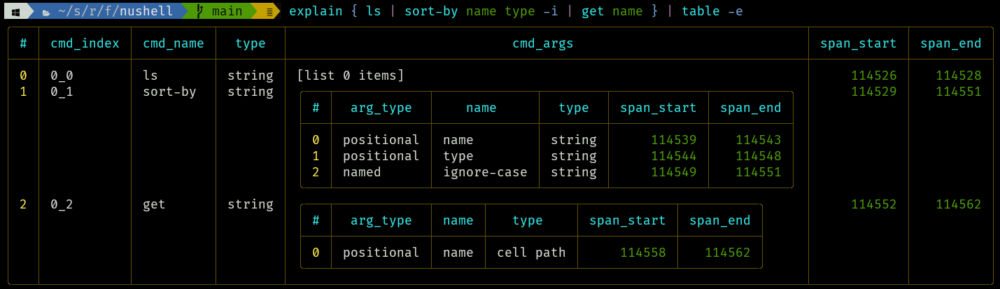

# Nushell 0.76

Nushell, or Nu for short, is a new shell that takes a modern, structured approach to your command line. It works seamlessly with the data from your filesystem, operating system, and a growing number of file formats to make it easy to build powerful command line pipelines.

Today, we're releasing version 0.76 of Nu. This release also contains a good amount of polish and refactoring behind the scenes.

<!-- more -->

# Where to get it

Nu 0.76 is available as [pre-built binaries](https://github.com/nushell/nushell/releases/tag/0.76.0) or from [crates.io](https://crates.io/crates/nu). If you have Rust installed you can install it using `cargo install nu`.

NOTE: The optional dataframe functionality is available by `cargo install nu --features=dataframe`.

As part of this release, we also publish a set of optional plugins you can install and use with Nu. To install, use `cargo install nu_plugin_<plugin name>`.

# Themes of this release / New features

## Debugging
We've added a few new commands to help with nushell debugging.

- `timeit` (formerly known as benchmark) [8018](https://github.com/nushell/nushell/pull/8018)

```bash
〉timeit { ls | sort-by name type -i | get name }
2ms 509µs 900ns
```

- `view source` (formerly known as view-source) [7989](https://github.com/nushell/nushell/pull/7989)

```bash
〉def my-cmd [arg] { echo $arg }
〉my-cmd hi
hi
〉view source my-cmd
def my-cmd [ arg:any --help (-h) ] { echo $arg }
```

- `view span` [7989](https://github.com/nushell/nushell/pull/7989)

Spans are important to nushell. One of their uses is to show where errors are. For instance, in this example below, the leader lines pointing to parts of the command line are able to point to `10`, `/`, and `"bob"` because each of those items have a span.

```bash
〉10 / "bob"
Error: nu::parser::unsupported_operation (link)

  × Types mismatched for operation.
   ╭─[entry #8:1:1]
 1 │ 10 / "bob"
   · ─┬ ┬ ──┬──
   ·  │ │   ╰── string
   ·  │ ╰── doesn't support these values.
   ·  ╰── int
   ╰────
  help: Change int or string to be the right types and try again.
```

### Example usage:

```bash
〉let a = 42
〉$a
42
〉metadata $a | get span
╭───────┬────────╮
│ start │ 113226 │
│ end   │ 113228 │
╰───────┴────────╯
〉view span 113226 113228
42
```

You can also find spans by using the `debug --raw` command.

```bash
〉$env.config | get keybindings | first | debug -r
... bunch of stuff
                    span: Span {
                        start: 68065,
                        end: 68090,
                    },
                },
            ],
            span: Span {
                start: 68050,
                end: 68101,
            },
        },
    ],
    span: Span {
        start: 67927,
        end: 68108,
    },
}

〉view span 67927 68108
{
    name: clear_everything
    modifier: control
    keycode: char_l
    mode: emacs
    event: [
        { send: clearscrollback }
    ]
}

〉view span 68065 68090
{ send: clearscrollback }

〉view span 68050 68101
[
    { send: clearscrollback }
]
```

- `view files` [7989](https://github.com/nushell/nushell/pull/7989)

`view files` lists the files and entries loaded into nushell's EngineState memory. Note the spans, for use with `view span` and the size of each file's contents stored.


- `profile` [7854](https://github.com/nushell/nushell/pull/7854)

- `explain` [7957](https://github.com/nushell/nushell/pull/7957)

The explain command attempts to explain to you how the pipeline, in the passed in block, is going to be interpreted. It shows the pipeline and command index, the looked up and found command name, the command argument data type, and argument details, among other things. Note that spans are also included and can be used with `view span`.



In an effort to have a little more organization, we've assigned a category of `Debug` to all commands that participate in nushell script debugging. Here is a list of commands that are in that category now.

- debug
- explain
- view
- view source
- view span
- view files
- profile
- timeit
- metadata

Dataframe commands have all been renamed in order to avoid confusion with nushell commands. It also make our help commands less confusing. For instance, you can now do `help select` and understand how to use the traditional nushell select command and you can do `help dfr select` and understand how to use the dataframe specific select command. [7998](https://github.com/nushell/nushell/pull/7998)

We fixed a `PATH` vs `Path` bug in completions, so now you should be able to do commands like `cod<tab>` and get completions like `code` and `code.cmd` across all operating systems. [8003](https://github.com/nushell/nushell/pull/8003)


## Brand spanking new feature or major change ([author](https://github.com/nushell/nushell/pull/42))

::: warning

**Breaking Change**: You need to update Whatever

:::


```bash
〉echo "AB\u{43}\u{044}"
ABCD
〉echo "Gabriel, blow your \u{1f3BA}"
Gabriel, blow your 🎺
```


| Old name | New name beginning with `0.76` |
| -------- | ------------------------------ |
| `fetch`  | `http get`                     |
| `post`   | `http post`                    |
| `to url` | `url build-query`              |


# Breaking changes

- `load-env` can not accidentally set `$env.PWD` anymore ([#7963](https://github.com/nushell/nushell/pull/7963))
- The `--numbered` flag to enumerate entries has been removed from `each`, `par-each`, `each while`, and `reduce`. Use the `enumerate` command added in 0.75 instead. ([#7777](https://github.com/nushell/nushell/pull/7777))
- Plugin system: `nu_plugin::Plugin::signature` has changed from `fn signature(&self) -> Vec<Signature>` to `fn signature(&self) -> Vec<PluginSignature>` to support examples on plugin commands.  Plugin authors have to update the relative structure to apply these changes. Normally you just need to perform a global search/replace from `Signature` to `PluginSignature`, then rebuild and run with the latest nushell version. ([#7984](https://github.com/nushell/nushell/pull/7984))

# Full changelog
