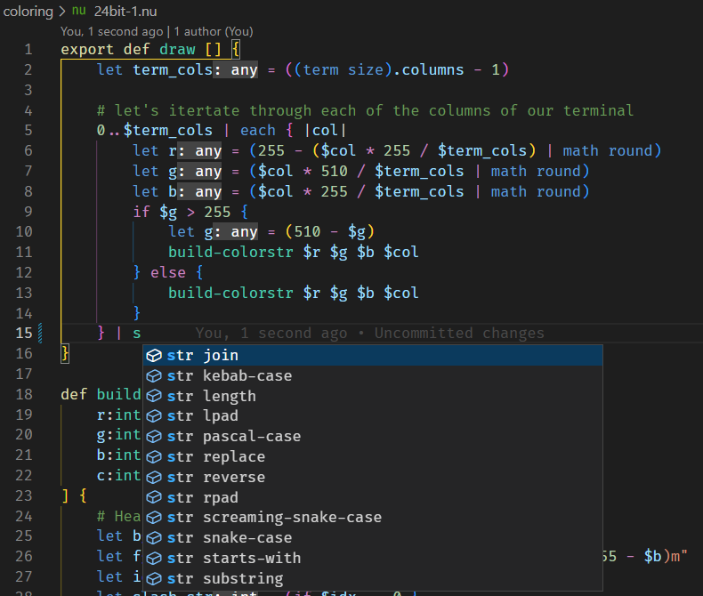

# Nushell 0.79

Nushell, or Nu for short, is a new shell that takes a modern, structured approach to your command line. It works seamlessly with the data from your filesystem, operating system, and a growing number of file formats to make it easy to build powerful command line pipelines.

Today, we're releasing version 0.79 of Nu. This release adds a standard library written in nu itself and enhanced IDE support.

<!-- more -->

# Where to get it

Nu 0.79 is available as [pre-built binaries](https://github.com/nushell/nushell/releases/tag/0.79.0) or from [crates.io](https://crates.io/crates/nu). If you have Rust installed you can install it using `cargo install nu`.

NOTE: The optional dataframe functionality is available by `cargo install nu --features=dataframe`.

As part of this release, we also publish a set of optional plugins you can install and use with Nu. To install, use `cargo install nu_plugin_<plugin name>`.

# Themes of this release / New features

## Standard library ([@amtoine, @bobhy, @fdncred, @presidento, ...][stdlib PRs])

This is it. We finally release the standard library with this `0.79`!
It's been on the mind of the core team of Nushell for some time and it was made real between the two releases.

But first of all... **what is the _standard library_?**

The nushell standard library is a **collection of nushell scripts** that are **automatically loaded** in the nushell binary
and **reachable via the `use` command** without any additional setup.

> :bulb: **Note**
> some of the commands from the standard library are `use`d without human intervention as part of what we call
> the _prelude_.
>
> As said above, the other commands are available with the `use` command.
> The goal of this library is, as its name suggests, to provide a _standard_ experience and a _standardized_ set of commands and tools to any Nushell user.
> In `std`, one can find things like

- a test framework to write robust Nushell scripts, modules and libraries
- implementation of builtin commands once written in `rust`
- logging commands with several log levels
- ...

> :bulb: **Note**
> yes, you heard right, in the future, the standard library might become a sanctuary for non-time-critical commands that were once written in `rust`
> as part of the built-in set of commands!
>
> Right now, we are actively trying to move the `help` commands from the `nushell` core implementation to the library.

With this release, the library comes with the following custom commands:
| module | description | commands |
| ----------------------------------------------------------------------------------------- | ------------------------------------------------------ | ------------------------------------------------------------------------------------------------------------------------------------------------------------------------------------------------- |
| [`std assert`](https://github.com/nushell/nushell/blob/main/crates/nu-std/lib/testing.nu) | a set of commands to write tests | `assert`, `assert equal`, `assert error`, `assert greater`, `assert greater or equal`, `assert length`, `assert less`, `assert less or equal`, `assert not equal`, `assert skip`, `assert str contains` |
| [`std dirs`](https://github.com/nushell/nushell/blob/main/crates/nu-std/lib/dirs.nu) | a re-implementation of the `shells` commands | `dirs add`, `dirs drop`, `dirs next`, `dirs prev`, `dirs show` |
| [`std help`](https://github.com/nushell/nushell/blob/main/crates/nu-std/lib/help.nu) | a Nushell implementation of the built-in commands | `help`, `help aliases`, `help commands`, `help externs`, `help modules`, `help operators` |
| [`std iter`](https://github.com/nushell/nushell/blob/main/crates/nu-std/lib/iter.nu) | an extension of built-in commands to iterate over data | `iter filter-map`, `iter find`, `iter intersperse`, `iter scan` |
| [`std log`](https://github.com/nushell/nushell/blob/main/crates/nu-std/lib/log.nu) | never miss something in your scripts | `log critical`, `log debug`, `log error`, `log info`, `log warning` |
| [`xml` module](https://github.com/nushell/nushell/blob/main/crates/nu-std/lib/xml.nu) | tools to interact with Xml data | `xaccess`, `xinsert`, `xtype`, `xupdate` |

- some other commands live under the `std` namespace, without any module: `clip`, `path add` and `run-tests`

### TL;DR

As there has been quite a lot of contributions already (see the [50 closed PRs][stdlib PRs] at the time i'm writing this :o),
i'm just gonna give some hints and links in this release note, leaving the rest to the amazing work of other contributors who wrote parts of the lib and its documents (shout out to
[@bobhy](https://github.com/bobhy),
[@fdncred](https://github.com/fdncred) and
[@presidento](https://github.com/presidento)

- the library can be used and tested with

```nushell
use std   # will load the whole library under the `std` namespace
use std * #   -    -   -    -      -    without the `std` prefix
```

or use direct imports, such as

```nushell
use std 'dirs show'
```

- one can follow the activity of the library in the [roadmap](https://github.com/nushell/nushell/issues/8450)
- the library comes with a test framework; see the [_Testing your Nushell code_](https://www.nushell.sh/book/testing.html) chapter of the book
- the long term information, changelog and updates shall be found in the [_Standard library_](https://www.nushell.sh/book/standard_library.html) chapter of the Nushell book
- if you are a contributor willing to help out, everything happens in the [`nu-std` crate](https://github.com/nushell/nushell/tree/main/crates/nu-std), especially the
  [`CONTRIBUTING.md` document](https://github.com/nushell/nushell/blob/main/crates/nu-std/CONTRIBUTING.md) which explains all there is to know about "_developing with `std`_"
  in great details.

[stdlib PRs]: https://github.com/nushell/nushell/pulls?q=is%3Aclosed+is%3Apr+label%3Astd-library

If, for some reason, you want to load Nushell without the standard library, start `nu` with the `--no-std-lib`. This can be the case if you find the startup times much longer than before. We're aiming to improve the loading speed in the future.

## enhanced IDE support in our VS code extension ([Sophia](https://github.com/nushell/nushell/pull/8745), [fdncred](https://github.com/nushell/vscode-nushell-lang/pull/89))



Nushell now has a first [LSP (Language Server Protocol)](https://en.wikipedia.org/wiki/Language_Server_Protocol) implementation with a VSCode integration. If you install the latest version of our [VSCode plugin](https://github.com/nushell/vscode-nushell-lang), you'll see hovers, inlays, tooltips, error squigglies and other features. We are still very early in the LSP development, but the extension is already very usable and definitely moves the experience of writing Nu code to another level!

While currently we have only VSCode integration, the server itself is standalone and we welcome projects adding the LSP support to more editors.

## `atuin` now [supports Nushell](https://atuin.sh/blog/release-v14)

Thanks to [@stevenxxiu](https://github.com/stevenxxiu) you can now use `atuin` with Nushell. We are happy to see Nushell supported by more projects and we welcome PRs adding more integrations.

## Relaxed parsing rules ([Sophia](https://github.com/nushell/nushell/pull/8846))

We listened to your feedback around the syntax changes introduced with 0.78 and decided to revert to the old behavior around the parsing rules for numeric literals as well as the compulsory `||` for closures.

## Removed old alias implementation ([kubouch](https://github.com/nushell/nushell/pull/8797))

While there are still some missing pieces, we removed the old alias implementation. This means that `old-alias` is no longer available. We decided to remove it to clean up the code. It makes further fixes to aliases easier as you do not need to remember which alias implementation a piece of code belongs to.

There are two notable missing features from the old aliases:

- Missing completions with external completers.
- Most parser keywords (such as `source`) cannot be aliased but adding support for aliasing them should be possible in most cases.
- Not possible to alias with environment shorthands (e.g., `alias foo = FOO=bar spam`)
- Some presentation issues, such as the output of `which` and the alias `usage` pointing at the aliased call instead of the alias itself.

## Changes to default files locations ([ito](https://github.com/nushell/nushell/pull/8792)-[hiroki](https://github.com/nushell/nushell/issues/8887))

`$nu.config-path` and `$nu.env-path` are now set based on `--config` and `--env-config` flags passed to Nushell and also use the path after resolving symlinks. This means that they no longer guarantee pointing at the default Nushell's config directory. To be able to refer to the default config directory, `$nu.default-config-dir` was added and used in default `env.nu` to always point `NU_LIB_DIRS` to the `scripts` directory under the default config directory.

Related to that, [`$env.CURRENT_FILE`](https://github.com/nushell/nushell/pull/8861) was added to be able to show the currently evaluated file.

# Breaking changes

- [#8797](https://github.com/nushell/nushell/pull/8797) `old-alias` is no longer available
- [#8724](https://github.com/nushell/nushell/pull/8724) `str index-of -r` now uses ranges
- [#8792](https://github.com/nushell/nushell/pull/8792) `config nu` and `config env` now open `$nu.config-path` and `$nu.env-path`, respectively.
- [#8779](https://github.com/nushell/nushell/pull/8779) Aliasing math expressions now shows error immediately instead of failing silently and showing a confusing error later.
- [#8917](https://github.com/nushell/nushell/pull/8917) `exec` inherits Nushell's environment variables
- [#8887](https://github.com/nushell/nushell/pull/8887) `NU_LIB_DIRS` definition in `env.nu` changed

# Full changelog

## Nushell

- sholderbach created [Bump to `0.79.1` dev version](https://github.com/nushell/nushell/pull/8998), and [Pin `reedline` to `0.19.0` release](https://github.com/nushell/nushell/pull/8996), and [Bump version for `0.79.0` release](https://github.com/nushell/nushell/pull/8980), and [Run coverage immediately](https://github.com/nushell/nushell/pull/8876), and [Reenable CI coverage](https://github.com/nushell/nushell/pull/8867), and [Fix span of multibyte short flags](https://github.com/nushell/nushell/pull/8866), and [Move CLI related commands to `nu-cli`](https://github.com/nushell/nushell/pull/8832), and [Follow up #8758 with a style fix](https://github.com/nushell/nushell/pull/8822)
- hustcer created [Add npm installation instruction](https://github.com/nushell/nushell/pull/8982), and [Upgrade to nu v0.78 for binaries release workflow](https://github.com/nushell/nushell/pull/8840)
- rgwood created [Tweak run-external signature so command must be a string](https://github.com/nushell/nushell/pull/8971), and [Upgrade `open` crate to fix WSL bug](https://github.com/nushell/nushell/pull/8905)
- fdncred created [use record separator `\x1e` for `include_path`](https://github.com/nushell/nushell/pull/8961), and [allow `find` command to look in specified columns only](https://github.com/nushell/nushell/pull/8937), and [fix reedline breaking changes due to PR562](https://github.com/nushell/nushell/pull/8921), and [fix bug with include_path -I parameter](https://github.com/nushell/nushell/pull/8915), and [allow custom commands to show up in `$nu.scope.commands` better](https://github.com/nushell/nushell/pull/8910), and [remove debug print bug](https://github.com/nushell/nushell/pull/8909), and [Update issue templates](https://github.com/nushell/nushell/pull/8901), and [limit the ide-check error amount](https://github.com/nushell/nushell/pull/8875), and [change include dirs separator to colon](https://github.com/nushell/nushell/pull/8873), and [make inlays show type instead of shape](https://github.com/nushell/nushell/pull/8801)
- pingiun created [Set override locale in toolkit](https://github.com/nushell/nushell/pull/8957), and [Set env in exec command](https://github.com/nushell/nushell/pull/8917), and [Add $env.CURRENT_FILE variable](https://github.com/nushell/nushell/pull/8861), and [Add $nu.current-exe variable](https://github.com/nushell/nushell/pull/8789), and [Add ppid example for ps](https://github.com/nushell/nushell/pull/8768)
- stevenxxiu created [fix: set the initial repl cursor pos, fixes #8943](https://github.com/nushell/nushell/pull/8955)
- WindSoilder created [using ratatui instead of tui](https://github.com/nushell/nushell/pull/8952), and [`rm`: enable trash flag on android and ios platrofm](https://github.com/nushell/nushell/pull/8871), and [optimize hash md5 for binary input](https://github.com/nushell/nushell/pull/8860), and [Remove autoprinting of `for` loop](https://github.com/nushell/nushell/pull/8843), and [Update crossterm version to 0.26](https://github.com/nushell/nushell/pull/8623), and [`update` command: make `$in`(in closure body) takes cell path](https://github.com/nushell/nushell/pull/8610)
- sophiajt created [Reuse the cached parse results of parsed files](https://github.com/nushell/nushell/pull/8949), and [Hopefully speedup startup](https://github.com/nushell/nushell/pull/8913), and [Allocate less when doing a capture discovery](https://github.com/nushell/nushell/pull/8903), and [Improve hovers, including for custom commands](https://github.com/nushell/nushell/pull/8881), and [Make -I take in a ;-delimited list](https://github.com/nushell/nushell/pull/8864), and [Adds multi-file support to IDE support](https://github.com/nushell/nushell/pull/8857), and [Relax the closure syntax, highlight differently](https://github.com/nushell/nushell/pull/8846), and [Revert numberlike parsing restriction](https://github.com/nushell/nushell/pull/8845), and [Add option to not load std-lib. Default tests to not use std-lib](https://github.com/nushell/nushell/pull/8833), and [Only add the std lib files once](https://github.com/nushell/nushell/pull/8830), and [improve operation mismatch errors](https://github.com/nushell/nushell/pull/8800), and [Fix parser recovery after error](https://github.com/nushell/nushell/pull/8798), and [Refactor to support multiple parse errors](https://github.com/nushell/nushell/pull/8765)
- 1Kinoti created [unify the `*-BuiltinVar` parser errors](https://github.com/nushell/nushell/pull/8944), and [add `filter-map` command to `std iter`](https://github.com/nushell/nushell/pull/8926), and [add `iter` module to standard library](https://github.com/nushell/nushell/pull/8899), and [rename toolkit's `set-git-hooks` to `setup-git-hooks`](https://github.com/nushell/nushell/pull/8897), and [use `let-else` syntax where possible](https://github.com/nushell/nushell/pull/8886), and [allow register to accept a const argument](https://github.com/nushell/nushell/pull/8758)
- presidento created [Fix `into decimal` command category](https://github.com/nushell/nushell/pull/8932), and [std: remove logging example](https://github.com/nushell/nushell/pull/8877), and [Move unit test runner to standard library](https://github.com/nushell/nushell/pull/8850), and [stdlib test runner: implement `setup` and `teardown` commands to unit tests](https://github.com/nushell/nushell/pull/8776), and [Stdlib: use default color for info log level](https://github.com/nushell/nushell/pull/8766), and [stdlib: add `assert skip` command to skip test case](https://github.com/nushell/nushell/pull/8748)
- amtoine created [refactor the `CONTRIBUTING.md` guidelines for `nu-std`](https://github.com/nushell/nushell/pull/8912), and [stdlib: fix the `clip` command with integer values](https://github.com/nushell/nushell/pull/8898), and [FEATURE: do not use theme-independent colors in the default configs](https://github.com/nushell/nushell/pull/8855), and [stdlib: make helper modules available in std](https://github.com/nushell/nushell/pull/8841), and [remove the "MODULE NOT FOUND" print from the parser](https://github.com/nushell/nushell/pull/8816), and [stdlib: refactor into a multi-module library](https://github.com/nushell/nushell/pull/8815), and [stdlib: use the loaded library in tests and update `README`](https://github.com/nushell/nushell/pull/8811), and [stdlib: add completion to `help` commands](https://github.com/nushell/nushell/pull/8799), and [FEATURE: make the link in the `ansi` extra usage an ANSI link](https://github.com/nushell/nushell/pull/8795), and [add the standard `help` to the prelude as `std help ...`](https://github.com/nushell/nushell/pull/8794), and [FIX: load the library before anything else](https://github.com/nushell/nushell/pull/8774), and [stdlib: make the library a standalone crate](https://github.com/nushell/nushell/pull/8770), and [DEV: make all "comments" real md comments in the PR template](https://github.com/nushell/nushell/pull/8708)
- vaishaag created [Fix strange error on unbalanced curly braces](https://github.com/nushell/nushell/pull/8906), and [Correct error description for unknown external commands](https://github.com/nushell/nushell/pull/8868)
- bobhy created [`std run-tests`: Rename --command switch to --test; and likewise in --list output](https://github.com/nushell/nushell/pull/8895), and [Replace #8824: CONTRIBUTING.md for standard library](https://github.com/nushell/nushell/pull/8894), and [Pick up fix in dtparse for nanosec truncation noted at bottom of #8337](https://github.com/nushell/nushell/pull/8805)
- Mehrbod2002 created [Apply `continue` to `each`](https://github.com/nushell/nushell/pull/8889)
- ito-hiroki created [Change `NU_LIB_DIRS` not to depend on `$nu.config-path`](https://github.com/nushell/nushell/pull/8887), and [Fix `config {nu,env}` to open `$nu.{config,env}-file`](https://github.com/nushell/nushell/pull/8792)
- federicoviscomi created [Parser panic for signature with multibyte char for short flag #8821](https://github.com/nushell/nushell/pull/8849)
- nibon7 created [Fix process_range on 32-bit platforms](https://github.com/nushell/nushell/pull/8842)
- dependabot[bot] created [Bump sys-locale from 0.2.4 to 0.3.0](https://github.com/nushell/nushell/pull/8838), and [Bump winreg from 0.11.0 to 0.50.0](https://github.com/nushell/nushell/pull/8837), and [Bump rstest from 0.16.0 to 0.17.0](https://github.com/nushell/nushell/pull/8836), and [Bump umask from 2.0.0 to 2.1.0](https://github.com/nushell/nushell/pull/8835), and [Bump miette from 5.6.0 to 5.7.0](https://github.com/nushell/nushell/pull/8720), and [Bump tempfile from 3.4.0 to 3.5.0](https://github.com/nushell/nushell/pull/8719)
- MariaSolOs created [Add git hooks for formatting and running `clippy`](https://github.com/nushell/nushell/pull/8820), and [Use `pretty_assertions` in the root crate](https://github.com/nushell/nushell/pull/8818), and [Allow arguments for the last flag in short flag batch ](https://github.com/nushell/nushell/pull/8808)
- stormasm created [remove nu_cli crate dependency from nu_std](https://github.com/nushell/nushell/pull/8807), and [add LICENSE to nu-std](https://github.com/nushell/nushell/pull/8803)
- kubouch created [Remove old alias implementation](https://github.com/nushell/nushell/pull/8797), and [Remove parser keywords label from commands that do not need it](https://github.com/nushell/nushell/pull/8780), and [Aliasing math expression shows error earlier](https://github.com/nushell/nushell/pull/8779), and [Allow multi-word aliases](https://github.com/nushell/nushell/pull/8777)
- harshalchaudhari35 created [fix(nu-command/tests): further remove unnecessary pipeline() and cwd()](https://github.com/nushell/nushell/pull/8793)
- fnordpig created [Add regex separators for split row/list/column](https://github.com/nushell/nushell/pull/8707)
- Sygmei created [feat: added `items` command for Records](https://github.com/nushell/nushell/pull/8640)
- amtoine created [standard library: implement `help` commands with `$nu`](https://github.com/nushell/nushell/pull/8505)
- bobhy created [range operator accepts bot..=top as well as bot..top](https://github.com/nushell/nushell/pull/8382)

## Extension

- fdncred created [update changelog](https://github.com/nushell/vscode-nushell-lang/pull/115), and [update syntax for 0.79.0](https://github.com/nushell/vscode-nushell-lang/pull/114), and [change the `:` separator to a record separator `\x1e`](https://github.com/nushell/vscode-nushell-lang/pull/113), and [add folding regions](https://github.com/nushell/vscode-nushell-lang/pull/111), and [rename to match readme](https://github.com/nushell/vscode-nushell-lang/pull/110), and [update readme](https://github.com/nushell/vscode-nushell-lang/pull/109), and [update example generation script and examples](https://github.com/nushell/vscode-nushell-lang/pull/107), and [add a throttle timeout so that we don't update to frequently](https://github.com/nushell/vscode-nushell-lang/pull/106), and [add timing to more server functions](https://github.com/nushell/vscode-nushell-lang/pull/105), and [update vscode launch json so we can see debug messages from client](https://github.com/nushell/vscode-nushell-lang/pull/103), and [update files to model after jakt](https://github.com/nushell/vscode-nushell-lang/pull/101), and [limit the amount of errors returned by ide-check](https://github.com/nushell/vscode-nushell-lang/pull/98), and [respect the setting to enable or disable hints/inlays](https://github.com/nushell/vscode-nushell-lang/pull/97), and [change include dir separator from semicolon to colon](https://github.com/nushell/vscode-nushell-lang/pull/96), and [revert vscodeignore changes](https://github.com/nushell/vscode-nushell-lang/pull/95), and [add include dirs setting to extension](https://github.com/nushell/vscode-nushell-lang/pull/94), and [utilize nushell IDE features with built-in vscode LSP functionality](https://github.com/nushell/vscode-nushell-lang/pull/89)
- glcraft created [Add underscore separator in numbers](https://github.com/nushell/vscode-nushell-lang/pull/108)
- sophiajt created [Have launch build instead of watch](https://github.com/nushell/vscode-nushell-lang/pull/102), and [Delete tmp file on exit](https://github.com/nushell/vscode-nushell-lang/pull/100), and [Limit buffer calculation to buffer size not text size](https://github.com/nushell/vscode-nushell-lang/pull/99), and [Move runCompiler to be in charge of the script include flag](https://github.com/nushell/vscode-nushell-lang/pull/93), and [Add support for -I call to nushell](https://github.com/nushell/vscode-nushell-lang/pull/92)

## Documentation

- hustcer created [Refresh command docs for nu v0.79.0](https://github.com/nushell/nushell.github.io/pull/889), and [Add npm installation instruction](https://github.com/nushell/nushell.github.io/pull/882), and [Fix i18n script for nu v0.78](https://github.com/nushell/nushell.github.io/pull/867), and [Update some docs for nu v0.78](https://github.com/nushell/nushell.github.io/pull/863)
- dependabot[bot] created [Bump yaml from 2.1.3 to 2.2.2](https://github.com/nushell/nushell.github.io/pull/888)
- Ifthel created [Use explicit printing in custom_commands.md](https://github.com/nushell/nushell.github.io/pull/887), and [Improve `insert` and `update` examples in working_with_lists.md](https://github.com/nushell/nushell.github.io/pull/886), and [Update dataframe examples](https://github.com/nushell/nushell.github.io/pull/878), and [Fix ranges in `str substring` examples](https://github.com/nushell/nushell.github.io/pull/877)
- amtoine created [add the note about the standard library](https://github.com/nushell/nushell.github.io/pull/885)
- kai-tub created [Update standard_library.md](https://github.com/nushell/nushell.github.io/pull/883)
- MariaSolOs created [Fix some typos and other nits to the variable documentation](https://github.com/nushell/nushell.github.io/pull/881)
- 1Kinoti created [update variable documentation](https://github.com/nushell/nushell.github.io/pull/880)
- rgwood created [Mention optional cell path members](https://github.com/nushell/nushell.github.io/pull/879)
- presidento created [Dataframes](https://github.com/nushell/nushell.github.io/pull/876), and [Add info about echo, print and log commands to the book](https://github.com/nushell/nushell.github.io/pull/870), and [Update testing chapter](https://github.com/nushell/nushell.github.io/pull/868)
- maxim-uvarov created [fixing typo in 2023-04-04-nushell_0_78.md](https://github.com/nushell/nushell.github.io/pull/875)
- D3V1LC0D3R created [Update working_with_tables.md to include reject](https://github.com/nushell/nushell.github.io/pull/874)
- Kissaki created [Improve misleading text format on note](https://github.com/nushell/nushell.github.io/pull/873)
- sholderbach created [Release notes for `0.79.0` release.](https://github.com/nushell/nushell.github.io/pull/872)
- uselesspseudo created [Fix old keybding for help menu](https://github.com/nushell/nushell.github.io/pull/871)
- efulleratindeed created [Fix syntax error in blog post](https://github.com/nushell/nushell.github.io/pull/865)
- pingiun created [Add ppid to ps examples](https://github.com/nushell/nushell.github.io/pull/864)
- SamirTalwar created [Update the Direnv recipe to use a block, rather than `code:`](https://github.com/nushell/nushell.github.io/pull/852)

## Nu_Scripts

- fdncred created [some cleanup](https://github.com/nushell/nu_scripts/pull/463), and [update progress meter to work with latest nushell](https://github.com/nushell/nu_scripts/pull/457), and [update sg.nu to print again](https://github.com/nushell/nu_scripts/pull/456), and [some fun iterm2 drawing](https://github.com/nushell/nu_scripts/pull/449), and [update range syntax in str substring usage](https://github.com/nushell/nu_scripts/pull/448), and [move assets so they're more accessible](https://github.com/nushell/nu_scripts/pull/445), and [a little cleanup](https://github.com/nushell/nu_scripts/pull/444), and [fix some quoting bugs that the lsp found](https://github.com/nushell/nu_scripts/pull/441)
- sholderbach created [Include `nu-std` in the release script](https://github.com/nushell/nu_scripts/pull/462)
- fj0r created [prompt powerline support color theme](https://github.com/nushell/nu_scripts/pull/461), and [refactor: unified configuration environment variables](https://github.com/nushell/nu_scripts/pull/460), and [prompt](https://github.com/nushell/nu_scripts/pull/455), and [upgrade to 0.78: git, ssh, docker, kubernetes](https://github.com/nushell/nu_scripts/pull/438)
- Darkness9724 created [Fix wolframalpha.nu](https://github.com/nushell/nu_scripts/pull/459)
- RickCogley created [Enhance by getting length of symbol string](https://github.com/nushell/nu_scripts/pull/458), and [Add nupass.nu password generator](https://github.com/nushell/nu_scripts/pull/450)
- nils-degroot created [Added completions for pass](https://github.com/nushell/nu_scripts/pull/454)
- D3V1LC0D3R created [Update nuschiit.nu (used deprecated fetch)](https://github.com/nushell/nu_scripts/pull/453), and [a small query web showcase with unscramble.me](https://github.com/nushell/nu_scripts/pull/452)
- TuffenDuffen created [Fix issue with open in yarn completions](https://github.com/nushell/nu_scripts/pull/451)
- Hofer-Julian created [conda: Add `||` to closure](https://github.com/nushell/nu_scripts/pull/447), and [Speeding up activating conda environment](https://github.com/nushell/nu_scripts/pull/442)
- fnuttens created [Add --all aliases for exa](https://github.com/nushell/nu_scripts/pull/446), and [Add exa aliases](https://github.com/nushell/nu_scripts/pull/440)
- Kissaki created [Fix winget-completions.nu for nushell v0.78 closure syntax change](https://github.com/nushell/nu_scripts/pull/443)
- Tiggax created [Fixed support for env files](https://github.com/nushell/nu_scripts/pull/439)
- melMass created [refactor: ✨ ](https://github.com/nushell/nu_scripts/pull/418)

## reedline

- sholderbach created [Bump version for 0.19 release](https://github.com/nushell/reedline/pull/575)
- nibon7 created [Restore the cursor shape when reedline exits](https://github.com/nushell/reedline/pull/574)
- stevenxxiu created [feat: add `current_insertion_point()` to return the current insertion point of the input buffer](https://github.com/nushell/reedline/pull/573)
- WindSoilder created [support bracketed paste](https://github.com/nushell/reedline/pull/571), and [Update crossterm to version 0.26.1](https://github.com/nushell/reedline/pull/560)
- xiuxiu62 created [re-export crossterm::style::Color for custom prompt implementations](https://github.com/nushell/reedline/pull/569)
- fdncred created [Allow history searching via session id](https://github.com/nushell/reedline/pull/562)
