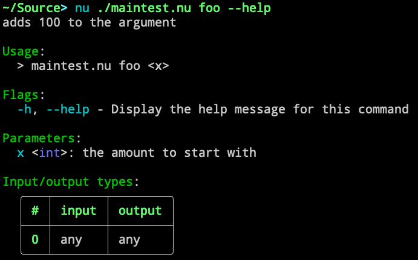

# Nushell turns 4 years old!

Today marks 4 years since Nushell's [first public release](https://www.nushell.sh/blog/2019-08-23-introducing-nushell.html). In that time, Nushell has grown and changed, while always staying true to the idea that started it all: being a structure data language and shell.

To celebrate, we thought we'd share stories of how people are using Nushell today.

## Watching for database changes (Reilly)

> I like how easy it is to hack together ad-hoc dev tools with Nushell. For example:
>
> - In a loop: clear the screen, do something like `open app.db | get some_table`, and then `sleep` a few seconds
>   - Now I've got an auto-updating "dashboard" of what's going on in a SQLite database
> - Use `watch` to run a SQLite command whenever a .sql file changes - suddenly I've got a little SQLite IDE
>
> Nu's useful in a lot of situations like this because it's great at displaying tabular data and working with external data.

## Using a `grid` when you `cd` (fdncred)

"I have it in a custom command name `lsg` and then in my `env_change` hook on the `PWD` env var, I call `print (lsg)`. So, every time I `cd`, `lsg` gets ran for whatever directory I'm `cd`'ing to, automatically."

Using `ls | sort-by type name -i | grid -c`, it looks like this:


## Converting SVG to PDF in bulk (sholderbach)

"Converting SVG drawings and figures to PDFs in bulk. I like how explicit and clean that is compared to a solution with xargs in bash"


## Gotta have a Chuck Norris joke

```nushell
> (http get https://api.chucknorris.io/jokes/random).value
```

## Surprise, we support script subcommands (sophiajt)

"Turns out, we already support subcommands in scripts."

```nu
# adds 100 to the argument
def "main foo" [
  x: int # the amount to start with
] {
  print ($x + 100)
}

def "main" [] {
  print "usage: maintest.nu <command name>"
}
```

```nu
> nu ../maintest.nu foo 123
223
```

It even comes with its own help


## Crossplatform symlinks (Kubouch)

"Here is my favorite: Cross-platform symlink:"

```nushell
# Create a symlink
export def symlink [
    existing: path   # The existing file
    link_name: path  # The name of the symlink
] {
    let existing = ($existing | path expand -s)
    let link_name = ($link_name | path expand)

    if $nu.os-info.family == 'windows' {
        if ($existing | path type) == 'dir' {
            mklink /D $link_name $existing
        } else {
            mklink $link_name $existing
        }
    } else {
        ln -s $existing $link_name | ignore
    }
}
```

## Giving your hex values some color (fdncred)

add `string: {|x| if $x =~ '^#[a-fA-F\d]+' { $x } else { 'white' } }` to your `$env.config.color_config` and you'll get:


# And many more

We've hope you all have enjoyed using Nushell as much as we've enjoyed making. Here's to many more happy birthdays to come!
