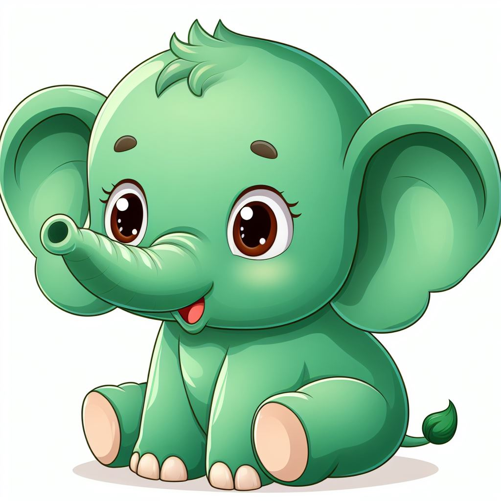
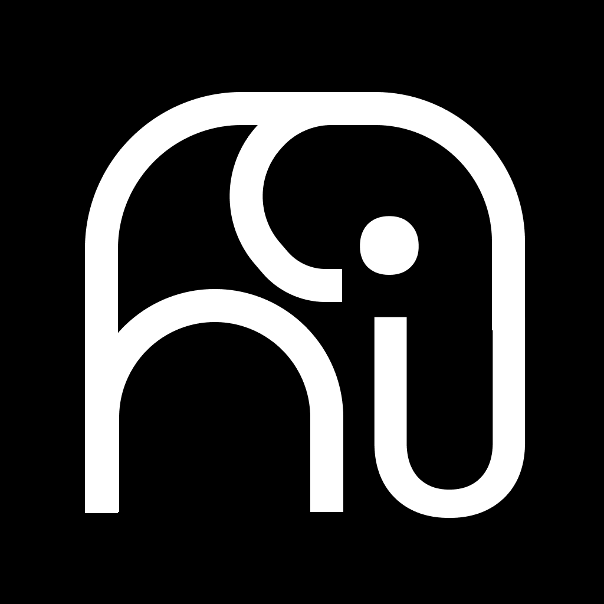
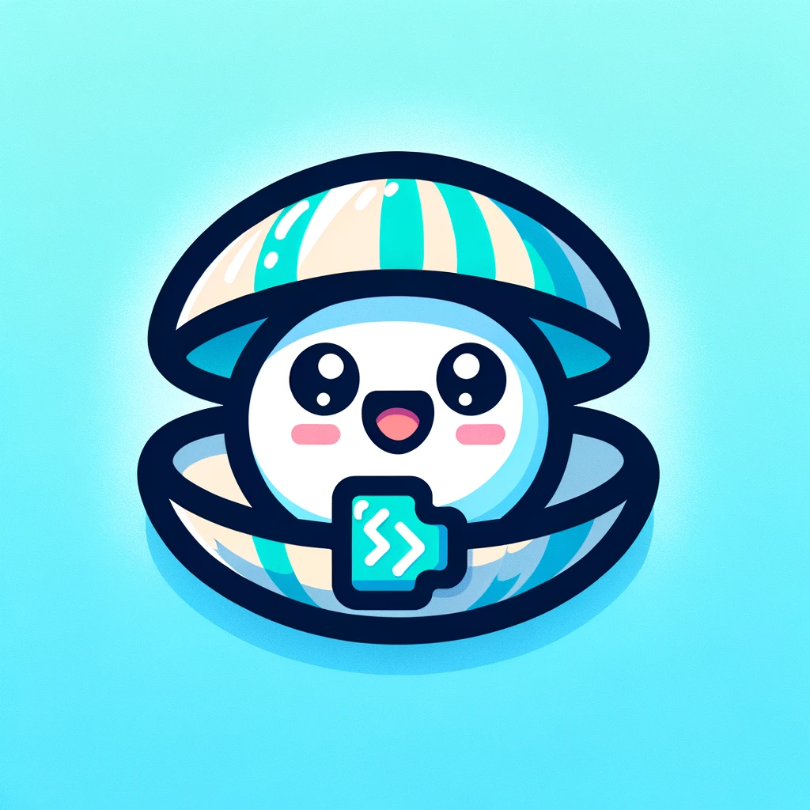

## Who's got talent?
Quite often the community asks us what the logo and the mascot of Nushell are.
Unfortunately, as of today, we do not have a fully satisfying and official
answer to this :open_mouth:

It is true we have [a few artworks][Nushell artworks] and
[one of them][current Nushell logo] is used as the logo of the Nushell discord
server, Twitter account and GitHub organization.

It is true we have Ellie the friendly elephant as our currently unofficial
mascot alongside emojis in the Discord server.

However, as Nushell is becoming more popular and mature, we would like to have
an official stamped brand for this project we love. Thus...

### We need a logo and a mascot :)
For this and to reflect as best as we can our community, we would like to get
YOU involved in this endeavour :smirk:

In the following weeks, we will be organizing a contest where YOU can submit
your creations and have them compete in a fierce battle where only one will
stand by the end of the event, also known as a vote :wink:

Let us explain the rules, what you'll be asked exactly, how to submit your work
and how all this will unfold :yum:

## Rules
- your creation will have to follow a few required themes:
  - shell (as with Bash, Fish and Nushell, not necessarilly the animal)
  - friendly
  - colorful
- your submitted files should be in the SVG format, including the signature of
    the software you used or any other proof that you are indeed the author of
    the artwork <!-- QUESTION: is that something that exists? the signature of an SVG software -->
- any offensive or out-of-topic content will obviously be removed during the
    preselection

::: warning IMPORTANT NOTE: On the use of generative algorithms
Because we (as in the Nushell project) want to fully own the logo and mascot of
Nushell, we want to have a certain level of confidence in the fact that you are
indeed the author of the artworks you submit and thus are able to fully, and
legally, give us the ownership of the winning logo and mascot.

This is why we ask you to give us proof that you created the images and **NOT TO
USE ANY GENERATIVE ALGORITHMS** such as _MidJourney_ or
_Dall-E_ :pray:

Any work that can be proven to be from one of these algorithms and that we can't
legally own will be immediately discarded...

Thanks for your understanding :innocent:
:::

### Some ideas
Here are some ideas for what we might consider as a good fit for Nushell,
following the themes detailed above:
- Ellie the friendly and yet powerful mascot

- a minimalist font-like logo, featuring "nu" and an abstract elephant

- a blue and friendly shell mascot

## Submissions
In order to submit your work, please follow the instructions below:
- send an email to [the.nushell@gmail.com](mailto:the.nushell@gmail.com)
- it should contain your Discord name so that we can contact you easily <!-- QUESTION: do we want the Discord login? -->
- your creations should be called `logo.svg` and `mascot.svg`
- you can submit only a logo, only a mascot or multiple ideas for each <!-- QUESTION: do we allow multiple submissions? -->

## Course of events
Below are the four main phases of this event:
| phase          | start      | deadline       |
| -------------- | ---------- | -------------- |
| _submission_   | now        | **2024-02-01** |
| _preselection_ | 2024-02-01 | **2024-02-15** |
| _vote_         | 2024-02-15 | **2024-03-01** |

The results and the _winners_ will be announced shortly in March 2024.

::: tip Note
details on the vote will be given in time, but will likely happen either on
Discord and / or with a _Google Form_
:::

With all this in mind, we are very excited to find the official look of
Nushell's logo and mascot in the following weeks and can't wait to see what you
will be able to produce :heart:

And now... let the best logo and mascot win! :tada:

[Nushell artworks]: https://github.com/nushell/showcase/tree/main/artwork#artwork-showcase
[current Nushell logo]: https://github.com/nushell/showcase/blob/main/artwork/nushell-sliced.png
