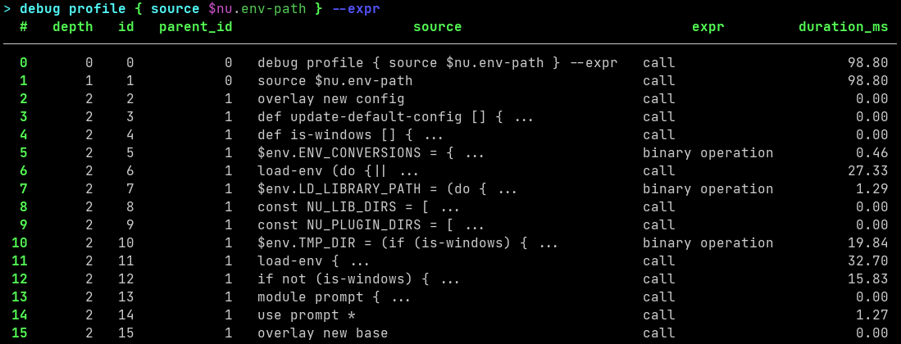
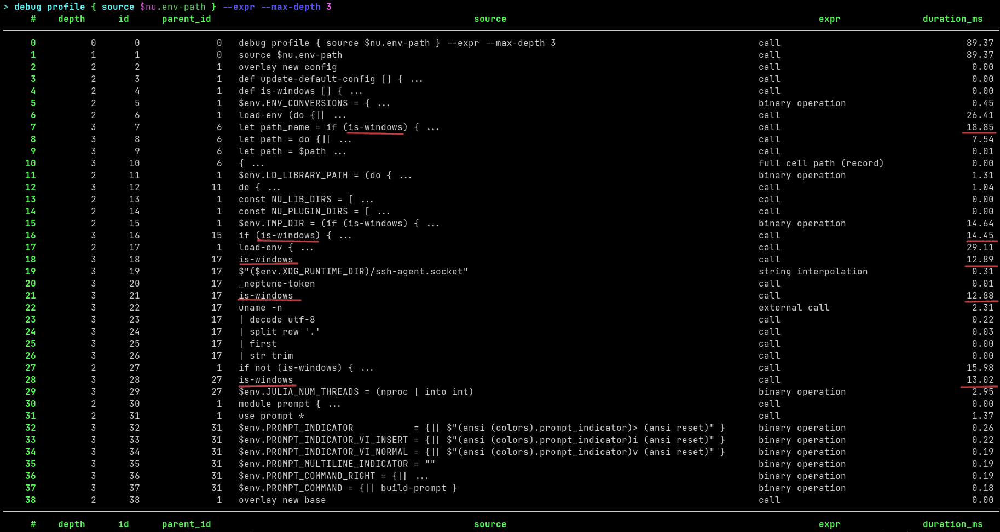
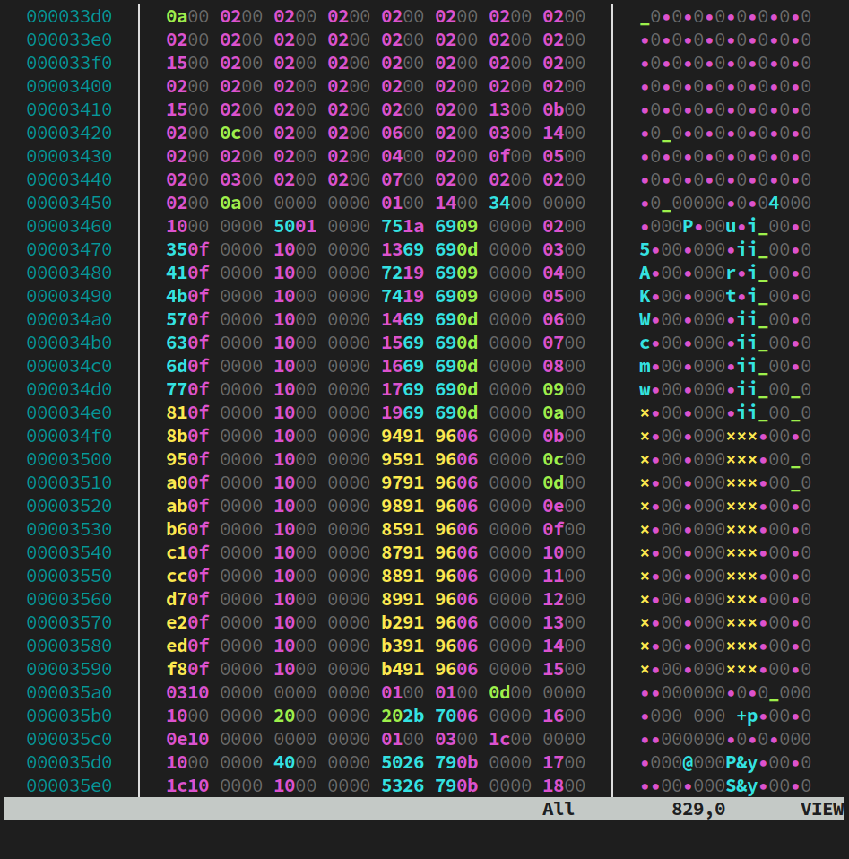

# Nushell 0.92.0

Nushell, or Nu for short, is a new shell that takes a modern, structured approach to your command line. It works seamlessly with the data from your filesystem, operating system, and a growing number of file formats to make it easy to build powerful command line pipelines.

Today, we're releasing version 0.92.0 of Nu. This release adds exciting new plugin features (persistence, a reworked API, and more functionality), a simple profiler, support for XDG_CONFIG_HOME, scoped file redirections, and changes to external command output.

# Where to get it

Nu 0.92.0 is available as [pre-built binaries](https://github.com/nushell/nushell/releases/tag/0.92.0) or from [crates.io](https://crates.io/crates/nu). If you have Rust installed you can install it using `cargo install nu`.

::: tip Note
The optional dataframe functionality is available by `cargo install nu --features=dataframe`.
:::

As part of this release, we also publish a set of optional plugins you can install and use with Nu. To install, use `cargo install nu_plugin_<plugin name>`.

# Table of content
- [*Themes of this release / New features*](#themes-of-this-release-new-features-toc)
    - [*External command output changes*](#external-command-output-changes-toc)
    - [*Scoped file redirections*](#scoped-file-redirections-toc)
    - [*Tilde expansion*](#tilde-expansion-toc)
    - [*Support for `XDG_CONFIG_HOME`*](#support-for-xdg-config-home-toc)
    - [*Incorporating the `extra` feature by default*](#incorporating-the-extra-feature-by-default-toc)
    - [*Persistent plugins*](#persistent-plugins-toc)
    - [*Plugin API overhaul*](#plugin-api-overhaul-toc)
    - [*Plugin engine calls*](#plugin-engine-calls-toc)
    - [*Improved plugin custom values*](#improved-plugin-custom-values-toc)
    - [*Plugin test support crate*](#plugin-test-support-crate-toc)
    - [*Official plugin template*](#official-plugin-template-toc)
    - [*Debugging support and proof-of-concept profiler*](#debugging-support-and-proof-of-concept-profiler-toc)
    - [*Support for binary data in `explore`*](#support-for-binary-data-in-explore-toc)
    - [*Performance improvements*](#performance-improvements-toc)
    - [*Hall of fame*](#hall-of-fame-toc)
        - [*Bug fixes*](#bug-fixes-toc)
        - [*Enhancing the documentation*](#enhancing-the-documentation-toc)
    - [*Our set of commands is evolving*](#our-set-of-commands-is-evolving-toc)
        - [*New commands*](#new-commands-toc)
            - [*`plugin list`*](#plugin-list-toc)
            - [*`plugin stop`*](#plugin-stop-toc)
            - [*`debug profile`*](#debug-profile-toc)
            - [*`uname`*](#uname-toc)
            - [*`query db --params`*](#query-db-params-toc)
            - [*`detect columns --guess`*](#detect-columns-guess-toc)
        - [*Changes to existing commands*](#changes-to-existing-commands-toc)
            - [*`echo`*](#echo-toc)
            - [*`table`*](#table-toc)
            - [*`into bits`*](#into-bits-toc)
            - [*`nu-check`*](#nu-check-toc)
            - [*`mkdir`*](#mkdir-toc)
            - [*`ls`*](#ls-toc)
            - [*`version`*](#version-toc)
            - [*`filter`*](#filter-toc)
            - [*`insert`*](#insert-toc)
            - [*`do`*](#do-toc)
            - [*`complete`*](#complete-toc)
            - [*`ignore`*](#ignore-toc)
            - [*`export use`*](#export-use-toc)
            - [*`sleep`*](#sleep-toc)
            - [*`into sqlite`*](#into-sqlite-toc)
            - [*`to json`*](#to-json-toc)
            - [*`du`*](#du-toc)
            - [*`histogram`*](#histogram-toc)
            - [*`into string`*](#into-string-toc)
        - [*Deprecated commands*](#deprecated-commands-toc)
            - [*`run-external` flags*](#run-external-flags-toc)
        - [*Removed commands*](#removed-commands-toc)
            - [*`str escape-glob`*](#str-escape-glob-toc)
- [*Breaking changes*](#breaking-changes-toc)
- [*Full changelog*](#full-changelog-toc)

# Themes of this release / New features [[toc](#table-of-content)]

## External command output changes [[toc](#table-of-content)]

::: warning Breaking change
See a full overview of the [breaking changes](#breaking-changes-toc)
:::

With [#11934](https://github.com/nushell/nushell/pull/11934), we improved the performance of pipelines with external commands.
As part of this effort, Nushell now streams external command output in more places where it is possible.
Namely, parentheses no longer collect external command output and are now solely for grouping and precedence.
For example, take this pipeline:
```nushell
(nu -c "for x in 1.. { try { print $x } catch { break } }")
| lines
| first
```
In previous versions, this would collect the output of `nu` and would not print anything until `ctrl+c` was pressed.
Now, this will immediately print the first line and then immediately finish the pipeline.

So now, external command output will only be collected if it's being turned into a value
(or if it's passed to an internal command that collects its input).
For example, external commands will be collected if it's a command argument:
```nushell
print (^external)
```
Or, if it's being stored in record, list, table, or variable:
```nushell
{
    result: (^external)
}

[(^external)]

let result = ^external
```

"Being turned into a value" now also includes closures in many cases. For example,
`each`, `insert`, `reduce`, and many other commands run closures to compute values.
In these cases, if an external command is in "return position" (it's the last command),
then its output will be collected into a value instead of writing to the terminal/stdio.
For example, the code below used to print `"text"` twice and then return an empty list:
```nushell
1..2 | each { nu -c 'print text' }
```
But now, this will collect the output of `nu`, giving the list `['text', 'text']`.
To achieve the old behavior, you can return `null` instead:
```nushell
1..2 | each { nu -c "print text"; null }
# or, you could use a `for` loop
```

Only a few commands take a closure but do not use it to compute a value:
- `do`
- `with-env`
- `collect`
- `tee`
- `watch`

These commands will not collect external command output from the closure and will instead forward it to the next command in the pipeline or to the terminal/stdio.

Another notable change is that external command output will no longer be implicitly ignored.
For example, external commands in subexpressions that were not the last command used to have their output discarded:
```nushell
(^echo first; ^echo last)
```
Before, this would only print `last`, but now this prints both `first` and `last`.

One final change to note is that external command output now has trailing new lines removed by default.
The exceptions are if the external command is being redirected to a file, another external command, to the terminal, or to the `complete` command.

## Scoped file redirections [[toc](#table-of-content)]

::: warning Breaking change
See a full overview of the [breaking changes](#breaking-changes-toc)
:::

File redirections (`o>`, `e>`, `o+e>`, etc.) now apply to all ***external*** commands inside an expression.
For example, the snippet below will redirect stderr from both commands into `err.log`.

```nushell
(nu -c "print -e first"; nu -c "print -e last") e> err.log
# err.log will contain: "first\nlast\n"
```

Note that if there were any custom commands called inside the subexpression,
then any external commands inside the custom command would also use the same file redirection.

```nushell
def cmd [] {
    ^extern1
    ^extern2
}

(^extern3; cmd) o> out.txt

# output from `extern1`, `extern2`, `extern3` will be redirected to the file
```

## Tilde expansion [[toc](#table-of-content)]

::: warning Breaking change
See a full overview of the [breaking changes](#breaking-changes-toc)
:::

Building off of last release's [work with globs](/blog/2024-03-05-nushell_0_91_0.html#handling-globs-for-variables-toc), this version makes similar changes to tilde expansion in [#12232](https://github.com/nushell/nushell/pull/12232). Now, tildes will be expanded to the home directory only if it's part of a glob.
```nushell
ls ~/dir              # expands tilde
ls "~/dir"            # does not expand tilde

let f = "~/dir"
ls $f                 # does not expand tilde
ls ($f | path expand) # tilde explicitly expanded
ls ($f | into glob)   # tilde will be expanded

let f: glob = "~/aaa"
ls $f                 # tilde will be expanded
```

## Support for `XDG_CONFIG_HOME` [[toc](#table-of-content)]

::: warning Breaking change
See a full overview of the [breaking changes](#breaking-changes-toc)
:::

When nushell firsts starts up, if it detects that the `XDG_CONFIG_HOME` environment variable is set to an absolute path, then nushell will use `XDG_CONFIG_HOME/nushell` as the config directory. Otherwise, nushell will use the same config directory as it did in previous versions. Note that setting `XDG_CONFIG_HOME` in `env.nu` will not work! `XDG_CONFIG_HOME` must be set before nushell is launched. This can be accomplished through settings in your terminal emulator, using another shell to launch nushell, by setting environment variables at the OS level, etc. The relevant PR is [#12118](https://github.com/nushell/nushell/pull/12118).

## Incorporating the `extra` feature by default [[toc](#table-of-content)]

::: warning Breaking change
See a full overview of the [breaking changes](#breaking-changes-toc)
:::

The `extra` cargo feature was removed in this version, since all of its features and commands are now included by default with [#12140](https://github.com/nushell/nushell/pull/12140).
Packagers and users that compile nushell from source will need to check whether they enable the `extra` feature and remove it from their build scripts.

This was done to simplify the distribution of Nushell to have a canonical set of commands. Commands that we deem to serve a niche role or are not fully developed yet will now most likely be removed from the core `nu` binary and move into their dedicated plugins.

(Now only the `dataframe` feature remains to add a major set of commands, but work is underway to allow you to add this simply as a plugin)

If your current build of nushell does not have the `extra` feature enabled, then you should have access to more commands in this new release:
- `update cells` provides an easy way to update all cells of a table using a closure.
- `each while` is like the `each` command, except it stops once a null value is returned by the closure.
- `into bits` returns the stringified binary representation of a value.
- The `bits` family of commands which has bit-wise operations like `bits and`, `bits or`, `bits not`, `bits shl`, and more!
- More `math` commands like `math exp`, `math ln`, and trigonometric functions like `math sin`, `math sinh`, `math arcsin`, and `math arcsinh`.
- `format pattern` which provides a simpiler way to format columns of a table compared to, for example, using string interpolation.
- `fmt` which formats numbers into binary, hex, octal, exponential notation, and more.
- `encode hex` and `decode hex` allows one to encode and decode binary values as hex strings.
- Commands to change the casing of strings like `str camel-case`, `str kebab-case`, and more.
- The `roll` family of commands to roll columns or rows of a table up, down, left, or right.
- The `rotate` command to rotate a table clockwise or counter clockwise.
- `ansi gradient` adds a color gradient to text foreground and/or background.
- `to html` converts a table into HTML text.
- `from url` parses a url encoded string into a record.

Future releases may choose to remove some of those commands to plugins to slim down the `nu` binary or make sure that we can maintain stability guarantees after the 1.0 release of Nushell.

## Persistent plugins [[toc](#table-of-content)]

::: warning
We recommend removing your `plugin.nu` file (from the config directory) when migrating to this new version, due to the significant changes made. You will then need `register` all of your plugins again after they have been updated.
:::

A major enhancement for plugin users: plugins can now run persistently in the background and serve multiple calls before exiting! :tada:

This improves the performance of plugin commands considerably, because starting a process has a much more considerable overhead than talking to an existing one:

```nushell
# 0.91.0
> 1..1000 | each { timeit { "2.3.2" | inc -m } } | math avg
2ms 498µs 493ns

# 0.92.0 (8x faster!)
> 1..1000 | each { timeit { "2.3.2" | inc -m } } | math avg
308µs 577ns
```

That difference is even more significant for plugins written in JIT or interpreted languages:

```nushell
# 0.91.0
> 1..100 | each { timeit { nu-python 1 foo } } | math avg
40ms 704µs 902ns

# 0.92.0 (47x faster!)
> 1..1000 | each { timeit { nu-python 1 foo } } | math avg
871µs 410ns
```

This will open the door to plugins that would have otherwise been too slow to be useful, particularly in languages that have a reputation for being slow to cold start, like Java and other JVM languages.

By default, plugins will stay running for 10 seconds after they were last used, and quit if there is no activity. This behavior is [configurable](/book/plugins.md#plugin-garbage-collector):

```nushell
$env.config.plugin_gc = {
    # Settings for plugins not otherwise specified:
    default: {
        enabled: true # set to false to never automatically stop plugins
        stop_after: 10sec # how long to wait after the plugin is inactive before stopping it
    }
    # Settings for specific plugins, by plugin name
    # (i.e. what you see in `plugin list`):
    plugins: {
        gstat: {
            stop_after: 1min
        }
        inc: {
            stop_after: 0sec # stop as soon as possible
        }
        stream_example: {
            enabled: false # never stop automatically
        }
    }
}
```

Aside from performance, this also enables plugins to have much more advanced behavior. Plugins can now maintain state across plugin calls, and for example use a handle custom value to track resources that remain in the plugin's process without having to be serialized somehow, or implement caches to speed up certain operations that are repeated often.

For more details on how to manage plugins with this change, see the newly added [`plugin list`](#plugin-list-toc) and [`plugin stop`](#plugin-stop-toc) commands.

## Plugin API overhaul [[toc](#table-of-content)]

::: warning Breaking change
See a full overview of the [breaking changes](#breaking-changes-toc)
:::

::: warning
Plugins are no longer launched in the current working directory of the shell. Instead, they are launched in the directory of their plugin executable. See [this section](/contributor-book/plugins.md#launch-environment) of the plugins guide for details.
:::

This release brings major reorganization to the plugin API. The [`Plugin`](https://docs.rs/nu-plugin/0.92.0/nu_plugin/trait.Plugin.html) trait now specifies a list of [`PluginCommand`](https://docs.rs/nu-plugin/latest/nu_plugin/trait.PluginCommand.html) trait objects, which implement both the signature and the functionality for that command. Dispatching the commands by name is now handled by `serve_plugin()` automatically, so no more `match` statements! This should make creating plugins that expose many commands much easier, and also makes a one-command-per-module pattern easier to follow.

`StreamingPlugin` has been removed. Instead, `PluginCommand` uses the streaming API, with `PipelineData` input and output, and `SimplePluginCommand` has value input and output just as before.

The `signature()` method has been broken up into more methods to reflect the internal `Command` trait. This makes core commands and plugin commands look more similar to each other, and makes it easier to move core commands to plugins if we want to. The new methods are: `name()`, `usage()`, `extra_usage()`, `examples()`, `search_terms()`. `PluginSignature` and `PluginExample` are both no longer needed to be used by plugin developers - just use `Signature` and `Example` like core commands do.

The arguments passed to `run()` have also changed. It now takes `&self` rather than `&mut self`, and all plugins and commands are required to be `Sync`, so that they can be safely shared between threads. Use thread-safe state management utilities such as those found in `std::sync` to create stateful plugins.

The `config` parameter has been removed and replaced with an `EngineInterface` reference, which supports many more functions, including `get_plugin_config()` to get the config. For the other added functionality on `EngineInterface`, see [that section](#plugin-engine-calls-toc).

`LabeledError` has been reworked, and now supports multiple labeled spans and some other attributes that miette provides. This helps to ensure that `ShellError` can generally be passed through a `LabeledError` and still appear the same to the user. A new `ShellError::LabeledError` variant is provided to contain it. More complex plugins might like to implement a `miette::Diagnostic` error, in which case converting to `LabeledError` can be done automatically via `LabeledError::from_diagnostic()`.

A complete example of the new API organization from the [plugin docs](/contributor-book/plugins.md):

```rust
use nu_plugin::{serve_plugin, EvaluatedCall, JsonSerializer};
use nu_plugin::{EngineInterface, Plugin, PluginCommand, SimplePluginCommand};
use nu_protocol::{LabeledError, Signature, Type, Value};

struct LenPlugin;

impl Plugin for LenPlugin {
    fn commands(&self) -> Vec<Box<dyn PluginCommand<Plugin = Self>>> {
        vec![Box::new(Len)]
    }
}

struct Len;

impl SimplePluginCommand for Len {
    type Plugin = LenPlugin;

    fn name(&self) -> &str {
        "len"
    }

    fn usage(&self) -> &str {
        "calculates the length of its input"
    }

    fn signature(&self) -> Signature {
        Signature::build(PluginCommand::name(self))
            .input_output_type(Type::String, Type::Int)
    }

    fn run(
        &self,
        _plugin: &LenPlugin,
        _engine: &EngineInterface,
        call: &EvaluatedCall,
        input: &Value,
    ) -> Result<Value, LabeledError> {
        let span = input.span();
        match input {
            Value::String { val, .. } => Ok(Value::int(val.len() as i64, span)),
            _ => Err(
                LabeledError::new("Expected String input from pipeline").with_label(
                    format!("requires string input; got {}", input.get_type()),
                    call.head,
                ),
            ),
        }
    }
}

fn main() {
    serve_plugin(&LenPlugin, JsonSerializer)
}
```

## Plugin engine calls [[toc](#table-of-content)]

The added `EngineInterface` parameter [mentioned previously](#plugin-api-overhaul-toc) enables the following new functionality for plugins:

- Get the engine `Config`: `.get_config()` (part of [#12029](https://github.com/nushell/nushell/pull/12029))
- Evaluate closure: `.eval_closure()`, `.eval_closure_with_stream()` (part of [#12029](https://github.com/nushell/nushell/pull/12029))
- Get environment variables and working directory: `.get_env_var()`, `.get_env_vars()`, `.get_current_dir()` ([#12166](https://github.com/nushell/nushell/pull/12166))
- Set environment variables in caller's scope: `.add_env_var()` ([#12204](https://github.com/nushell/nushell/pull/12204))
- Plugin garbage collection disable/enable: `.set_gc_disabled()` (part of [#12064](https://github.com/nushell/nushell/pull/12064))
- Get command help text, useful for subcommand collections: `.get_help()` ([#12243](https://github.com/nushell/nushell/pull/12243))

See the [docs](https://docs.rs/nu-plugin/0.92.0/nu_plugin/struct.EngineInterface.html) for details and examples on what can be done with the `EngineInterface`.

## Improved plugin custom values [[toc](#table-of-content)]

Custom values returned by plugins previously had very limited functionality - they could really only be sent back to the same plugin in another command. This release expands the number of supported operations:

- Cell paths (e.g. `$custom_value.0` and `$custom_value.field`)
- Operators (e.g. `$custom_value + $other`, `$custom_value ++ "plain value"`)
- Comparisons (for compatibility with `sort`)
- [Drop notification](/contributor-book/plugins.md#drop-notification) (useful for implementing handles)

Most of these improvements originated in [#12088](https://github.com/nushell/nushell/pull/12088). Additionally, custom values are now also allowed to be used in examples for commands in plugins [#12113](https://github.com/nushell/nushell/pull/12213).

For more information, see [the plugins guide](/contributor-book/plugins.md#custom-values) and [`CustomValue` docs](https://docs.rs/nu-plugin/0.92.0/nu_protocol/trait.CustomValue.html).

## Plugin test support crate [[toc](#table-of-content)]

With plugins having much more functionality, we thought it would be nice if it were easy to write tests for your plugins, and even test your examples automatically. [Now you can!](/contributor-book/plugins.md#testing-plugins)

Add the `nu-plugin-test-support` crate to your dev-dependencies:

```toml
[dev-dependencies]
nu-plugin-test-support = "0.92.0"
```

Then test your examples:

```rust
#[test]
fn test_examples() -> Result<(), nu_protocol::ShellError> {
    use nu_plugin_test_support::PluginTest;
    PluginTest::new("my_plugin", MyPlugin.into())?.test_command_examples(&MyCommand)
}
```

For more information, see the [crate docs](https://docs.rs/nu-plugin-test-support/0.92.0/) and the [contributor book](/contributor-book/plugins.md#testing-plugins).

## Official plugin template [[toc](#table-of-content)]

With this release, we are launching an official template for plugins, to help you get started. Use [cargo-generate](https://github.com/cargo-generate/cargo-generate):

```
> cargo generate --force --git https://github.com/nushell/nu_plugin_template
🤷   What will this plugin be named?: foo
Creating a new plugin named "foo"
Your plugin crate will be named "nu_plugin_foo".

Note that the MIT license is used by default, to reflect the majority of
Nushell projects. You can change this manually if you'd like to.

!!! IMPORTANT !!!
You must run cargo generate with --force, or it will rename your project to
something that is non-standard for Nushell plugins and this will fail.

If you see a message after this about renaming your project, please abort and
try again with --force.

🔧   Destination: /var/home/devyn/Projects/nushell/nu_plugin_foo ...
🔧   project-name: nu_plugin_foo ...
🔧   Generating template ...
🤷   What should your first command be called? (spaces are okay): foo
✔ 🤷   Do you intend to create more than one command / subcommand? · No
✔ 🤷   Would you like a simple command? Say no if you would like to use streaming. · Yes
🤷   What is your GitHub username? (Leave blank if you don't want to publish to GitHub) [default: ]:
🔧   Moving generated files into: `/var/home/devyn/Projects/nushell/nu_plugin_foo`...
🔧   Initializing a fresh Git repository
✨   Done! New project created /var/home/devyn/Projects/nushell/nu_plugin_foo
> cd nu_plugin_foo
> cargo build
> register target/debug/nu_plugin_foo
> foo Ferris
Hello, Ferris. How are you today?
```

## Debugging support and proof-of-concept profiler [[toc](#table-of-content)]

You may remember that we used to have a `profile` command which then got removed due to unsound implementation. Now, [it's back](https://github.com/nushell/nushell/pull/11441) as `debug profile`! You can give it a closure and it will profile each pipeline element in it, stepping recursively into nested blocks/closures/command calls. Make sure to check its help message to understand its output and options.

Under the hood, the profiler uses a new general debugging API that is now hooked into the evaluation engine. The profiler is a proof-of-concept implementation using this API, but we imagine it could be used for other purposes, such as step debugging, code coverage, or even allowing to create custom debugger plugins.

A short user story as an example: The following screenshot shows the profiler output of sourcing kubouch's env.nu file:

You can see that most time is spent inside the `load-env` calls and in the `if (is-windows) { ...`. We can increase the number of blocks to step into with the `--max-depth` flag which reveals more detail:

You can notice that most of the expensive pipeline elements have one thing in common: The `is-windows` call. It is a custom command in kubouch's env.nu which internally calls `(sys).host.name` which on kubouch's machine takes around 13 ms. Changing it to use `$nu.os-info.name` and other smaller fixes decreased the startup time from 130ms to 50ms.

## Support for binary data in `explore` [[toc](#table-of-content)]

[@zhiburt](https://github.com/zhiburt) has added the colored hexdump view for binary data to the `explore` command ([#12184](https://github.com/nushell/nushell/pull/12184)), making it much easier to page through the output. This should be handy for anyone who spends a lot of time looking at binary formats!



## Performance improvements [[toc](#table-of-content)]

A significant effort in this release went into improving Nushell's performance and resource usage.
As part of this, we grew our internal benchmark suite to measure the performance impact of future changes ([#12025](https://github.com/nushell/nushell/pull/12025), [#12293](https://github.com/nushell/nushell/pull/12293)).
In addition to performance improvements from the external command and plugin changes, there have been other notable efforts to make nushell faster! In [#11654](https://github.com/nushell/nushell/pull/11654), [@rtpg](https://github.com/rtpg) reduced the work needed to clone stacks.
This improvement will be most noticeable if you have very large global variables in the REPL, as these will no longer need to be copied in memory each time you hit enter.
On top of this, [@devyn](https://github.com/devyn) made it cheaper to clone the engine state in [#12229](https://github.com/nushell/nushell/pull/12229).
This should make nushell more performant when evaluating closures and also should reduce memory usage (especially in the REPL).
To further address memory usage [@FilipAndersson245](https://github.com/FilipAndersson245) reduced the size of our `Value` primitive in [#12252](https://github.com/nushell/nushell/pull/12252) and with [#12326](https://github.com/nushell/nushell/pull/12326) [@sholderbach](https://github.com/sholderbach) changed our internal `Record` to a more compact and efficient representation.
During work we also identified and fixed inefficiencies like unnecessarily copying values when accessing columns in a table or record ([#12325](https://github.com/nushell/nushell/pull/12325)).
Overall we hope to improve the experience with Nushell and welcome the community to contribute suggestions for benchmarks that reflect their workloads to avoid regressions and tune Nushell's engine.

## Hall of fame [[toc](#table-of-content)]

### Bug fixes [[toc](#table-of-content)]

Thanks to all the contributors below for helping us solve issues and bugs :pray:
| author | description | url |
|-|-|-|
|[@merelymyself](https://github.com/merelymyself)|Make autocd return exit code 0|[#12337](https://github.com/nushell/nushell/pull/12337)|
|[@dead10ck](https://github.com/dead10ck)|into sqlite: Fix insertion of null values|[#12328](https://github.com/nushell/nushell/pull/12328)|
|[@sholderbach](https://github.com/sholderbach)|Fix `return` in `filter` closure eval|[#12292](https://github.com/nushell/nushell/pull/12292)|
|[@lavafroth](https://github.com/lavafroth)|fix: use environment variables to prevent command_not_found from recursing|[#11090](https://github.com/nushell/nushell/pull/11090)|
|[@YizhePKU](https://github.com/YizhePKU)|Fix: missing parse error when extra tokens are given to let bindings|[#12238](https://github.com/nushell/nushell/pull/12238)|
|[@dannou812](https://github.com/dannou812)|`to json -r` not removing whitespaces fix|[#11948](https://github.com/nushell/nushell/pull/11948)|
|[@JoaoFidalgo1403](https://github.com/JoaoFidalgo1403)|Fix usage of --tabs flag while converting to json|[#12251](https://github.com/nushell/nushell/pull/12251)|
|[@YizhePKU](https://github.com/YizhePKU)|Fix inaccurate sleep duration|[#12235](https://github.com/nushell/nushell/pull/12235)|
|[@IanManske](https://github.com/IanManske)|Use rest argument in `export use` to match `use`|[#12228](https://github.com/nushell/nushell/pull/12228)|
|[@sarubo](https://github.com/sarubo)|Adjust permissions using `umask` in `mkdir`|[#12207](https://github.com/nushell/nushell/pull/12207)|
|[@WindSoilder](https://github.com/WindSoilder)|fix ls with empty string|[#12086](https://github.com/nushell/nushell/pull/12086)|
|[@rgwood](https://github.com/rgwood)|Fix up ctrl+C handling in `into sqlite`|[#12130](https://github.com/nushell/nushell/pull/12130)|
|[@NowackiPatryk](https://github.com/NowackiPatryk)|Fix unexpected sqlite insert behaviour (attempt 2)|[#12128](https://github.com/nushell/nushell/pull/12128)|
|[@VlkrS](https://github.com/VlkrS)|Fix build on OpenBSD|[#12111](https://github.com/nushell/nushell/pull/12111)|
|[@dj-sourbrough](https://github.com/dj-sourbrough)|Fix: lex now throws error on unbalanced closing parentheses (issue #11982)|[#12098](https://github.com/nushell/nushell/pull/12098)|
|[@NotTheDr01ds](https://github.com/NotTheDr01ds)|Fix: Convert help example results to text|[#12078](https://github.com/nushell/nushell/pull/12078)|
|[@rgwood](https://github.com/rgwood)|Remove unused/incorrect input type from `start`|[#12107](https://github.com/nushell/nushell/pull/12107)|
|[@fdncred](https://github.com/fdncred)|fix `du` `--exclude` globbing bug|[#12093](https://github.com/nushell/nushell/pull/12093)|

### Enhancing the documentation [[toc](#table-of-content)]

Thanks to all the contributors below for helping us making the documentation of Nushell commands better :pray:
| author | description | url |
|-|-|-|
|[@Jasha10](https://github.com/Jasha10)|Fix dead links in CONTRIBUTING.md|[#12353](https://github.com/nushell/nushell/pull/12353)|
|[@AucaCoyan](https://github.com/AucaCoyan)|♻️ rework some help strings|[#12306](https://github.com/nushell/nushell/pull/12306)|
|[@devyn](https://github.com/devyn)|Fix zip signature to mention closure input type|[#12216](https://github.com/nushell/nushell/pull/12216)|
|[@thomassimmer](https://github.com/thomassimmer)|Fix histogram error message|[#12197](https://github.com/nushell/nushell/pull/12197)|
|[@nils-degroot](https://github.com/nils-degroot)|Improve error message for `into sqlite` with empty records|[#12149](https://github.com/nushell/nushell/pull/12149)|
|[@IanManske](https://github.com/IanManske)|Fix broken doc link|[#12092](https://github.com/nushell/nushell/pull/12092)|
|[@wellweek](https://github.com/wellweek)|remove repetitive word|[#12117](https://github.com/nushell/nushell/pull/12117)|
|[@sholderbach](https://github.com/sholderbach)|Remove outdated doccomment on `EngineState`|[#12158](https://github.com/nushell/nushell/pull/12158)|
|[@devyn](https://github.com/devyn)|Misc doc fixes|[#12266](https://github.com/nushell/nushell/pull/12266)|
|[@fdncred](https://github.com/fdncred)|cleanup coreutils tagging|[#12286](https://github.com/nushell/nushell/pull/12286)|

## Our set of commands is evolving [[toc](#table-of-content)]

### New commands [[toc](#table-of-content)]

This release adds four new commands and more flags to some existing commands.

#### `plugin list` [[toc](#table-of-content)]

As part of the plugin persistence update, this command shows you not only all of the plugins you have installed and their commands, but also whether they are running and what their process ID is if they are:

```nushell
> plugin list
╭───┬─────────┬────────────┬─────────┬───────────────────────┬───────┬───────────────────────────────╮
│ # │  name   │ is_running │   pid   │       filename        │ shell │           commands            │
├───┼─────────┼────────────┼─────────┼───────────────────────┼───────┼───────────────────────────────┤
│ 0 │ gstat   │ true       │ 1389890 │ .../nu_plugin_gstat   │       │ ╭───┬───────╮                 │
│   │         │            │         │                       │       │ │ 0 │ gstat │                 │
│   │         │            │         │                       │       │ ╰───┴───────╯                 │
│ 1 │ inc     │ false      │         │ .../nu_plugin_inc     │       │ ╭───┬─────╮                   │
│   │         │            │         │                       │       │ │ 0 │ inc │                   │
│   │         │            │         │                       │       │ ╰───┴─────╯                   │
│ 2 │ example │ false      │         │ .../nu_plugin_example │       │ ╭───┬───────────────────────╮ │
│   │         │            │         │                       │       │ │ 0 │ nu-example-1          │ │
│   │         │            │         │                       │       │ │ 1 │ nu-example-2          │ │
│   │         │            │         │                       │       │ │ 2 │ nu-example-3          │ │
│   │         │            │         │                       │       │ │ 3 │ nu-example-config     │ │
│   │         │            │         │                       │       │ │ 4 │ nu-example-disable-gc │ │
│   │         │            │         │                       │       │ ╰───┴───────────────────────╯ │
╰───┴─────────┴────────────┴─────────┴───────────────────────┴───────┴───────────────────────────────╯
```

You can join the output of this command on `pid` with `ps` in order to get information about the running plugins. For example, to see the memory usage of running plugins:

```nushell
> plugin list | join (ps) pid | select name pid mem
╭───┬───────┬────────┬──────────╮
│ # │ name  │  pid   │   mem    │
├───┼───────┼────────┼──────────┤
│ 0 │ gstat │ 741572 │ 10.2 MiB │
│ 1 │ inc   │ 741577 │  3.6 MiB │
╰───┴───────┴────────┴──────────╯
```

#### `plugin stop` [[toc](#table-of-content)]

If you want to explicitly stop a plugin that's running in the background, you can use the `plugin stop` command. This works even if the plugin signals to Nushell [that it wants to stay running](/contributor-book/plugins.md#disabling-garbage-collection).

```nushell
> plugin stop inc
> plugin list | where is_running and name == inc
╭────────────╮
│ empty list │
╰────────────╯
```

Unlike `kill`, this does not send a signal to the process - it merely deregisters the plugin from Nushell's list of running plugins, which should eventually cause it to exit. If the plugin is unresponsive, you can `kill` its PID:

```nushell
> plugin list | where is_running and name == inc | each { kill $in.pid }
```

#### `debug profile` [[toc](#table-of-content)]

Profile a closure, see [debugging support and proof-of-concept profiler](#debugging-support-and-proof-of-concept-profiler-toc).

#### `uname` [[toc](#table-of-content)]

Thanks to [@dmatos2012](https://github.com/dmatos2012), version 0.92.0 adds the `uname` command. Under the hood, it uses [uutils](https://github.com/uutils/coreutils) to return a record containing system information.

#### `query db --params` [[toc](#table-of-content)]

Thanks to [@Dorumin](https://github.com/Dorumin), the `--params` flag was added to `query db` in [#12249](https://github.com/nushell/nushell/pull/12249). This allows one to specify parameters in the SQL query instead of using string interpolation. This helps avoids potential SQL injection attacks.

#### `detect columns --guess` [[toc](#table-of-content)]

A new flag, `--guess`, was added to `detect columns` in [#12277](https://github.com/nushell/nushell/pull/12277).
This uses a histogram approach to detect the boundaries between fixed-width columns,
and may give better results for certain command outputs.

### Changes to existing commands [[toc](#table-of-content)]

#### `echo` [[toc](#table-of-content)]

::: warning Breaking change
See a full overview of the [breaking changes](#breaking-changes-toc)
:::

`echo` will now never directly print values. It only returns its arguments, matching the behavior described in its `help` text.
Use the `print` command instead to print values to stdout or stderr.

#### `table` [[toc](#table-of-content)]

::: warning Breaking change
See a full overview of the [breaking changes](#breaking-changes-toc)
:::

With [#12294](https://github.com/nushell/nushell/pull/12294), the `table` command will always pretty print binary values. It used to not if the next command was an external command.

#### `into bits` [[toc](#table-of-content)]

::: warning Breaking change
See a full overview of the [breaking changes](#breaking-changes-toc)
:::

In [#12313](https://github.com/nushell/nushell/pull/12313), `into bits` was changed so that it can no longer take date values as input.
The current implementation of `into binary` (and until this release of `into bits`) for the `date` type is unstable and dependent on your system locale and timezone settings, as it creates a human-readable string instead of unique representation of the date-time point.
We intend to deprecate and remove the `into binary` implementation for the `date` type in a future release.

#### `nu-check` [[toc](#table-of-content)]

::: warning Breaking change
See a full overview of the [breaking changes](#breaking-changes-toc)
:::

`nu-check` received a significant refactor in [#12317](https://github.com/nushell/nushell/pull/12317).
It is now possible to check module directories, so the provided path no longer needs to end in `.nu`.
As part of this, the `--all` flag was removed, since all modules can be parsed as a script.

#### `mkdir` [[toc](#table-of-content)]

`mkdir` now uses `uucore` under the hood to determine the umask to apply to the directory being created (implemented in [#12207](https://github.com/nushell/nushell/pull/12207)).

#### `ls` [[toc](#table-of-content)]

With [#12086](https://github.com/nushell/nushell/pull/12086), `ls ""` no longer behaves like `ls /`. Instead, it will now report an error.

#### `version` [[toc](#table-of-content)]

The `version` command has been changed to list plugin names in `plugins`. These reflect the `name` field of `plugin list`. The previous behavior was to list all plugin commands.

#### `filter` [[toc](#table-of-content)]

The `filter` command now supports early returns in closures (fixed by [#12292](https://github.com/nushell/nushell/pull/12292)).

#### `insert` [[toc](#table-of-content)]

With [#12209](https://github.com/nushell/nushell/pull/12209), if a closure is used to insert new values,
then the `$in` value for the closure will now have the same value as the first parameter of the closure (instead of often being `null`).

#### `do` [[toc](#table-of-content)]

Closures passed to `do` may now take optional parameters and rest parameters.
Additionally, type annotations on the parameters will be checked/enforced.
See [#12056](https://github.com/nushell/nushell/pull/12056) for the relevant PR.

#### `complete` [[toc](#table-of-content)]

`complete` now captures stderr output by default, and it is no longer necessary to use `do` in combination with `complete`.

#### `ignore` [[toc](#table-of-content)]

In [#12120](https://github.com/nushell/nushell/pull/12120), the `ignore` command has been patched to drop values it receives immediately rather than storing them first.
This helps reduce the memory usage of large command output passed to `ignore`.

#### `export use` [[toc](#table-of-content)]

In [#12228](https://github.com/nushell/nushell/pull/12228), `export use` was changed to take a rest argument instead of an optional argument. This allows exporting items from nested modules at any arbitrary depth, and this now matches the existing behavior of `use` (without `export`).

#### `sleep` [[toc](#table-of-content)]

Fixed an issue with `sleep` in [#12235](https://github.com/nushell/nushell/pull/12235) where the sleep duration would be rounded up to the nearest 100ms.

#### `into sqlite` [[toc](#table-of-content)]

`into sqlite` has had a few bug fixes:
- Ctrl+c handling in `into sqlite` was fixed with [#12130](https://github.com/nushell/nushell/pull/12130).
- Insertion of null values was fixed with [#12328](https://github.com/nushell/nushell/pull/12328).
- Column ordering for INSERT was fixed in [#11429](https://github.com/nushell/nushell/issues/11429).
- Improved the error message for empty records in [#12149](https://github.com/nushell/nushell/pull/12149).

#### `to json` [[toc](#table-of-content)]

With [#11948](https://github.com/nushell/nushell/pull/11948), `to json --raw` now properly removes all whitespace.
Additionally, the `--tabs` and `--indent` flags were fixed in [#12251](https://github.com/nushell/nushell/pull/12251).

#### `du` [[toc](#table-of-content)]

A bug with `du` was fixed in [#12903](https://github.com/nushell/nushell/pull/12093) where the `--exclude` flag would error complaining that it couldn't convert a glob to a string.

#### `histogram` [[toc](#table-of-content)]

Improved the error message for when the `column-name` parameter was not provided (fixed by [#12197](https://github.com/nushell/nushell/pull/12197)).

#### `into string` [[toc](#table-of-content)]

Custom values are now supported if their base value resolves to a string ([#12231](https://github.com/nushell/nushell/pull/12231)). We will likely extend this to other conversions in the future.

### Deprecated commands [[toc](#table-of-content)]

#### `run-external` flags [[toc](#table-of-content)]

::: warning Breaking change
See a full overview of the [breaking changes](#breaking-changes-toc)
:::

All preexisting flags for `run-external` are now deprecated.

This is because `run-external` now interacts with pipe and file redirections just like if an external command had been run directly.
I.e., `run-external cmd` should be the same as just `^cmd`. The only difference is that `run-external` may have additional flags added in the future for other functionality.
- To achieve the old `--redirect-stdout` behavior, simply use a pipe `|`.
- Instead of `--redirect-stderr`, use the stderr pipe `e>|`, or use a regular pipe `|` for internal commands that use stderr directly (i.e., `save --stderr` and `tee --stderr`).
- Instead of `--redirect-combine`, use the stdout and stderr pipe `o+e>|`.

As noted in [external command output changes](#external-command-output-changes-toc),
external command output now has trailing new lines trimmed by default, so the `--trim-end-newline` flag was deprecated as well.

### Removed commands [[toc](#table-of-content)]

#### `str escape-glob` [[toc](#table-of-content)]

`str escape-glob` was deprecated in the previous release (0.91.0), and it has now been removed.

# Breaking changes [[toc](#table-of-content)]

- [#11934](https://github.com/nushell/nushell/pull/11934) IO and redirection overhaul
- [#12232](https://github.com/nushell/nushell/pull/12232) ls, rm, cp, open, touch, mkdir: Don't expand tilde if input path is quoted string or a variable.
- [#12118](https://github.com/nushell/nushell/pull/12118) Use XDG_CONFIG_HOME before default config directory
- [#12140](https://github.com/nushell/nushell/pull/12140) Remove feat `extra` and include in default
- [#12064](https://github.com/nushell/nushell/pull/12064) Keep plugins persistently running in the background
- [#12279](https://github.com/nushell/nushell/pull/12279) Change PluginCommand API to be more like Command
- [#12029](https://github.com/nushell/nushell/pull/12029) Add support for engine calls from plugins
- [#12294](https://github.com/nushell/nushell/pull/12294) Always pretty print binary values in `table`
- [#12249](https://github.com/nushell/nushell/pull/12249) Initial --params implementation (`query db`)
- [#11948](https://github.com/nushell/nushell/pull/11948) `to json -r` not removing whitespaces fix
- [#12309](https://github.com/nushell/nushell/pull/12309) Rename `Value::CustomValue` to `Value::Custom`
- [#12313](https://github.com/nushell/nushell/pull/12313) Remove ambiguous `into bits` impl for `date`
- [#12328](https://github.com/nushell/nushell/pull/12328) into sqlite: Fix insertion of null values
- [#12241](https://github.com/nushell/nushell/pull/12241) remove str escape-glob command
- [#12137](https://github.com/nushell/nushell/pull/12137) Refactor nu-check

# Full changelog [[toc](#table-of-content)]

- [IanManske](https://github.com/IanManske) created
    - [`mkdir` umask fix](https://github.com/nushell/nushell/pull/12354)
    - [Use safe `nix` API instead of `libc`](https://github.com/nushell/nushell/pull/12315)
    - [Fix file redirection for externals streams](https://github.com/nushell/nushell/pull/12321)
    - [Make `Record.cols` private](https://github.com/nushell/nushell/pull/12317)
    - [Add `command_prelude` module](https://github.com/nushell/nushell/pull/12291)
    - [Cancel old CI runs on commit](https://github.com/nushell/nushell/pull/12298)
    - [Always pretty print binary values in `table`](https://github.com/nushell/nushell/pull/12294)
    - [Use rest argument in `export use` to match `use`](https://github.com/nushell/nushell/pull/12228)
    - [Fix wrong stdout with `e>|`](https://github.com/nushell/nushell/pull/12227)
    - [Fix `$in` value for `insert` closure](https://github.com/nushell/nushell/pull/12209)
    - [IO and redirection overhaul](https://github.com/nushell/nushell/pull/11934)
    - [Fix ignored clippy lints](https://github.com/nushell/nushell/pull/12160)
    - [Fix clippy lints](https://github.com/nushell/nushell/pull/12139)
    - [Fix `chrono` deprecation warnings](https://github.com/nushell/nushell/pull/12091)
    - [Fix clippy lints](https://github.com/nushell/nushell/pull/12094)
    - [Fix broken doc link](https://github.com/nushell/nushell/pull/12092)
- [Jasha10](https://github.com/Jasha10) created
    - [Fix dead links in CONTRIBUTING.md](https://github.com/nushell/nushell/pull/12353)
- [sholderbach](https://github.com/sholderbach) created
    - [Refactor `Record` to use a single backing `Vec`](https://github.com/nushell/nushell/pull/12326)
    - [Remove ambiguous `into bits` impl for `date`](https://github.com/nushell/nushell/pull/12313)
    - [Reuse existing small allocations if possible](https://github.com/nushell/nushell/pull/12335)
    - [Elide clone in `V::follow_cell_path` for record](https://github.com/nushell/nushell/pull/12325)
    - [Use nightly clippy to kill dead code/fix style](https://github.com/nushell/nushell/pull/12334)
    - [Avoid uses of `Record` internals again](https://github.com/nushell/nushell/pull/12312)
    - [Fix #10131](https://github.com/nushell/nushell/pull/12310)
    - [Rename `Value::CustomValue` to `Value::Custom`](https://github.com/nushell/nushell/pull/12309)
    - [Deduplicate `nix` dependency versions](https://github.com/nushell/nushell/pull/12307)
    - [Benchmark table creation and access](https://github.com/nushell/nushell/pull/12293)
    - [Fix `return` in `filter` closure eval](https://github.com/nushell/nushell/pull/12292)
    - [Follow API guidelines for public types](https://github.com/nushell/nushell/pull/12283)
    - [Remove dead `impl PluginEncoder for EncodingType`](https://github.com/nushell/nushell/pull/12284)
    - [Style: move some `Option` if/else to method chains](https://github.com/nushell/nushell/pull/12285)
    - [Refactor source cache into `CachedFile` struct](https://github.com/nushell/nushell/pull/12240)
    - [Respond to nightly clippy](https://github.com/nushell/nushell/pull/12174)
    - [Update contributor image generation with new upper bound](https://github.com/nushell/nushell/pull/12198)
    - [Disable `fmt` feature of `polars(-core)`](https://github.com/nushell/nushell/pull/12151)
    - [Minor refactor in `to html`](https://github.com/nushell/nushell/pull/12172)
    - [Remove the rarely used std-lib issue template](https://github.com/nushell/nushell/pull/12173)
    - [Bump `arboard` from `3.3.0` to `3.3.2`](https://github.com/nushell/nushell/pull/12178)
    - [Refactor benches for more command benchmarks](https://github.com/nushell/nushell/pull/12171)
    - [Include benchmarks in the CI clippy run](https://github.com/nushell/nushell/pull/12165)
    - [Bump `iana-time-zone` due to yanked locked version](https://github.com/nushell/nushell/pull/12162)
    - [Remove outdated doccomment on `EngineState`](https://github.com/nushell/nushell/pull/12158)
    - [Bump `reedline` to dev (and `strum`)](https://github.com/nushell/nushell/pull/12150)
    - [Restructure `nu-protocol` in more meaningful units](https://github.com/nushell/nushell/pull/11917)
    - [Remove feat `extra` and include in default](https://github.com/nushell/nushell/pull/12140)
    - [Reschedule dependabot PR opening to Wednesday](https://github.com/nushell/nushell/pull/12082)
    - [Bump version to `0.91.1`](https://github.com/nushell/nushell/pull/12085)
- [merelymyself](https://github.com/merelymyself) created
    - [Make autocd return exit code 0](https://github.com/nushell/nushell/pull/12337)
    - [Exposed the recursion limit value as a config option](https://github.com/nushell/nushell/pull/12308)
- [devyn](https://github.com/devyn) created
    - [Remove serde derive for `ShellError`, replace via `LabeledError`](https://github.com/nushell/nushell/pull/12319)
    - [Fix build of nu-protocol without plugin feature enabled](https://github.com/nushell/nushell/pull/12323)
    - [Change PluginCommand API to be more like Command](https://github.com/nushell/nushell/pull/12279)
    - [Add example tests (nu-plugin-test-support) for plugins in repo](https://github.com/nushell/nushell/pull/12281)
    - [Fix #12280: replace `difference` crate with `similar`](https://github.com/nushell/nushell/pull/12282)
    - [Make some of the stream tests more robust against bad timeouts](https://github.com/nushell/nushell/pull/12271)
    - [Support for getting help text from a plugin command](https://github.com/nushell/nushell/pull/12243)
    - [Add test support crate for plugin developers](https://github.com/nushell/nushell/pull/12259)
    - [Misc doc fixes](https://github.com/nushell/nushell/pull/12266)
    - [Better generic errors for plugins (and perhaps scripts)](https://github.com/nushell/nushell/pull/12236)
    - [Address feedback from PR #12229](https://github.com/nushell/nushell/pull/12242)
    - [Refactor `PluginCustomValue::render_to_base_value_in`](https://github.com/nushell/nushell/pull/12244)
    - [Refactor PipelineDataHeader ⇄ PipelineData mapping](https://github.com/nushell/nushell/pull/12248)
    - [Make EngineState clone cheaper with Arc on all of the heavy objects](https://github.com/nushell/nushell/pull/12229)
    - [Merge stream_example into example plugin and clean up names](https://github.com/nushell/nushell/pull/12234)
    - [Fix broken build: replace value_string() straggler](https://github.com/nushell/nushell/pull/12237)
    - [Make custom value type handling more consistent](https://github.com/nushell/nushell/pull/12230)
    - [Support `into string` for custom values](https://github.com/nushell/nushell/pull/12231)
    - [Support for custom values in plugin examples](https://github.com/nushell/nushell/pull/12213)
    - [Fix zip signature to mention closure input type](https://github.com/nushell/nushell/pull/12216)
    - [Add `Value::recurse_mut()` to save duplicated code in `PluginCustomValue`](https://github.com/nushell/nushell/pull/12218)
    - [Allow plugins to set environment variables in their caller's scope](https://github.com/nushell/nushell/pull/12204)
    - [Reorganize plugin API around commands](https://github.com/nushell/nushell/pull/12170)
    - [MsgPack deserializer: improve handling of EOF](https://github.com/nushell/nushell/pull/12183)
    - [More robustness improvements to plugin persistence tests](https://github.com/nushell/nushell/pull/12185)
    - [Fix locking soundness in PersistentPlugin](https://github.com/nushell/nushell/pull/12182)
    - [Disable plugin GC tests on macOS](https://github.com/nushell/nushell/pull/12177)
    - [Add environment engine calls for plugins](https://github.com/nushell/nushell/pull/12166)
    - [Sync with the plugin garbage collector when setting config](https://github.com/nushell/nushell/pull/12152)
    - [Support for all custom value operations on plugin custom values](https://github.com/nushell/nushell/pull/12088)
    - [Make the plugin persistence GC delay test more reliable](https://github.com/nushell/nushell/pull/12153)
    - [Fix unused IntoSpanned warning in nu_parser::parse_keywords when 'plugin' feature not enabled](https://github.com/nushell/nushell/pull/12144)
    - [Keep plugins persistently running in the background](https://github.com/nushell/nushell/pull/12064)
    - [Add support for engine calls from plugins](https://github.com/nushell/nushell/pull/12029)
    - [Improve the error message for a plugin version mismatch](https://github.com/nushell/nushell/pull/12122)
    - [Change the ignore command to use drain() instead of collecting a value](https://github.com/nushell/nushell/pull/12120)
- [WindSoilder](https://github.com/WindSoilder) created
    - [detect columns: intruduce a --guess flag, remove --legacy](https://github.com/nushell/nushell/pull/12333)
    - [Change default algorithm in `detect columns`](https://github.com/nushell/nushell/pull/12277)
    - [ls, rm, cp, open, touch, mkdir: Don't expand tilde if input path is quoted string or a variable.](https://github.com/nushell/nushell/pull/12232)
    - [remove str escape-glob command](https://github.com/nushell/nushell/pull/12241)
    - [remove test warnings](https://github.com/nushell/nushell/pull/12201)
    - [clean cp tests](https://github.com/nushell/nushell/pull/12202)
    - [`do` command: Make closure support default parameters and type checking](https://github.com/nushell/nushell/pull/12056)
    - [fix ls with empty string](https://github.com/nushell/nushell/pull/12086)
- [dead10ck](https://github.com/dead10ck) created
    - [into sqlite: Fix insertion of null values](https://github.com/nushell/nushell/pull/12328)
- [fdncred](https://github.com/fdncred) created
    - [add a few more logging statements for debugging startup](https://github.com/nushell/nushell/pull/12316)
    - [keep sqlparser at 39 until polars is upgraded](https://github.com/nushell/nushell/pull/12311)
    - [cleanup coreutils tagging](https://github.com/nushell/nushell/pull/12286)
    - [bump rust-toolchain to 1.75.0](https://github.com/nushell/nushell/pull/12258)
    - [remove stdlib logging env variables](https://github.com/nushell/nushell/pull/12196)
    - [Revert "fix: now sqlite insert handles column names as expected"](https://github.com/nushell/nushell/pull/12112)
    - [fix `du` `--exclude` globbing bug](https://github.com/nushell/nushell/pull/12093)
- [AucaCoyan](https://github.com/AucaCoyan) created
    - [:recycle: rework some help strings](https://github.com/nushell/nushell/pull/12306)
    - [:bug: remove 3 backticks messing the `hover`](https://github.com/nushell/nushell/pull/12273)
- [app/dependabot](https://github.com/app/dependabot) created
    - [Bump sqlparser from 0.43.1 to 0.44.0](https://github.com/nushell/nushell/pull/12302)
    - [Bump ical from 0.10.0 to 0.11.0](https://github.com/nushell/nushell/pull/12303)
    - [Bump rayon from 1.9.0 to 1.10.0](https://github.com/nushell/nushell/pull/12301)
    - [Bump base64 from 0.21.7 to 0.22.0](https://github.com/nushell/nushell/pull/12188)
    - [Bump heck from 0.4.1 to 0.5.0](https://github.com/nushell/nushell/pull/12187)
    - [Bump uuid from 1.7.0 to 1.8.0](https://github.com/nushell/nushell/pull/12246)
    - [Bump rayon from 1.8.1 to 1.9.0](https://github.com/nushell/nushell/pull/12186)
    - [Bump miette from 7.1.0 to 7.2.0](https://github.com/nushell/nushell/pull/12189)
    - [Bump softprops/action-gh-release from 2.0.1 to 2.0.4](https://github.com/nushell/nushell/pull/12191)
    - [Bump actions/checkout from 4.1.1 to 4.1.2](https://github.com/nushell/nushell/pull/12192)
    - [Bump windows from 0.52.0 to 0.54.0](https://github.com/nushell/nushell/pull/12037)
    - [Bump scraper from 0.18.1 to 0.19.0](https://github.com/nushell/nushell/pull/12060)
    - [Bump open from 5.0.1 to 5.1.1](https://github.com/nushell/nushell/pull/12061)
    - [Bump mockito from 1.3.0 to 1.4.0](https://github.com/nushell/nushell/pull/12063)
- [FilipAndersson245](https://github.com/FilipAndersson245) created
    - [Fixes broken bench](https://github.com/nushell/nushell/pull/12297)
    - [Boxes record for smaller Value enum.](https://github.com/nushell/nushell/pull/12252)
    - [Divan extra benchmarks](https://github.com/nushell/nushell/pull/12025)
- [dmatos2012](https://github.com/dmatos2012) created
    - [Initial implementation for uutils uname](https://github.com/nushell/nushell/pull/11684)
- [schrieveslaach](https://github.com/schrieveslaach) created
    - [Send LSP Completion Item Kind](https://github.com/nushell/nushell/pull/11443)
- [Dorumin](https://github.com/Dorumin) created
    - [Initial --params implementation](https://github.com/nushell/nushell/pull/12249)
- [abusch](https://github.com/abusch) created
    - [Move more dependencies to workspace level](https://github.com/nushell/nushell/pull/12270)
    - [Introduce workspace dependencies](https://github.com/nushell/nushell/pull/12043)
- [zhiburt](https://github.com/zhiburt) created
    - [nu-explore/ Use hex-dump for binary data](https://github.com/nushell/nushell/pull/12184)
- [lavafroth](https://github.com/lavafroth) created
    - [fix: use environment variables to prevent command_not_found from recursing](https://github.com/nushell/nushell/pull/11090)
- [YizhePKU](https://github.com/YizhePKU) created
    - [Fix: missing parse error when extra tokens are given to let bindings](https://github.com/nushell/nushell/pull/12238)
    - [Fix inaccurate sleep duration](https://github.com/nushell/nushell/pull/12235)
- [dannou812](https://github.com/dannou812) created
    - [`to json -r` not removing whitespaces fix](https://github.com/nushell/nushell/pull/11948)
- [JoaoFidalgo1403](https://github.com/JoaoFidalgo1403) created
    - [Fix usage of --tabs flag while converting to json](https://github.com/nushell/nushell/pull/12251)
- [Tastaturtaste](https://github.com/Tastaturtaste) created
    - [Use the system clipboard only for explicit copy/paste operations. Addresses issue 11907](https://github.com/nushell/nushell/pull/12179)
- [sarubo](https://github.com/sarubo) created
    - [Adjust permissions using `umask` in `mkdir`](https://github.com/nushell/nushell/pull/12207)
- [thomassimmer](https://github.com/thomassimmer) created
    - [Fix histogram error message](https://github.com/nushell/nushell/pull/12197)
- [ysthakur](https://github.com/ysthakur) created
    - [Canonicalize each component of config files](https://github.com/nushell/nushell/pull/12167)
    - [Use XDG_CONFIG_HOME before default config directory](https://github.com/nushell/nushell/pull/12118)
    - [Canonicalize config dir](https://github.com/nushell/nushell/pull/12136)
    - [Update tests Playground](https://github.com/nushell/nushell/pull/12134)
- [nils-degroot](https://github.com/nils-degroot) created
    - [Improve error message for `into sqlite` with empty records](https://github.com/nushell/nushell/pull/12149)
- [kubouch](https://github.com/kubouch) created
    - [Refactor nu-check](https://github.com/nushell/nushell/pull/12137)
    - [Debugger experiments](https://github.com/nushell/nushell/pull/11441)
- [rtpg](https://github.com/rtpg) created
    - [Allow for stacks to have parents](https://github.com/nushell/nushell/pull/11654)
- [hustcer](https://github.com/hustcer) created
    - [Upgrade actions/checkout and softprops/action-gh-release](https://github.com/nushell/nushell/pull/12135)
    - [Fix Nu release packages after upgrading to Nu v0.91](https://github.com/nushell/nushell/pull/12119)
    - [Upgrade Nu to v0.91 for release and nightly workflow](https://github.com/nushell/nushell/pull/12114)
- [rgwood](https://github.com/rgwood) created
    - [Fix up ctrl+C handling in `into_sqlite`](https://github.com/nushell/nushell/pull/12130)
    - [Remove unused/incorrect input type from `start`](https://github.com/nushell/nushell/pull/12107)
- [NowackiPatryk](https://github.com/NowackiPatryk) created
    - [Fix unexpected sqlite insert behaviour (attempt 2)](https://github.com/nushell/nushell/pull/12128)
    - [fix: now sqlite insert handles column names as expected](https://github.com/nushell/nushell/pull/12039)
- [wellweek](https://github.com/wellweek) created
    - [remove repetitive word](https://github.com/nushell/nushell/pull/12117)
- [VlkrS](https://github.com/VlkrS) created
    - [Fix build on OpenBSD](https://github.com/nushell/nushell/pull/12111)
- [dj-sourbrough](https://github.com/dj-sourbrough) created
    - [Fix: lex now throws error on unbalanced closing parentheses (issue #11982)](https://github.com/nushell/nushell/pull/12098)
- [NotTheDr01ds](https://github.com/NotTheDr01ds) created
    - [Fix: Convert help example results to text](https://github.com/nushell/nushell/pull/12078)
