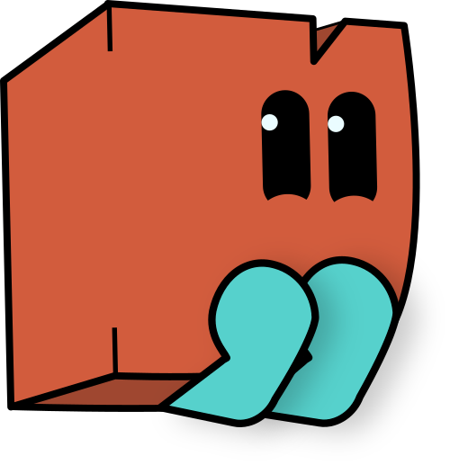
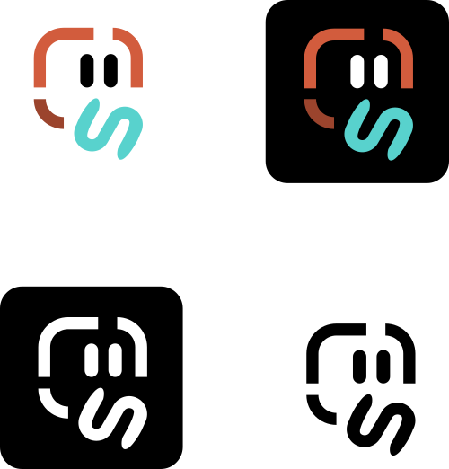
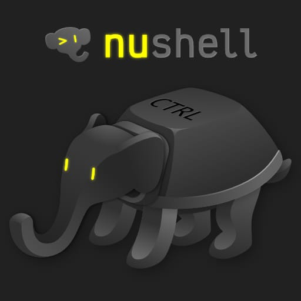

# Art Contest Summary

Some time ago, we announced Nushell [logo and mascot contest](2023-12-21-logo-contest.md). We (the core team) agreed that we were not ready to commit to any of the submitted designs and begin using them as our official logo. Nevertherless, since the submissions are great, we wanted to collect and showcase them as a shoutout to the talented contributors.

_(The ordering of authors was generated via `[ EliFlamel JLi JustinGarrison aboutscientific ulitroyo ] | shuffle`)._

## JustinGarrison

Justin created a cute hermit crab Hermes looking for its new shell:

A collection of hermit crab logo variations with snaky elephant trunks:

## JLi

JLi made a cool minimalist abstract elephant head. The ears are made of transformed letters "n" and "u".

## aboutscientific

aboutscientific submitted this cool futuristic logo:

## ulitroyo

Uli Troyo went completely overboard and created a [whole webpage](https://ulitroyo.github.io/nushell-ellie) for the mascot! You can choose themes for the shellefant, very cool! Here is one also with a logo and an icon matching the theme:

