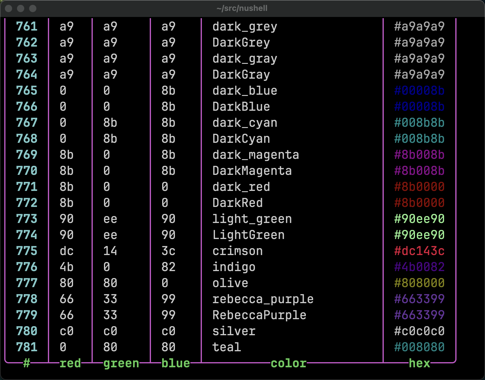

# Nushell Hacks

Listed below are the top nushell hacks that people often forget about or didn't know.

## 1. ends-with / starts-with operators
```nushell
❯ ls | where name ends-with .toml or name starts-with Car
╭─#─┬────────name─────────┬─type─┬───size───┬────modified────╮
│ 0 │ Cargo.lock          │ file │ 165.4 KB │ 22 minutes ago │
│ 1 │ Cargo.toml          │ file │   6.4 KB │ an hour ago    │
│ 2 │ Cross.toml          │ file │    666 B │ an hour ago    │
│ 3 │ rust-toolchain.toml │ file │   1.1 KB │ an hour ago    │
╰───┴─────────────────────┴──────┴──────────┴────────────────╯
```

## 2. easter egg

Did you know that when you start nushell, the `$env.CMD_DURATION_MS` value of 0823 is an easter egg? [It's nushell's first public release date month day](https://github.com/nushell/nushell/releases/tag/0.2.0).

## 3. abbr

With this menu and keybinding configured appropriately in your config.nu file, you can hit `ctrl+space` and your alias abbreviation will expand to it's non-abbreviated form.

For instance, if you have this alias
```nushell
alias gwch = git whatchanged -p --abbrev-commit --pretty=medium
```
and then you type `gwch<ctrl+space>` it will expand on the prompt line to 
```nushell
git whatchanged -p --abbrev-commit --pretty=medium
```

### keybinding
```js
  {
    name: abbr
    modifier: control
    keycode: space
    mode: [emacs, vi_normal, vi_insert]
    event: [
    { send: menu name: abbr_menu }
    { edit: insertchar, value: ' '}
    ]
  }
```
### menu
```js
    {
      name: abbr_menu
      only_buffer_difference: false
      marker: "👀 "
      type: {
        layout: columnar
        columns: 1
        col_width: 20
        col_padding: 2
      }
      style: {
        text: green
        selected_text: green_reverse
        description_text: yellow
      }
      source: { |buffer, position|
        scope aliases
        | where name == $buffer
        | each { |elt| {value: $elt.expansion }}
      }
    }
```
## 4. case-insensitive `where` with `ls`

People often forget that the `=~` and `!~` are regular expression operators, which means you can do a case-insensitive search like this.

```nushell
❯ ls | where name =~ '(?i)car'
╭─#─┬────name────┬─type─┬───size───┬────modified────╮
│ 0 │ Cargo.lock │ file │ 160.6 KB │ 8 hours ago    │
│ 1 │ Cargo.toml │ file │   6.4 KB │ 8 hours ago    │
│ 2 │ car.txt    │ file │      0 B │ 11 seconds ago │
╰───┴────────────┴──────┴──────────┴────────────────╯
```

## 5. the magic of nushell datatype closures

In your config.nu file you can have themes that color nushell datatypes a particular color. One thing that is sometimes overlooked is that these colors can also be closures, like the one below for `string`.

```nushell
string: {|| if $in =~ '^#[a-fA-F\d]+' { $in } else { 'default' } }
```

This allows nushell to detect anything that looks like a hex color and display that color in nushell.

This allows you to take a file like the x11 rgb.txt file and parse it into colors.

rgb.txt
```nushell
❯ open ~/Downloads/rgb.txt | lines | last 10
╭───┬───────────────────────────────────╮
│ 0 │ 139   0   0        DarkRed        │
│ 1 │ 144 238 144        light green    │
│ 2 │ 144 238 144        LightGreen     │
│ 3 │ 220  20  60        crimson        │
│ 4 │  75   0 130        indigo         │
│ 5 │ 128 128   0        olive          │
│ 6 │ 102  51 153        rebecca purple │
│ 7 │ 102  51 153        RebeccaPurple  │
│ 8 │ 192 192 192        silver         │
│ 9 │   0 128 128        teal           │
╰───┴───────────────────────────────────╯
```
And after parsing the file looks similar to this.

