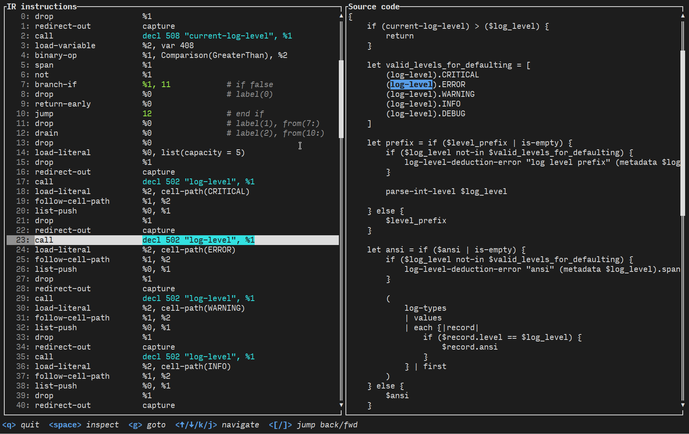

# Nushell 0.96.0

Nushell, or Nu for short, is a new shell that takes a modern, structured approach to your command line. It works seamlessly with the data from your filesystem, operating system, and a growing number of file formats to make it easy to build powerful command line pipelines.

Today, we're releasing version 0.96.0 of Nu. This release adds a new internal representation compiler and evaluator (in preview), makes `$in` expressions more consistent, adds autoload directories for package managers to use when bundling additional functionality for Nushell, enables new functionality for plugins, and includes numerous bug fixes and improvements to usability.

# Where to get it

Nu 0.96.0 is available as [pre-built binaries](https://github.com/nushell/nushell/releases/tag/0.96.0) or from [crates.io](https://crates.io/crates/nu). If you have Rust installed you can install it using `cargo install nu`.

As part of this release, we also publish a set of optional plugins you can install and use with Nu. To install, use `cargo install nu_plugin_<plugin name>`.

# Table of content

- [_Highlights and themes of this release_](#highlights-and-themes-of-this-release-toc)
  - [_Internal representation preview_](#internal-representation-preview-toc)
  - [_`$in` overhaul_](#in-overhaul-toc)
  - [_Autoload directories for package managers_](#autoload-directories-for-package-managers-toc)
  - [_Consistent parsing for known externals_](#consistent-parsing-for-known-externals-toc)
- [_Changes to commands_](#changes-to-commands-toc)
  - [_Additions_](#additions-toc)
    - [_`str deunicode`_](#str-deunicode-toc)
    - [_`chunks`_](#chunks-toc)
    - [_`watch --quiet`_](#watch-quiet-toc)
    - [_`char nul`_](#char-nul-toc)
    - [_`view ir`_](#view-ir-toc)
  - [_Breaking changes_](#breaking-changes-toc)
    - [_`generate`_](#generate-toc)
    - [_Default column numbering_](#default-column-numbering-toc)
    - [_`select`_](#select-toc)
    - [_`std path add`_](#std-path-add-toc)
    - [_`default`_](#default-toc)
    - [_`window`_](#window-toc)
    - [_`break` and `continue`_](#break-and-continue-toc)
  - [_Deprecations_](#deprecations-toc)
    - [_`group`_](#group-toc)
  - [_Removals_](#removals-toc)
    - [_`register`_](#register-toc)
    - [_`for --numbered`_](#for-numbered-toc)
  - [_Other changes_](#other-changes-toc)
    - [_`http` commands_](#http-commands-toc)
    - [_`metadata set --content-type`_](#metadata-set-content-type)
    - [_`to json`_](#to-json-toc)
    - [_`into bits`_](#into-bits-toc)
  - [_Bug fixes_](#bug-fixes-toc)
    - [_`find`_](#find-toc)
    - [_`detect columns --guess`_](#detect-columns-guess-toc)
    - [_`into datetime`_](#into-datetime-toc)
    - [_`from toml`_](#from-toml-toc)
    - [_`help operators`_](#help-operators-toc)
    - [_`into binary`_](#into-binary-toc)
    - [_`take until`_](#take-until-toc)
- [_All breaking changes_](#all-breaking-changes-toc)
  - [_Notes for plugin developers_](#notes-for-plugin-developers)
    - [_New engine calls: `FindDecl`, `CallDecl`_](#new-engine-calls-finddecl-calldecl-toc)
- [_Hall of fame_](#hall-of-fame-toc)
- [_Full changelog_](#full-changelog-toc)
<!-- TODO: please add links to the other sections here

    the following command should help pre-generate a great deal of the table of content.
    be careful with the format and false-positives :wink:
    ```nushell
    rg '^#+ ' blog/...
        | lines
        | each {
            str replace '# ' '- '
                | str replace --all '#' '    '
                | str replace --regex '- (.*)' '- [_$1_](#$1-toc)'
        }
        | to text
    ```
-->

# Highlights and themes of this release [[toc](#table-of-content)]

<!-- NOTE: if you wanna write a section about a breaking change, when it's a very important one,
    please add the following snippet to have a "warning" banner :)
    > see [an example](https://www.nushell.sh/blog/2023-09-19-nushell_0_85_0.html#pythonesque-operators-removal)

    ```md
    ::: warning Breaking change
    See a full overview of the [breaking changes](#breaking-changes)
    :::
    ```
-->
<!-- NOTE: see https://vuepress.github.io/reference/default-theme/markdown.html#custom-containers
    for the list of available *containers*
-->

## Internal representation preview [[toc](#table-of-content)]

This release adds an internal representation language to Nushell, which overhauls our evaluation flow by compiling the output of our parser into an instruction set for a much simpler register-based virtual machine.

The feature is currently opt-in, and can be enabled by setting `$env.NU_USE_IR` to any value while starting Nushell, in the REPL, or before running a `do` command.

As described in the original PR [#13330](https://github.com/nushell/nushell/pull/13330), this has the following benefits:

1. **Performance.** By simplifying the evaluation path and making it more cache-friendly and branch predictor-friendly, code that does a lot of computation in Nushell itself can be sped up a decent bit. Because the IR is fairly easy to reason about, we can also implement optimization passes in the future to eliminate and simplify code.
2. **Correctness.** The instructions mostly have very simple and easily-specified behavior, so hopefully engine changes are a little bit easier to reason about, and they can be specified in a more formal way at some point.
3. **An intermediate target.** This is a good step for us to bring the [`new-nu-parser`](https://github.com/nushell/new-nu-parser) in at some point, as code generated from new AST can be directly compared to code generated from old AST. If the IR code is functionally equivalent, it will behave the exact same way.
4. **Debugging.** With a little bit more work, we can probably give control over advancing the virtual machine that IR runs on to some sort of external driver, making things like breakpoints and single stepping possible.

The [`view ir`](#view-ir) command has been added to make it possible to see a dump of the instructions that would be executed for a block, and this can be used whether IR evaluation is enabled or not. [`debug profile`](#debug-profile) also now supports IR, and if IR evaluation is enabled and the `-i` option is used, each instruction executed will be in the trace.

[@devyn](https://github.com/devyn) has also released a plugin called [`explore ir`](https://github.com/devyn/nu_plugin_explore_ir), which provides a terminal user interface for diving into IR code:



We expect to be able to replace the current evaluation engine with the IR evaluator at some point in the near future. You can help us by trying it out with your own config and scripts now. Setting `$env.NU_USE_IR = 1` in your `env.nu` file should be sufficient to use it in the REPL, but it does need to be set before Nushell starts for it to take effect in scripts. We would appreciate [reports](https://github.com/nushell/nushell/issues/new/choose) about any incompatibilities or performance regressions that you may encounter.

## `$in` overhaul [[toc](#table-of-content)]

::: warning Breaking change
See a full overview of the [breaking changes](#breaking-changes)
:::

The behavior of `$in` expressions has been made more consistent in [#13357](https://github.com/nushell/nushell/pull/13357), with the following rules generally applying:

- Within a pipeline, if `$in` is used at the beginning of the pipeline, or is the only command in the pipeline, it always refers to the input of the block. This was generally the case with closures, but not all blocks in general. Using `$in` at the beginning of a pipeline within a block causes the block input to be collected, though this may change in the future.
- For subsequent commands in the pipeline, `$in` still always refers to the output of the previous command.

For example:

```nushell
def example [] {
    let x = $in
    let y = $in
    [$x $y]
}
42 | example
```

In previous versions of Nushell, this would have resulted in `[42 null]`, but now results in `[42 42]` as expected.

`$in` expressions are no longer transformed into `collect {|$in| ... }` internally, and use a special-purpose AST node instead. This avoids some of the drawbacks of using a closure implicitly, and allows IR to compile the operation directly into the block.

We don't expect this to break any real code in practice, but it is a change that could theoretically break something, so keep an eye out.

## Autoload directories for package managers [[toc](#table-of-content)]

`$nu.vendor-autoload-dir` is now a list of directories that will automatically be loaded from at startup. The nu script files within these directories are loaded in lexical order, and the directories are loaded in the order they appear in that list.

Added in [#13217](https://github.com/nushell/nushell/pull/13217), and further refined by [@jcgruenhage](https://github.com/jcgruenhage) in [#13382](https://github.com/nushell/nushell/pull/13382).

The goal of this feature is to make it easier for system package managers to install autoloading scripts, including completions, as part of other packages. This has been frequently requested by package maintainers and is something that is done for most other shells. We are open to continuing to refine this feature according to community feedback.

The exact directories that appear in the list are platform-dependent:

<table>
    <thead>
        <tr>
            <th>Platform</th>
            <th>Directories</th>
        </tr>
    </thead>
    <tbody>
        <tr>
            <td>Windows</td>
            <td>
                <ol>
                    <li><code>($env.ProgramData)\nushell\vendor\autoload</code> (system-wide)</li>
                    <li><code>($env.AppData)\nushell\vendor\autoload</code> (per-user)</li>
                    <li><code>$env.NU_VENDOR_AUTOLOAD_DIR</code></li>
                </ol>
            </td>
        </tr>
        <tr>
            <td>Linux and BSD</td>
            <td>
                <ol>
                    <li><code>($dir)/nushell/vendor/autoload</code> for each directory in <code>$env.XDG_DATA_DIRS</code> in reverse, defaulting to <code>/usr/local/share:/usr/share</code></li>
                    <li><code>($env.XDG_DATA_HOME)/nushell/vendor/autoload</code> (default <code>~/.local/share</code>)</li>
                    <li><code>$env.NU_VENDOR_AUTOLOAD_DIR</code></li>
                </ol>
            </td>
        </tr>
        <tr>
            <td>macOS</td>
            <td>
                <ol>
                    <li><code>/Library/Application Support/nushell/vendor/autoload</code></li>
                    <li><code>($dir)/nushell/vendor/autoload</code> for each directory in <code>$env.XDG_DATA_DIRS</code> in reverse, defaulting to <code>/usr/local/share:/usr/share</code></li>
                    <li><code>($env.XDG_DATA_HOME)/nushell/vendor/autoload</code> (default <code>~/.local/share</code>)</li>
                    <li><code>~/Library/Application Support/nushell/vendor/autoload</code></li>
                    <li><code>$env.NU_VENDOR_AUTOLOAD_DIR</code></li>
                </ol>
            </td>
        </tr>
    </tbody>
</table>

Where `/usr` is used as the default, it can be customized by setting `$env.PREFIX` when compiling Nushell. All platforms support `$env.NU_VENDOR_AUTOLOAD_DIR` and it is always the highest precedence option.

## Consistent parsing for known externals [[toc](#table-of-content)]

::: warning Breaking change
See a full overview of the [breaking changes](#breaking-changes)
:::

[#13414](https://github.com/nushell/nushell/pull/13414) modified how known externals (i.e., those declared with the `extern` command) are parsed to make them behave more like normal external commands when arguments that are outside of the declaration are provided.

For the given known external declaration:

```nushell
extern echo []
```

this should now behave exactly like `^echo` in all cases, including some of the more unique things we do for externals like removing the quotes in `--foo="bar"`:

```nushell
> echo --foo="bar"
--foo=bar
> ^echo --foo="bar"
--foo=bar
```

Unknown args that look like filepaths will also be expanded. This mostly a restoration of behavior prior to 0.95.0, where `run-external` handled all of that internally.

# Changes to commands [[toc](#table-of-content)]

## Additions [[toc](#table-of-content)]

### `str deunicode` [[toc](#table-of-content)]

This release adds the `str deunicode` command which will convert unicode characters in a string to ASCII characters ([#13270](https://github.com/nushell/nushell/pull/13270)).

```nushell
> "A…B" | str deunicode
A...B
```

### `chunks` [[toc](#table-of-content)]

The `group` command has been deprecated in favor of the new `chunks` command in [#13377](https://github.com/nushell/nushell/pull/13377). The hope is that the name "chunks" is more descriptive or intuitive compared to "group" so that users can more easily find the command they are looking for. `chunks` behaves exactly like `group` except that it will error if provided a chunk size of zero.

### `watch --quiet` [[toc](#table-of-content)]

https://github.com/nushell/nushell/pull/13415

Thanks to [@Zoybean](https://github.com/Zoybean) in [#13415](https://github.com/nushell/nushell/pull/13415), the `watch` command now has a `--quiet` flag which will prevent the initial watch message from being shown.

### `char nul` [[toc](#table-of-content)]

Thanks to [@weirdan](https://github.com/weirdan) in [#13241](https://github.com/nushell/nushell/pull/13241), the NUL character (0x0) is now available via `char nul`, `char null_byte`, or `char zero_byte`.

### `view ir` [[toc](#table-of-content)]

This new command prints the [internal representation](#internal-representation-preview-toc) (IR) code for the given target. For example:

```nushell
> view ir { 1 + 1 }
# 2 registers, 5 instructions, 0 bytes of data
   0: load-literal           %0, int(1)
   1: load-literal           %1, int(1)
   2: binary-op              %0, Math(Plus), %1
   3: span                   %0
   4: return                 %0
```

It can also be used with the name of any custom command written in Nushell:

```nushell
> use std
> view ir 'std assert'
# 8 registers, 41 instructions, 48 bytes of data
   0: load-variable          %1, var 46
   1: not                    %1
   2: branch-if              %1, 6       # if false
   3: drop                   %0          # label(0)
   4: return-early           %0
   5: jump                   7           # end if
...
```

Block IDs and declaration IDs (with `--decl-id`) are also supported, in case you find it useful to step into them from other IR code.

## Breaking changes [[toc](#table-of-content)]

### `generate` [[toc](#table-of-content)]

To support default closure parameters, the argument order for `generate` has been reversed. Instead of the initial value followed by the closure, `generate` now takes a closure followed by an initial value ([#13393](https://github.com/nushell/nushell/pull/13393)).

For example, using a closure with a default parameter:

```nushell
> generate {|fib=[0, 1]| { out: $fib.0, next: [$fib.1, ($fib.0 + $fib.1)] } } | skip 2 | take 6
╭───┬────╮
│ 0 │  1 │
│ 1 │  2 │
│ 2 │  3 │
│ 3 │  5 │
│ 4 │  8 │
│ 5 │ 13 │
╰───┴────╯
```

### Default column numbering [[toc](#table-of-content)]

The naming for default columns in `from csv`, `from tsv`, and `from ssv` was changed from 1-based indexing to 0-based indexing in [#13209](https://github.com/nushell/nushell/pull/13209) thanks to [@ito-hiroki](https://github.com/ito-hiroki). I.e., instead of:

```nushell
> "foo,bar,baz" | from csv -n
╭───┬─────────┬─────────┬─────────╮
│ # │ column1 │ column2 │ column3 │
├───┼─────────┼─────────┼─────────┤
│ 0 │ foo     │ bar     │ baz     │
╰───┴─────────┴─────────┴─────────╯
```

the columns will now be named:

```nushell
> "foo,bar,baz" | from csv -n
╭───┬─────────┬─────────┬─────────╮
│ # │ column0 │ column1 │ column2 │
├───┼─────────┼─────────┼─────────┤
│ 0 │ foo     │ bar     │ baz     │
╰───┴─────────┴─────────┴─────────╯
```

### `select` [[toc](#table-of-content)]

When providing cell paths with multiple members (e.g., `outer.inner`), the `select` command would name the output column by concatenating each cell path member with an underscore (e.g., `outer_inner`). After [#13361](https://github.com/nushell/nushell/pull/13361), instead of an underscore, a period will be used to concatenate the cell path members (e.g., `outer.inner`).

Before:

```nushell
> { a: { b: 1 } } | select a.b
╭─────┬───╮
│ a_b │ 1 │
╰─────┴───╯
```

After:

```nushell
> { a: { b: 1 } } | select a.b
╭─────┬───╮
│ a.b │ 1 │
╰─────┴───╯
```

### `std path add` [[toc](#table-of-content)]

To be less surprising, [@t-mart](https://github.com/t-mart) made the `std path add` function no longer resolve symlinks in either the newly added paths, nor expand paths already in the variable ([#13258](https://github.com/nushell/nushell/pull/13258)). To mimic the previous resolving behavior, you can use `path expand`:

```nushell
std path add ("foo/bar" | path expand)
```

### `default` [[toc](#table-of-content)]

Previously, when given a list as input, the `default` command would replace `null` values inside of the list with the default value. This made it impossible to keep input lists intact while also replacing input nulls with a default value. I.e., the transformation from `null | list<null | string>` to `list<null | string>` is now possible after [#13386](https://github.com/nushell/nushell/pull/13386) thanks to [@weirdan](https://github.com/weirdan).

To replace nulls in a list with a default value, you can now use `each` instead:

```nushell
[null, "a", null] | each { default "b" } # [b a b]
```

### `window` [[toc](#table-of-content)]

With [#13401](https://github.com/nushell/nushell/pull/13401), the `window` command will now error if the provided window size is zero. Similarly, `window` will also error if `--stride` is zero.

### `break` and `continue` [[toc](#table-of-content)]

After [#13398](https://github.com/nushell/nushell/pull/13398), `break` and `continue` are no longer allowed inside the `each` and `items` commands. This means `break` and `continue` are now only allowed inside loops (`for`, `while`, and `loop`).

## Deprecations [[toc](#table-of-content)]

### `group` [[toc](#table-of-content)]

See the notes for the new [`chunks` command](#chunks-toc) above.

## Removals [[toc](#table-of-content)]

### `register` [[toc](#table-of-content)]

The long deprecated `register` command has been finally removed in [#13297](https://github.com/nushell/nushell/pull/13297). Instead, please use the `plugin add` command. For more information, see the [release notes for 0.93.0](https://www.nushell.sh/blog/2024-04-30-nushell_0_93_0.html#redesigned-plugin-management-commands-toc).

### `for --numbered` [[toc](#table-of-content)]

The `--numbered` flag on `for` has been removed in [#13239](https://github.com/nushell/nushell/pull/13239) following its deprecation in the last release. See the [previous release notes](https://www.nushell.sh/blog/2024-06-25-nushell_0_95_0.html#for-numbered-toc) for more information.

## Other changes [[toc](#table-of-content)]

### `http` commands [[toc](#table-of-content)]

The data provided to the `http` family of commands (`post`, `put`, `patch`, `delete`) could previously only be supplied as a positional argument. But after [#13254](https://github.com/nushell/nushell/pull/13254), these commands now support taking data as pipeline input. This also means that these commands can now stream the input data over the network!

```nushell
# non-streaming version, content-type is automatically set
open test.json | http post https://httpbin.org/post

# streaming version, content-type needs to be set manually
open --raw test.json | http post -t application/json https://httpbin.org/post
```

### `metadata set --content-type` [[toc](#table-of-content)]

To implement automatic content-type detection, a new metadata field, the `content-type`, was added to pipeline outputs in [#13284](https://github.com/nushell/nushell/pull/13284). This field can be manually set using `metadata set` with the `--content-type` flag. Using this, we could have rewritten the streaming `http post` example above as:

```nushell
open --raw test.json
| metadata set --content-type application/json
| http post https://httpbin.org/post
```

### `to json` [[toc](#table-of-content)]

Thanks to [@drmason13](https://github.com/drmason13) in [#133523](https://github.com/nushell/nushell/pull/13352), `to json` now places braces on the same line instead of on a new line.

### `into bits` [[toc](#table-of-content)]

With [#13310](https://github.com/nushell/nushell/pull/13310), `into bits` now streams its output if provided a streaming input.

## Bug fixes [[toc](#table-of-content)]

### `find` [[toc](#table-of-content)]

Thanks to [@suimong](https://github.com/suimong) in [#13246](https://github.com/nushell/nushell/pull/13246), the `find` command now preserves the casing of its input. Before, it would output only lower cased text.

### `detect columns --guess` [[toc](#table-of-content)]

`detect columns --guess` would sometimes panic when handling multi-byte unicode characters. This has been fixed in [#13272](https://github.com/nushell/nushell/pull/13272) thanks to [@alex-tdrn](https://github.com/alex-tdrn).

### `do` [[toc](#table-of-content)]

The signature of the `do` command has been fixed in [#13216](https://github.com/nushell/nushell/pull/13216) thanks to [@NotTheDr01ds](https://github.com/NotTheDr01ds). The first parameter is now correctly typed as a `closure` instead of `any`, and this should allow for
better compile-time checks/safety.

### `into datetime` [[toc](#table-of-content)]

Thanks to [@hqsz](https://github.com/hqsz) in [#13289](https://github.com/nushell/nushell/pull/13289), `into datetime` can now take date strings without a timezone in combination with the `--format` flag.

### `from toml` [[toc](#table-of-content)]

Thanks to [@ito-hiroki](https://github.com/ito-hiroki) in [#13315](https://github.com/nushell/nushell/pull/13315), `from toml` now correctly handles toml date values in more cases.

### `help operators` [[toc](#table-of-content)]

With [#13307](https://github.com/nushell/nushell/pull/13307), the output of `help operators` has been updated and fixed. Some of precedence values were previously out of date.

### `into binary` [[toc](#table-of-content)]

In [#13305](https://github.com/nushell/nushell/pull/13305), an issue has been fixed where external command output would still be treated as raw bytes after being passed through `into binary`.

### `take until` [[toc](#table-of-content)]

The input/output types were edited in [#13356](https://github.com/nushell/nushell/pull/13356) to prevent type checking false positives.

<!-- NOTE: to start investigating the contributions of last release, i like to list them all in a raw table.
    to achieve this, one can use the [`list-merged-prs` script from `nu_scripts`](https://github.com/nushell/nu_scripts/blob/main/make_release/release-note/list-merged-prs)
    as follows:

    ```nushell
    use ./make_release/release-note/list-merged-prs
    use std clip

    let last_release_date = ^gh api /repos/nushell/nushell/releases
        | from json
        | into datetime published_at
        | get published_at
        | sort
        | last

    let prs = list-merged-prs nushell/nushell $last_release_date
        | sort-by mergedAt
        | update url {|it| $"[#($it.number)]\(($it.url)\)" }
        | update author { $"[@($in)]\(https://github.com/($in)\)" }
        | select author title url
        | rename -c {url: pr}
        | to md --pretty

    $prs | to md --pretty | clip
    ```
-->

# All breaking changes [[toc](#table-of-content)]

<!-- TODO:
    paste the output of
    ```nu
    ./make_release/release-note/list-merged-prs nushell/nushell --label pr:breaking-change --pretty --no-author
    ```
    here
-->

## Notes for plugin developers

### New engine calls: `FindDecl`, `CallDecl` [[toc](#table-of-content)]

Plugins can now call other commands within the Nushell engine using the [`FindDecl`](/contributor-book/plugin_protocol_reference.md#finddecl-engine-call) and [`CallDecl`](/contributor-book/plugin_protocol_reference.md#calldecl-engine-call) engine calls ([#13407](https://github.com/nushell/nushell/pull/13407)). This was enabled in part by the IR changes, as we can now construct calls without having to provide AST expressions as arguments - IR uses values instead.

These can be accessed using `.find_decl()` and `.call_decl()` on the `EngineInterface`. For example:

```rust
let nu_highlight = engine.find_decl("nu-highlight")?.ok_or_else(|| {
    LabeledError::new("nu-highlight not found")
        .with_label("required by my plugin", call.head)
})?;

let input =
    Value::string("if 2 > 3 { 'broken' } else { 'all good' }", call.head)
        .into_pipeline_data();

let output = engine
    .call_decl(
        nu_highlight,
        EvaluatedCall::new(call.head),
        input,
        true,
        false,
    )?
    .into_value(call.head)?
    .into_string()?;

Value::string(format!("highlighted string: {output}"), call.head)
```

For a real life example, see [`nu_plugin_explore_ir`](https://github.com/devyn/nu_plugin_explore_ir/blob/d01101b88792bbe5dff04c1d1bf25736617ceef2/src/data.rs#L15-L45).

# Hall of fame [[toc](#table-of-content)]

Thanks to all the contributors below for helping us solve issues and improve documentation :pray:

| author                               | title | url                                                     |
| ------------------------------------ | ----- | ------------------------------------------------------- |
| [@author](https://github.com/author) | ...   | [#12345](https://github.com/nushell/nushell/pull/12345) |

# Full changelog [[toc](#table-of-content)]

<!-- TODO:
    paste the output of
    ```nu
    ./make_release/release-note/get-full-changelog
    ```
    here
-->
