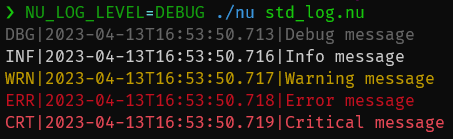

# Stdout, Stderr, and Exit Codes

An important piece of interop between Nushell and external commands is working with the standard streams of data coming from the external.

The first of these important streams is stdout.

## Stdout

Stdout is the way that most external apps will send data into the pipeline or to the screen. Data sent by an external app to its stdout is received by Nushell by default if it's part of a pipeline:

```nu
nu -c 'print hello' | str uppercase
# => HELLO
```

The above calls `nu` as an external command and redirects its stdout output stream into the pipeline. With this redirection, Nushell can then pass the data to the next command in the pipeline, here [`str uppercase`](/commands/docs/str_uppercase.md).

Without the pipeline, Nushell will not do any redirection, allowing it to print directly to the screen.

## Stderr

Another common stream that external applications often use to print error messages is stderr. By default, Nushell does not do any redirection of stderr, which means that by default it will print to the screen.

But you can pass stderr to a command or a file if you want to:

- use `e>|` to pass stderr to next command.
- use `e> file` to redirect stderr to a file.
- use `do -i { cmd } | complete` to capture stderr message.

## Exit Code

Finally, external commands have an "exit code". These codes help give a hint to the caller whether the command ran successfully.

Nushell tracks the last exit code of the recently completed external in one of two ways. The first way is with the `LAST_EXIT_CODE` environment variable.

```nu
nu -c 'print "something went wrong"; exit 3'
# => something went wrong
$env.LAST_EXIT_CODE
# => 3
```

The second way is to use the [`complete`](/commands/docs/complete.md) command.

A non-zero exit code is treated as an error. In a script, execution stops at the failing command, and the lines after it do not run. (In the REPL, type `$env.LAST_EXIT_CODE` on its own line after the failing command, as above.)

This also applies to externals in the middle of a pipeline: if _any_ external command in a pipeline fails, the whole pipeline fails, even when the commands after it succeed (similar to `set -o pipefail` in Bash). `$env.LAST_EXIT_CODE` is then set to the exit code of the rightmost command that failed. To handle a failure yourself, use [`try`](/commands/docs/try.md), whose `catch` closure receives an error record with an `exit_code` field, or capture the exit code with `complete`:

```nu
try { ^false | lines } catch {|err| $err.exit_code }
# => 1
```

::: tip
This pipeline behavior is an opt-out experimental option named `pipefail`. To turn it off, start Nushell with `nu --experimental-options '[pipefail=false]'`.
:::

## Using the [`complete`](/commands/docs/complete.md) command

The [`complete`](/commands/docs/complete.md) command allows you to run an external to completion, and gather the stdout, stderr, and exit code together in one record.

If we try to run the external `cat` on a file that doesn't exist, we can see what [`complete`](/commands/docs/complete.md) does with the streams, including the redirected stderr:

```nu
cat unknown.txt | complete
# => ╭───────────┬─────────────────────────────────────────────╮
# => │ stdout    │                                             │
# => │ stderr    │ cat: unknown.txt: No such file or directory │
# => │           │                                             │
# => │ exit_code │ 1                                           │
# => ╰───────────┴─────────────────────────────────────────────╯
```

The `stderr` value ends with a newline, which is why the table shows an empty line after the message.

## `echo`, `print`, and `log` commands

The [`echo`](/commands/docs/echo.md) command is mainly for _pipes_. It returns its arguments, ignoring the piped-in value. There is usually little reason to use this over just writing the values as-is.

In contrast, the [`print`](/commands/docs/print.md) command prints the given values to stdout as plain text. It can be used to write to standard error output, as well. Unlike [`echo`](/commands/docs/echo.md), this command does not return any value (`print | describe` will return "nothing"). Since this command has no output, there is no point in piping it with other commands.

The [standard library](/book/standard_library.md) has commands to write out messages in different logging levels. For example:

@[code](@snippets/book/std_log.nu)



The log level for output can be set with the [`NU_LOG_LEVEL`](/book/special_variables.md#env-nu-log-level) environment variable:

```nu
NU_LOG_LEVEL=DEBUG nu std_log.nu
```

## File Redirections

If you want to redirect stdout of an external command to a file, you can use `out>` followed by a file path. Similarly, you can use `err>` to redirect stderr:

```nu
cat unknown.txt out> out.log err> err.log
```

If you want to redirect both stdout and stderr to the same file, you can use `out+err>`:

```nu
cat unknown.txt out+err> log.log
```

Note that `out` can be shortened to just `o`, and `err` can be shortened to just `e`. So, the following examples are equivalent to the previous ones above:
```nu
cat unknown.txt o> out.log e> err.log

cat unknown.txt o+e> log.log
```

Also, any expression can be used for the file path, as long as it is a string value:
```nu
use std
cat unknown.txt o+e> (std null-device)
```

Semicolons follow defined pipeline behavior. In the following example, the first external command prints to stdout, and the second external command stdout becomes the output of the parentheses-subexpression and gets piped into `test.txt`.
```nu
(nu -c 'print hello'; nu -c 'print world') o> test.txt
# => hello
open test.txt
# => world
```

To combine the output, scope them into a block and execute it with `do`:
```nu
let text = "hello\nworld"
do { $text | head -n 1; $text | tail -n 1 } o> out.txt
open out.txt
# => hello
# => world
```

This external command behavior is in contrast to native Nushell expressions where the first command's stdout gets discarded:
```nu
('hello'; 'world') o> test.txt
open test.txt
# => world
```

## Pipe Redirections

If a regular pipe `|` comes after an external command, it redirects the stdout of the external command as input to the next command. To instead redirect the stderr of the external command, you can use the stderr pipe, `err>|` or `e>|`:

```nu
nu -c 'print -e error' e>| str uppercase
# => ERROR
```

Of course, there is a corresponding pipe for combined stdout and stderr, `out+err>|` or `o+e>|`:

```nu
nu -c 'print output; print -e error' o+e>| str uppercase
# => OUTPUT
# => ERROR
```

::: note
Because a failing external makes the whole pipeline fail (see [Exit Code](#exit-code)), the redirected output of a command that exits with an error can be lost. For example, `cat unknown.txt e>| str uppercase` prints nothing, because `cat` exits with code 1. Use [`complete`](#using-the-complete-command) when you need both the output and the exit code of a failing command.
:::

Unlike file redirections, pipe redirections do not apply to all commands inside an expression. Rather, only the last command in the expression is affected. For example, only the second `nu` command in the snippet below will have its stdout and stderr redirected by the pipe, so only its output is converted to uppercase.
```nu
(nu -c 'print -e one'; nu -c 'print -e two') o+e>| str uppercase
# => one
# => TWO
```

## Discarding Output

The [`ignore`](/commands/docs/ignore.md) command discards the output of the previous command. By default, it consumes stdout and lets the stderr of an external command through to the screen. Use `--stderr` to consume stderr instead, or both flags to silence the command completely:

```nu
nu -c 'print output; print -e error' | ignore
# => error
nu -c 'print output; print -e error' | ignore --stderr
# => output
nu -c 'print output; print -e error' | ignore --stdout --stderr
```

`ignore` also ignores a non-zero exit code, so `^false | ignore` does not stop a script. Add `--show-errors` to let the failure through and set `$env.LAST_EXIT_CODE`.

## Checking for a Terminal

A script may want to print colors or progress output only when a person is watching. [`is-terminal`](/commands/docs/is-terminal.md) checks whether the stdin, stdout, or stderr of the Nushell process is attached to a terminal (`--stdin`, `--stdout`, or `--stderr`). For example, a child `nu` process sees a terminal when its output goes to the screen, but not when its output is piped into another command:

```nu
nu -c 'is-terminal --stdout'
# => true
nu -c 'is-terminal --stdout' | str trim
# => false
```

## Raw Streams

Both stdout and stderr are represented as "raw streams" inside of Nushell. These are streams of bytes rather than the structured data used by internal Nushell commands.

Because streams of bytes can be difficult to work with, especially given how common it is to use output as if it was text data, Nushell attempts to convert raw streams into text data. This allows other commands to pull on the output of external commands and receive strings they can further process.

Nushell attempts to convert to text using UTF-8. If at any time the conversion fails, the rest of the stream is assumed to always be bytes.

If you want more control over the decoding of the byte stream, you can use the [`decode`](/commands/docs/decode.md) command. The [`decode`](/commands/docs/decode.md) command can be inserted into the pipeline after the external, or other raw stream-creating command, and will handle decoding the bytes based on the argument you give decode. For example, you could decode shift-jis text this way:

```nu
0x[8a 4c] | decode shift-jis
# => 貝
```
