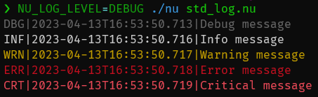

# 标准输入、输出和退出码

Nushell 和外部命令之间互操作的一个重要部分是与来自外部的标准数据流一起工作。

这些重要数据流中的第一个是标准输出流(stdout)。

## 标准输出流

标准输出流(stdout)是大多数外部应用程序将数据发送到管道或屏幕上的方式。如果由外部应用发送到其 stdout 的数据是管道的一部分，Nushell 会默认接收。

```nu
external | str join
```

以上将调用名为`external`的外部命令，并将 stdout 输出流重定向到管道中。有了这个重定向，Nushell 就可以把数据传递给管道中的下一个命令，这里是`str join`。

如果没有管道，Nushell 将不做任何重定向，允许它直接打印到屏幕上。

## 标准错误流

另一个外部应用程序经常用来打印错误信息的常见流是标准错误流(stderr)。默认情况下，Nushell 不会对 stderr 做任何重定向，这意味着它会默认打印到屏幕上。

你可以通过使用`do -i { ... }`来强制 Nushell 做一个重定向。例如，如果我们想调用上面的外部程序并重定向其 stderr，我们可以这样写：

```nu
do -i { external }
```

## 退出码

最后，外部命令有一个 "退出代码(exit code)"。这些代码有助于给调用者一个提示，说明该命令是否运行成功。

Nushell 通过两种方式之一跟踪最近完成的外部命令的最后退出代码。第一种方式是使用`LAST_EXIT_CODE`环境变量。

```nu
do -i { external }
echo $env.LAST_EXIT_CODE
```

第二种是使用一个叫做[`complete`](/zh-CN/commands/docs/complete.md)的命令。

## 使用 [`complete`](/zh-CN/commands/docs/complete.md) 命令

[`complete`](/zh-CN/commands/docs/complete.md)命令允许你运行一个外部程序直到完成，并将 stdout, stderr, 和退出代码收集在一条记录中。

如果我们尝试在一个不存在的文件上运行外部的`cat`，我们可以看到[`complete`](/zh-CN/commands/docs/complete.md)对流的处理，包括重定向的 stderr：

```nu
do -i { cat unknown.txt } | complete
# => ╭───────────┬─────────────────────────────────────────────╮
# => │ stdout    │                                             │
# => │ stderr    │ cat: unknown.txt: No such file or directory │
# => │ exit_code │ 1                                           │
# => ╰───────────┴─────────────────────────────────────────────╯
```

## `echo`、`print` 和 `log` 命令

[`echo`](/zh-CN/commands/docs/echo.md) 命令主要用于管道。它返回其参数，忽略管道传入的值。通常没有理由使用它而不是直接写出值。

相比之下，[`print`](/zh-CN/commands/docs/print.md) 命令将给定值作为纯文本打印到 stdout。它也可以用于写入标准错误输出。与 [`echo`](/zh-CN/commands/docs/echo.md) 不同，此命令不返回任何值（`print | describe` 将返回 "nothing"）。由于此命令没有输出，因此将其与其他命令管道连接没有意义。

[标准库](/book/standard_library.md) 提供了在不同日志级别写入消息的命令。例如：

@[code](@snippets/book/std_log.nu)



可以使用 [`NU_LOG_LEVEL`](/book/special_variables.md#env-nu-log-level) 环境变量设置输出日志级别：

```nu
NU_LOG_LEVEL=DEBUG nu std_log.nu
```

## 文件重定向

如果要将外部命令的 stdout 重定向到文件，可以使用 `out>` 后跟文件路径。类似地，可以使用 `err>` 重定向 stderr：

```nu
cat unknown.txt out> out.log err> err.log
```

如果要将 stdout 和 stderr 都重定向到同一个文件，可以使用 `out+err>`：

```nu
cat unknown.txt out+err> log.log
```

注意 `out` 可以简写为 `o`，`err` 可以简写为 `e`。因此，以下示例与前面的示例等效：

```nu
cat unknown.txt o> out.log e> err.log

cat unknown.txt o+e> log.log
```

此外，任何表达式都可以用作文件路径，只要它是字符串值：

```nu
use std
cat unknown.txt o+e> (std null-device)
```

请注意，文件重定向作用于表达式范围，并应用于表达式中的所有外部命令。在下面的示例中，`out.txt` 将包含 `hello\nworld`：

```nu
let text = "hello\nworld"
($text | head -n 1; $text | tail -n 1) o> out.txt
```

表达式内部的管道和额外的文件重定向将覆盖从外部应用的任何文件重定向。

## 管道重定向

如果在外部命令后使用常规管道 `|`，它会将外部命令的 stdout 重定向为下一个命令的输入。要改为重定向外部命令的 stderr，可以使用 stderr 管道 `err>|` 或 `e>|`：

```nu
cat unknown.txt e>| str upcase
```

当然，还有一个对应的管道用于组合 stdout 和 stderr，`out+err>|` 或 `o+e>|`：

```nu
nu -c 'print output; print -e error' o+e>| str upcase
```

与文件重定向不同，管道重定向不适用于表达式内的所有命令。相反，只有表达式中的最后一个命令会受到影响。例如，在下面的代码片段中，只有 `cmd2` 的 stdout 和 stderr 会被管道重定向。

```nu
(cmd1; cmd2) o+e>| cmd3
```

## 原始流

在 Nushell 中，stdout 和 stderr 都表现为 "原始流"。这些流是字节流，而不是结构化的流，而后者才是 Nushell 内部命令所使用的。

因为字节流可能很难处理，特别是考虑到使用输出作为文本数据是很常见的，Nushell 试图将原始流转换为文本数据。这使得其他命令可以拉取外部命令的输出，并接收他们可以进一步处理的字符串。

Nushell 试图将流转换为 UTF-8 文本，如果在任何时候转换失败，流的其余部分就会被假定为始终是字节。

如果你想对字节流的解码有更多的控制，你可以使用 [`decode`](/zh-CN/commands/docs/decode.md) 命令。[`decode`](/zh-CN/commands/docs/decode.md)命令可以插入到外部或其他原始流创建命令之后的管道中，它将根据你给`decode`的参数来处理字节的解码。例如，你可以这样对 shift-jis 文本进行解码：

```nu
0x[8a 4c] | decode shift-jis
# => 貝
```
